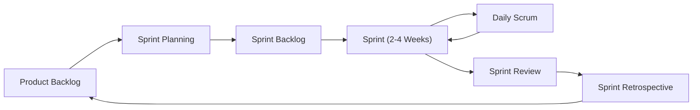

## 📌 Özet
Agile (Çevik) metodolojiler, yazılım geliştirme sürecinde esneklik, sürekli geri bildirim ve iteratif ilerlemeyi temel alan bir yaklaşımdır. Geleneksel Şelale (Waterfall) modelinin aksine, Agile projenin başında tüm gereksinimlerin dondurulmasını değil, değişen müşteri ihtiyaçlarına hızlıca uyum sağlanmasını hedefler. Scrum ve Kanban, Agile felsefesini hayata geçiren en popüler iki çerçevedir. Bu yaklaşımlar, ekiplerin daha yüksek değer üretmesini, iş birliğini artırmasını ve pazara çıkış süresini kısaltmasını sağlar. Modern yazılım dünyasında Agile, sadece bir metodoloji değil, aynı zamanda bir kurum kültürü ve zihniyet dönüşümü olarak kabul edilir.

## 🔄 Scrum ve Kanban Karşılaştırmalı Analiz

### 1. Scrum Çerçevesi (Scrum Framework)
Scrum, belirli süreli (genellikle 1-4 hafta) "Sprint" adı verilen döngüler üzerine kuruludur.

- **Roller:** Product Owner (Değer), Scrum Master (Süreç), Geliştirme Ekibi (Üretim).
- **Ritüeller:** Sprint Planning, Daily Scrum, Sprint Review, Sprint Retrospective.
- **Artefaktlar:** Product Backlog, Sprint Backlog, Increment.

### 2. Kanban Metodolojisi
Kanban, iş akışını görselleştirmeye ve "WIP (Work In Progress)" limitleri ile akışı optimize etmeye odaklanır.

- **Görselleştirme:** İşin durumunu gösteren kolonlar (To-Do, Doing, Done).
- **WIP Limitleri:** Bir aşamada aynı anda bulunabilecek maksimum iş sayısı. Bu, darboğazları (bottlenecks) anında tespit etmeyi sağlar.
- **Süreklilik:** Scrum'ın aksine sabit süreli döngüler yoktur; iş akışı süreklidir.

## 🛠️ Teknik Derinlik: Hangi Durumda Hangisi?

- **Scrum:** Eğer ekibiniz yeni bir ürün geliştiriyorsa, net hedeflere ve düzenli geri bildirime ihtiyaç duyuyorsa idealdir. Belirsizliğin yüksek olduğu projelerde yapıyı korur.
- **Kanban:** Eğer sürekli bir iş akışı varsa (örneğin; operasyonel destek, bakım-onarım ekipleri), Kanban daha esnektir. "Just-in-time" teslimat prensibi ile çalışır.

### Pratik Senaryo: Fintek Uygulaması Geliştirme
Bir bankanın mobil uygulaması geliştirilirken ana özellikler (Havale, EFT, Kredi Başvurusu) için **Scrum** kullanılır. Çünkü bu özelliklerin kapsamı ve teslimat zamanı planlı olmalıdır. Ancak uygulama yayına alındıktan sonra gelen hata bildirimleri ve küçük iyileştirmeler için destek ekibi **Kanban** panosuna geçiş yaparak gelen talepleri öncelik sırasına göre anlık olarak çözer.

## 📈 Agile Metrikleri
- **Velocity (Hız):** Ekibin bir sprintte tamamladığı ortalama iş yükü (Story Point).
- **Cycle Time:** Bir işin "Başlandı" durumundan "Bitti" durumuna geçene kadar geçen süre.
- **Cumulative Flow Diagram (CFD):** Kanban'da iş akışının dengesini gösteren grafik.
