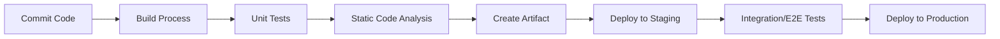

## 📌 Özet
CI-CD (Sürekli Entegrasyon ve Sürekli Dağıtım), yazılım geliştirme sürecinin otomatikleştirilmesini sağlayan bir DevOps pratiğidir. CI (Continuous Integration), geliştiricilerin kodlarını sık sık ana depoya birleştirmesi ve her birleştirmenin otomatik olarak test edilmesi sürecidir. CD ise (Continuous Delivery/Deployment), bu test edilmiş kodun otomatik olarak farklı ortamlara (Staging, Production) dağıtılmasıdır. Bu süreçler, insan hatasını minimize eder, geri bildirim döngüsünü hızlandırır ve yazılımın her an yayınlanabilir durumda olmasını sağlar. Modern yazılım mühendisliğinde CI-CD boru hatları (pipelines), kalitenin "gatekeeper" (kapı bekçisi) rolünü üstlenir.

## 🏗️ CI-CD Boru Hattı (Pipeline) Akışı

### 1. Continuous Integration (CI)
- **Automated Build:** Kodun derlenmesi ve bağımlılıkların yüklenmesi.
- **Automated Testing:** Unit ve komponent testlerinin çalıştırılması.
- **Code Linting:** Kod standartlarına uyumun kontrolü (ESLint, Pylint vb.).

### 2. Continuous Delivery vs. Deployment
- **Continuous Delivery:** Kod her zaman canlıya çıkmaya hazırdır, ancak dağıtım için manuel bir onay (click to deploy) gerekir.
- **Continuous Deployment:** Tüm testleri geçen her commit, insan müdahalesi olmadan doğrudan canlı ortama dağıtılır.

## 🛠️ Otomasyon Stratejileri ve Araçlar
- **Pipelines as Code:** CI-CD yapılandırmasının (YAML/Groovy) kod tabanında saklanması (örn: `.github/workflows/main.yml`).
- **Artifact Management:** Derlenmiş paketlerin (Docker Image, Jar file) versiyonlanarak saklanması (Nexus, Artifactory).
- **Environment Parity:** Geliştirme, test ve canlı ortamların birbirine olabildiğince yakın olması (Infrastructure as Code - Terraform).

## ⚡ Teknik Derinlik: Blue-Green ve Canary Deployment
- **Blue-Green:** Canlıda bir sürüm (Blue) varken, yeni sürüm tamamen ayrı bir ortamda (Green) ayağa kaldırılır. Trafik bir anda yeni ortama yönlendirilir. Hata anında anlık "rollback" sağlar.
- **Canary:** Yeni sürüm trafiğin sadece küçük bir kısmına (%5-%10) verilir. Sorun çıkmazsa kademeli olarak tüm kullanıcılara yayılır. Risk yönetimi için mükemmeldir.

## 📈 Başarı Metrikleri (DORA Metrics)
1. **Deployment Frequency:** Ne kadar sık canlıya çıkılıyor?
2. **Lead Time for Changes:** Kodun yazılmasından canlıya gitmesine kadar geçen süre.
3. **Change Failure Rate:** Canlıya çıkışların ne kadarı hata ile sonuçlanıyor?
4. **Time to Restore Service:** Bir hata oluştuğunda sistem ne kadar sürede kurtarılıyor?
