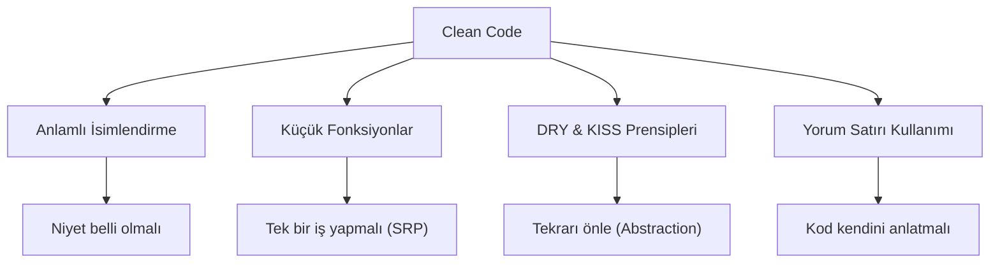

## 📌 Özet
Clean Code (Temiz Kod), sadece çalışan değil, aynı zamanda insanlar tarafından kolayca okunabilen, anlaşılabilen ve sürdürülebilen kod yazma sanatıdır. Yazılımın ömrünün %80'i bakım (maintenance) sürecinde geçtiği için, kodun netliği teknik borcun birikmesini engelleyen en önemli faktördür. Temiz kod, karmaşıklığı minimize ederken niyetin açıkça ifade edilmesini sağlar. "Anlamlı İsimlendirmeler", "Küçük Fonksiyonlar" ve "DRY (Don't Repeat Yourself)" gibi temel prensipler üzerine inşa edilir. Profesyonel bir yazılım mühendisi için kodun kalitesi, projenin başarısı ve ekibin hızıyla doğrudan ilişkilidir.

## 💎 Temiz Kod Prensipleri ve Uygulamalar

### 1. Anlamlı İsimlendirmeler (Meaningful Names)
Değişken, fonksiyon ve sınıf isimleri neden var olduklarını, ne yaptıklarını ve nasıl kullanıldıklarını anlatmalıdır.
- **Kötü:** `int d; // geçen gün sayısı`
- **İyi:** `int daysSinceLastLogin;`

### 2. Fonksiyonlar (Functions)
- **Küçüklük:** Fonksiyonlar olabildiğince küçük olmalıdır (genellikle 20 satırı geçmemeli).
- **Tek Bir İş Yapmalı (Do One Thing):** Fonksiyon sadece kendi ismiyle müsemma olan görevi yerine getirmelidir.
- **Argüman Sayısı:** İdeal olarak 0, en fazla 2-3 argüman olmalıdır. Fazlası nesneye dönüştürülmelidir.

### 3. DRY (Don't Repeat Yourself) ve KISS (Keep It Simple, Stupid)
- **DRY:** Aynı mantığın birden fazla yerde kopyalanması, bir değişiklik yapıldığında hata riskini artırır. Bu mantık bir fonksiyon veya sınıfa encapsulate edilmelidir.
- **KISS:** Bir problemi çözmek için en basit yaklaşımı seçin. Gereksiz "over-engineering" süreçten kaçının.

### 4. Hata Yönetimi (Error Handling)
Hata yönetimi kodun asıl amacını gölgelememelidir. `Try-Catch` blokları temiz bir şekilde ayrılmalı ve özel (custom) exception'lar kullanılmalıdır. Null dönmek yerine boş nesne veya opsiyonel (Optional) tipler tercih edilmelidir.

## 🛠️ Teknik Senaryo: Refactoring
Eski bir sistemde, tek bir fonksiyon içerisinde hem veritabanına kayıt atan, hem e-posta gönderen, hem de log tutan 200 satırlık bir yapı olduğunu varsayalım.
- **Adım 1:** Veritabanı işlemini `UserRepository.save()` metoduna taşıyın.
- **Adım 2:** E-posta gönderme mantığını `NotificationService` içine soyutlayın.
- **Adım 3:** Loglama işlemini bir `Decorator` veya `Interceptor` yapısına devredin.
Sonuç: Okunabilir, test edilebilir ve modüler 3-4 küçük fonksiyon.

## 📌 Profesyonel Tavsiye: Boy Scout Rule
*"Kodu bulduğunuzdan daha temiz bırakın."* Her check-in sırasında küçük bir refactoring yapmak, sistemin zamanla çürümesini (code rot) engeller.
