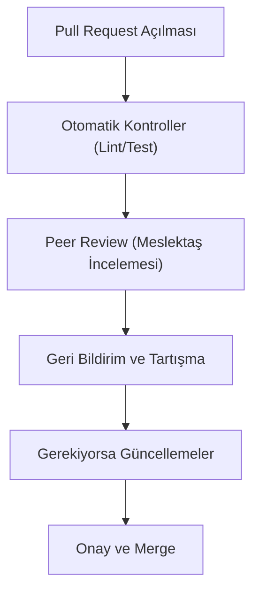

## 📌 Özet
Kod İncelemesi (Code Review), yazılan kodun başka bir geliştirici tarafından kalite, hata ve standartlar açısından denetlenmesi sürecidir. Bu süreç sadece hataları bulmak değil, aynı zamanda ekip içi bilgi paylaşımını artırmak ve ortak bir kod dili oluşturmak için kullanılır. Teknik Borç (Technical Debt) ise, hızlı teslimat adına alınan kalitesiz tasarım kararlarının veya geçici çözümlerin zamanla birikerek sistemin gelişimini yavaşlatmasıdır. İyi bir kod inceleme kültürü, teknik borcun kontrol altında tutulmasını sağlar. Teknik borç tamamen kaçınılmaz değildir; ancak bilinçli yönetilmeli ve düzenli olarak "faiziyle" (refactoring ile) ödenmelidir.

## 🔍 Etkili Kod İncelemesi (Code Review) Süreci

### Kod İncelemesinde Nelere Bakılmalı?
- **Doğruluk:** Kod istenen işlevi yerine getiriyor mu? Uç durumlar (edge cases) düşünülmüş mü?
- **Okunabilirlik:** Değişken ve fonksiyon isimleri net mi? Karmaşık mantıklar açıklanmış mı?
- **Güvenlik:** SQL injection, XSS veya hassas veri sızıntısı riski var mı?
- **Test Edilebilirlik:** Yeni kodun testleri yazılmış mı? Mevcut testleri bozuyor mu?

## 💳 Teknik Borç Yönetimi (Technical Debt Management)
Teknik borç, bir finansal borç gibi çalışır: Hızlı geliştirme için borç alırsınız, ancak zamanla ödemezseniz sistem "iflas" eder (bakım yapılamaz hale gelir).

### Teknik Borç Türleri
1. **Bilinçli Borç:** "Pazara hızlı çıkmamız lazım, bu özelliği şimdilik böyle çözelim, sonra düzelteceğiz."
2. **Bilinçsiz Borç:** Ekibin tecrübesizliği veya yanlış tasarım kararları sonucu oluşan borç.
3. **Eskime Borcu:** Zamanla kütüphanelerin veya teknolojilerin güncelliğini yitirmesi.

## 🛠️ Borç Azaltma Stratejileri
- **Refactoring Sprints:** Her 4-5 sprintte bir sadece teknik borç temizliğine odaklanmak.
- **Definition of Done (DoD):** Bir işin bitti sayılması için "Testleri yazıldı", "Dokümantasyonu yapıldı", "Kod incelemesi bitti" gibi şartların aranması.
- **Borç Kayıt Defteri:** Teknik borçları Jira veya benzeri araçlarda "Technical Debt" etiketiyle takip etmek.

## 🤝 İnceleme Kültürü: Yapıcı Eleştiri
Kod incelemesi kişisel bir saldırı değil, ürün kalitesini artırma çabasıdır. 
- **Geliştirici:** Eleştirilere açık olmalı, "kodum ben değilim" mantığını benimsemelidir.
- **İnceleyici:** Kibar olmalı, hataları göstermekle kalmayıp çözüm önerileri de sunmalıdır (Nitpicking'den kaçınmalıdır).

### Pratik Tavsiye
Küçük PR'lar her zaman daha iyi incelenir. 200 satırdan büyük Pull Request'lerin incelenme kalitesi dramatik şekilde düşer. Değişikliklerinizi atomik parçalara bölün.
