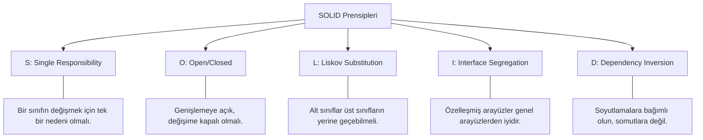

## 📌 Özet
SOLID, nesne yönelimli yazılım geliştirmede (OOP) kodun daha anlaşılır, esnek ve sürdürülebilir olmasını sağlayan beş temel tasarım prensibinin kısaltmasıdır. Bu prensipler, yazılımın zamanla değişen gereksinimlere direnç göstermesini engeller ve "katı" (rigid) sistemler yerine "evrilebilir" sistemler inşa etmemize yardımcı olur. SOLID prensiplerine uyulmadığında sistemler kırılgan (fragile), hareketsiz (immobile) ve karmaşık hale gelir. Bu prensiplerin doğru uygulanması, bir yazılım mühendisinin tasarım yetkinliğinin en önemli göstergelerinden biridir.

## 🏛️ SOLID Prensiplerinin Anatomisi

### 1. Single Responsibility Principle (SRP)
Bir sınıf sadece bir işi yapmalıdır. Örneğin; bir `User` sınıfı hem kullanıcı verilerini tutup hem de e-posta göndermemelidir. E-posta gönderimi `EmailService` sınıfına ait bir sorumluluktur.

### 2. Open/Closed Principle (OCP)
Yazılım birimleri (sınıflar, modüller) yeni özellikler eklenirken mevcut kodun değiştirilmesine gerek kalmayacak şekilde tasarlanmalıdır. Bu genellikle `Interface` veya `Abstract class` kullanımıyla sağlanır.

### 3. Liskov Substitution Principle (LSP)
Alt sınıflar, miras aldıkları üst sınıfların davranışlarını bozmamalıdır. Eğer `Kare` sınıfı `Dikdörtgen` sınıfından türetiliyorsa ve `setHeight` metodu genişliği de değiştiriyorsa, bu LSP ihlalidir.

### 4. Interface Segregation Principle (ISP)
İstemciler kullanmadıkları metodları içeren arayüzleri uygulamaya zorlanmamalıdır. Büyük, her şeyi yapan arayüzler yerine daha spesifik, küçük arayüzler (Role Interfaces) tercih edilmelidir.

### 5. Dependency Inversion Principle (DIP)
Yüksek seviyeli modüller, düşük seviyeli modüllere bağımlı olmamalıdır. Her ikisi de soyutlamalara (interface) bağımlı olmalıdır. Örneğin; bir `BusinessLogic` sınıfı doğrudan `MySQLDatabase` sınıfına değil, bir `IDatabase` arayüzüne bağımlı olmalıdır.

## 🛠️ Teknik Uygulama Örneği: Ödeme Sistemi
Bir sistemde farklı ödeme yöntemleri (Credit Card, PayPal, Crypto) olduğunu düşünelim.
- **Kötü Tasarım:** `PaymentProcessor` sınıfı içinde `if (type == "PayPal")` gibi kontroller yapmak OCP'yi ihlal eder.
- **SOLID Tasarım:** Bir `IPaymentMethod` arayüzü tanımlanır. Her ödeme yöntemi bu arayüzü implemente eder. `PaymentProcessor` sadece `IPaymentMethod` tipini kabul eder. Yeni bir yöntem eklendiğinde mevcut kod değişmez, sadece yeni bir sınıf eklenir.

## ⚠️ Dikkat Edilmesi Gerekenler
SOLID prensipleri birer kural değil, rehberdir. Gereksiz yere aşırı soyutlama (over-abstraction) yapmak kodun okunabilirliğini azaltabilir. İhtiyaç analizi yapılarak pragmatik bir şekilde uygulanmalıdır.
