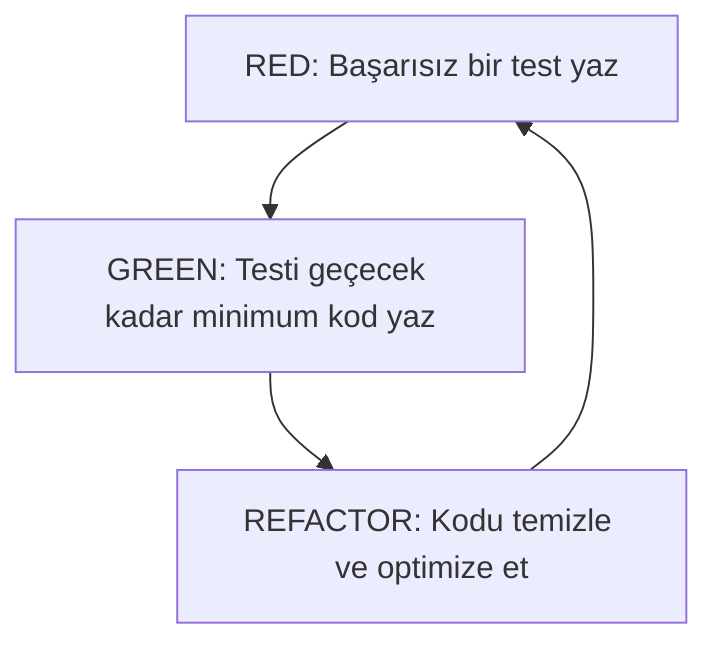
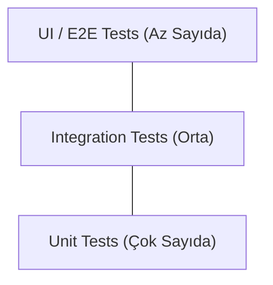

## 📌 Özet
Test Güdümlü Geliştirme (TDD), kodun kendisinden önce testinin yazılmasını savunan bir yazılım geliştirme disiplinidir. Bu yaklaşım, yazılımcının önce gereksinimleri tam olarak anlamasını sağlar ve daha temiz, modüler bir tasarım üretmeye zorlar. BDD (Behavior Driven Development) ise TDD'nin bir evrimi olup, teknik olmayan paydaşların da anlayabileceği bir dilde (genellikle Gherkin: Given-When-Then) sistemin davranışlarını tanımlamaya odaklanır. Her iki metodoloji de "hata yapma korkusunu" azaltır ve sürekli değişen yazılım projelerinde güvenli bir refactoring ortamı sunar.

## 🔄 TDD Döngüsü: Red - Green - Refactor

1. **Red (Kırmızı):** İstenen özellik için henüz implemente edilmemiş bir test yazılır ve testin başarısız olması beklenir.
2. **Green (Yeşil):** Testin geçmesi için gereken en basit ve hızlı kod yazılır (Clean code kaygısı gütmeden).
3. **Refactor (Düzenle):** Kod, işlevselliği bozulmadan temiz kod prensiplerine göre optimize edilir.

## 🗣️ BDD (Behavior Driven Development)
BDD, sistemin "nasıl" çalıştığından ziyade "ne" yaptığını test eder. İş birliğini artırmak için **Gherkin** dilini kullanır.

**Örnek Senaryo:**
- **Given (Verili):** Kullanıcı giriş sayfasında olduğunda
- **When (Zaman):** Geçerli bir e-posta ve şifre girdiğinde
- **Then (O zaman):** Başarılı bir şekilde ana sayfaya yönlendirilmelidir.

## 🛠️ Teknik Derinlik: Test Piramidi

- **Unit Tests:** Tek bir fonksiyon veya sınıfın yalıtılmış testi (Mocking kullanılır).
- **Integration Tests:** Birden fazla bileşenin veya dış sistemin (DB, API) birlikte çalışabilirliği.
- **E2E (End-to-End) Tests:** Tüm sistemin kullanıcı gözünden simülasyonu (Cypress, Selenium).

## 🚀 Avantajlar ve Zorluklar
- **Avantajlar:** Daha az hata, dokümantasyon niteliğinde testler, güvenli refactoring, daha iyi yazılım mimarisi.
- **Zorluklar:** İlk aşamada geliştirme süresini artırır (long-term'de kazandırır), öğrenme eğrisi yüksektir, iyi yazılmamış testler bakım yükü getirir.

### Pratik Tavsiye
TDD uygularken "asla testi geçmek için gerekenden fazla kod yazmayın". Bu, gereksiz karmaşıklığı (over-engineering) önlemenin en etkili yoludur.
