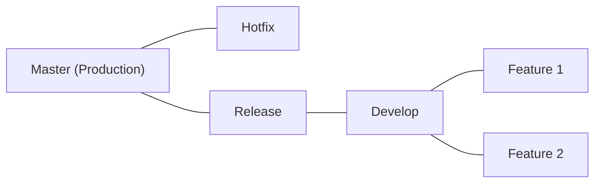

## 📌 Özet
Versiyon kontrol stratejileri, bir yazılım ekibinin kod tabanını (codebase) nasıl yönettiğini, özellikleri nasıl geliştirdiğini ve sürümleri nasıl yayınladığını belirleyen kurallar setidir. Rastgele branch kullanımı, büyük projelerde "merge hell" (birleştirme cehennemi) olarak adlandırılan karmaşıklıklara yol açar. Git-Flow gibi geleneksel modeller düzen ve stabilite sunarken, Trunk-based Development gibi modern yaklaşımlar hız ve sürekli entegrasyonu (CI) hedefler. Doğru strateji seçimi, ekibin büyüklüğü, projenin hızı ve dağıtım (deployment) sıklığına göre yapılmalıdır.

## 🌿 Git-Flow Stratejisi
Git-Flow, katı bir branching modelidir. Stabil sürümler ve paralel geliştirme için idealdir.

- **Master:** Her zaman canlıya hazır, stabil kod.
- **Develop:** Entegrasyon branch'i, bir sonraki sürüm için hazırlanan kod.
- **Feature:** Yeni özelliklerin geliştirildiği geçici branch'ler.
- **Release:** Canlıya çıkmadan önceki son hata ayıklama ve versiyonlama aşaması.
- **Hotfix:** Canlıdaki acil hataların giderilmesi için master'dan ayrılan dal.

## 🛤️ Trunk-based Development (Modern Yaklaşım)
Geliştiricilerin küçük güncellemeleri doğrudan ana dala (trunk/main) veya çok kısa ömürlü feature branch'lere gönderdiği stratejidir.

- **CI Zorunluluğu:** Kod sürekli ana dala merge edildiği için otomatik testlerin çok güçlü olması gerekir.
- **Feature Toggles:** Tamamlanmamış özelliklerin canlı ortamda kapalı tutulması için kullanılır.
- **Hız:** Uzun ömürlü branch'lerin birleştirme zorluklarını ortadan kaldırır.

## ⚖️ Karşılaştırmalı Analiz

| Özellik | Git-Flow | Trunk-based |
| :--- | :--- | :--- |
| **Yayın Hızı** | Yavaş / Planlı | Çok Hızlı / Sürekli |
| **Karmaşıklık** | Yüksek (Çok branch) | Düşük (Tek branch) |
| **Merge Risk** | Yüksek (Geç birleştirme) | Düşük (Sık birleştirme) |
| **Ekip Uyumu** | Büyük, kurumsal ekipler | Çevik, DevOps odaklı ekipler |

## 🛠️ Teknik Senaryo: Mikroservis Mimarisi
Eğer bir ekip günde 10 kez canlıya çıkış yapıyorsa (SaaS), **Trunk-based** kaçınılmazdır. Ancak yıllık sürüm takvimi olan bir gömülü sistem projesinde, **Git-Flow** sürümlerin izolasyonu ve kontrolü için daha güvenlidir.

## 📌 Profesyonel İpucu
Hangi modeli seçerseniz seçin, "Atomic Commits" prensibine uyun. Her commit tek bir mantıksal değişikliği temsil etmeli ve sistemin bütünlüğünü bozmamalıdır.
