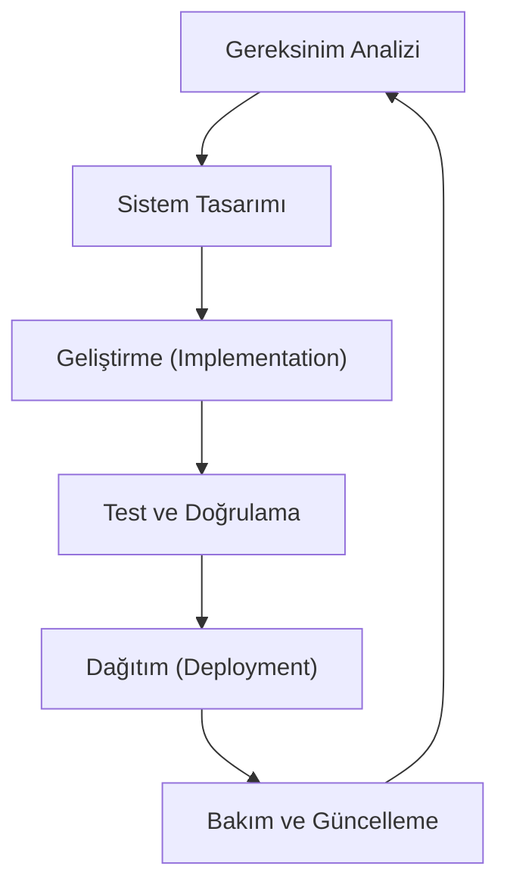

## 📌 Özet
Yazılım Geliştirme Yaşam Döngüsü (SDLC), bir yazılım projesinin başlangıcından teslimatına ve bakımına kadar geçen tüm aşamaları kapsayan sistematik bir süreçtir. Bu döngü, karmaşık yazılım sistemlerinin yüksek kalitede, bütçe dahilinde ve zamanında teslim edilmesini sağlamak için yapılandırılmış bir çerçeve sunar. SDLC aşamaları; gereksinim analizi, tasarım, geliştirme, test, dağıtım ve bakım olmak üzere birbirini takip eden veya iç içe geçen adımlardan oluşur. Modern mühendislik yaklaşımlarında SDLC, katı bir şelale modelinden ziyade daha esnek ve iteratif bir yapıya evrilmiştir. Bu sürecin doğru yönetilmesi, projedeki risklerin erken safhalarda tespit edilmesine ve kaynakların optimize edilmesine olanak tanır.

## 🏗️ SDLC Aşamaları ve Teknik Detaylar

### 1. Gereksinim Analizi (Requirement Analysis)
Bu aşama, projenin "ne" yapacağının tanımlandığı kritik fazdır. İş analistleri ve paydaşlar, fonksiyonel (functional) ve fonksiyonel olmayan (non-functional) gereksinimleri belirler. Teknik borcu minimize etmek için gereksinimlerin net, ölçülebilir ve test edilebilir olması gerekir.

### 2. Sistem Tasarımı (System Design)
Yazılım mimarisinin (Architecture) oluşturulduğu aşamadır. Veritabanı şemaları, API tasarımları ve bileşenler arası etkileşimler planlanır. 
- **High-Level Design (HLD):** Sistemin genel mimarisi ve modülleri.
- **Low-Level Design (LLD):** Sınıf diyagramları, algoritma detayları ve veri yapıları.

### 3. Geliştirme (Implementation)
Kodun yazıldığı ana fazdır. Yazılım mühendisleri, belirlenen tasarım dokümanlarına (SDD) sadık kalarak temiz kod prensipleri çerçevesinde geliştirme yapar. Kod incelemeleri (Code Review) bu aşamanın ayrılmaz bir parçasıdır.

### 4. Test ve Doğrulama (Testing)
Yazılımın gereksinimleri karşılayıp karşılamadığı ve hatalardan arındırıldığı süreçtir.
- **Unit Testing:** En küçük kod birimlerinin testi.
- **Integration Testing:** Modüller arası etkileşimin testi.
- **UAT (User Acceptance Testing):** Son kullanıcının onayı.

### 5. Dağıtım ve Bakım (Deployment & Maintenance)
Yazılımın canlı ortama alınması ve sonrasındaki operasyonel süreçlerdir. CI/CD boru hatları sayesinde bu süreç otomatikleştirilir. Canlı ortamdaki hataların giderilmesi (hotfix) ve yeni gereksinimlerin sisteme dahil edilmesi bakım sürecinin bir parçasıdır.

## ⚡ Pratik Senaryo: E-Ticaret Ödeme Sistemi
Bir e-ticaret platformu için ödeme modülü geliştirilirken, SDLC'nin tasarım aşamasında güvenlik (PCI-DSS uyumluluğu) fonksiyonel olmayan bir gereksinim olarak belirlenir. Geliştirme aşamasında bu güvenliği sağlamak için özel şifreleme algoritmaları implemente edilir. Test aşamasında ise "negatif testler" (hatalı kart numarası, yetersiz bakiye) yapılarak sistemin dayanıklılığı ölçülür.
