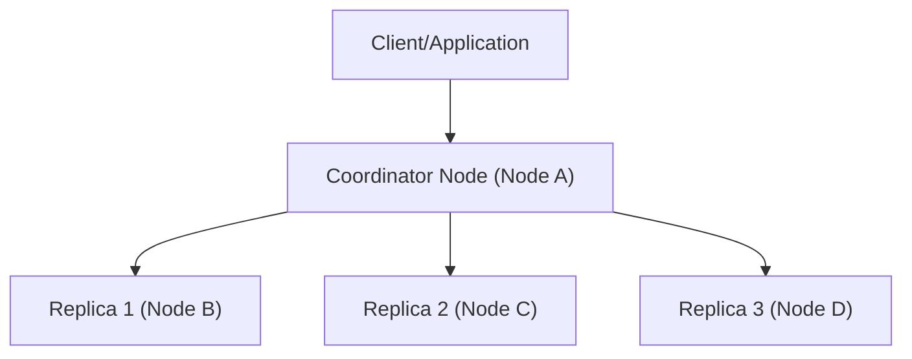

## 📌 Özet
Apache Cassandra, doğrusal ölçeklenebilirlik ve yüksek erişilebilirlik sağlamak amacıyla tasarlanmış, dağıtık ve geniş kolonlu (wide-column) bir NoSQL veritabanıdır. Masterless (efendisiz) bir mimariye sahip olan Cassandra, sistemde tek nokta hatasını (SPOF) ortadan kaldırarak her düğümün (node) eşit rollerde çalışmasına olanak tanır. CAP teoreminde Availability (Erişilebilirlik) ve Partition Tolerance (Bölünme Toleransı) tarafında konumlanarak AP sistemler sınıfında yer alır; ancak ayarlanabilir tutarlılık (tunable consistency) mekanizması ile ihtiyaç halinde güçlü tutarlılık (strong consistency) da sunabilir. Veriyi yatay eksende partition key'ler üzerinden ring (halka) topolojisine göre dağıtan bu mimari, yazma işlemlerinde (write-heavy workload) son derece yüksek performans gösterir. Columnar tabanlı yapısı sayesinde okuma sırasında yalnızca ihtiyaç duyulan kolonlara erişim sağlanarak I/O maliyetleri düşürülür. Özellikle IoT, log yönetimi ve zaman serisi verileri gibi yoğun yazma operasyonlarının olduğu senaryolarda yaygın olarak tercih edilen stratejik bir veritabanı çözümüdür.

## ⚙️ Teknik Detaylar

### Mimari ve Bileşenler
Cassandra, temelini Amazon'un Dynamo'sunun dağıtık sistem prensiplerinden ve Google'ın Bigtable'ının veri modelinden alır.

- **Node ve Cluster:** En küçük veri saklama birimi olan düğümler (node), birleşerek veri merkezlerini (datacenter) ve kümeleri (cluster) oluşturur.
- **Gossip Protokolü:** Düğümler arası iletişim, peer-to-peer bir protokol olan Gossip üzerinden sağlanır. Düğümler saniyede bir diğer düğümlerle konuşarak kümenin mevcut durumunu günceller.
- **Partitioner:** Verinin hangi düğümlere yazılacağını belirleyen algoritmadır (örn. Murmur3Partitioner). Gelen verinin `Partition Key` değeri hash'lenerek token hesaplanır.
- **Token Ring:** Cassandra kümesi, 0'dan 2^63-1'e kadar olan token uzayını bir halka şeklinde temsil eder. Her düğüm bu halka üzerinde belirli bir token aralığından sorumludur.

### Yazma Mekanizması (Write Path)
Cassandra, disk üzerinde rastgele yazma (random write) yerine sıralı yazma (sequential write) yaparak hız kazanır.

1. **Commit Log:** Veri ilk olarak diske, çökme durumunda kurtarma (recovery) sağlayabilmek için append-only çalışan Commit Log'a yazılır.
2. **Memtable:** Eş zamanlı olarak veri bellekte yer alan ve anahtarlara göre sıralı olan Memtable'a eklenir.
3. **SSTable:** Memtable dolduğunda, içindeki veriler diskte salt okunur (immutable) olan SSTable (Sorted String Table) dosyalarına ardışık olarak flush edilir.
4. **Compaction:** Zamanla artan SSTable dosyaları, okuma performansını düşürmemek ve yer kazanmak amacıyla arka planda birleştirilerek tek bir dosya haline getirilir.

### Okuma Mekanizması (Read Path)
Okuma işlemleri yazmalardan daha karmaşıktır çünkü veri birden fazla SSTable'da parçalanmış olabilir.

1. **Memtable Kontrolü:** İstenen veri öncelikle bellekteki Memtable'da aranır.
2. **Bloom Filter:** SSTable'ları diskten okumadan önce, anahtarın o dosyada olma ihtimalini hızlıca kontrol eden bir veri yapısı kullanılır. Eğer Bloom Filter "hayır" derse, disk okuması atlanır.
3. **Key Cache ve Partition Index:** Bloom Filter onaylarsa, Key Cache ve Index dosyaları kullanılarak verinin diskteki konumu bulunur ve okunur.
4. **Read Repair:** Okuma sırasında replikalar arası veri uyuşmazlığı (inconsistency) tespit edilirse, eski versiyondaki veri anında arka planda güncellenir.

### Ayarlanabilir Tutarlılık (Tunable Consistency)
Cassandra'da her okuma ve yazma işlemi için `Consistency Level` ayarlanabilir.

- **ANY, ONE, LOCAL_ONE:** En düşük gecikmeyi sağlar. Sadece tek bir düğümün cevap vermesi yeterlidir (Eventual Consistency).
- **QUORUM, LOCAL_QUORUM:** Çoğunluğun (Replikaların yarısından 1 fazlası) cevap vermesini zorunlu kılar.
- **ALL:** Tüm replikaların cevap vermesini bekler. Maksimum tutarlılık, maksimum gecikme.

*Formül:* Eger `Write_CL + Read_CL > Replication_Factor` ise Güçlü Tutarlılık (Strong Consistency) elde edilir.