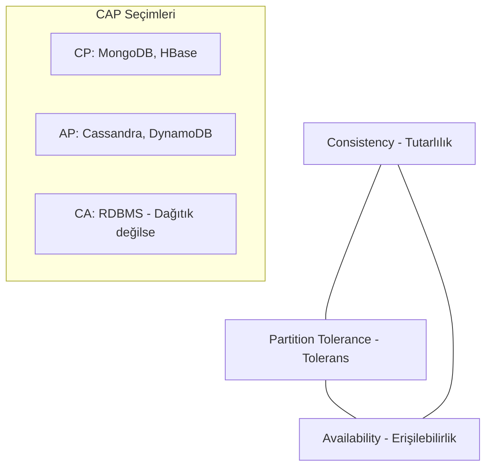

## 📌 Özet
CAP Teoremi, dağıtık bir sistemde aynı anda sadece iki özelliğin tam olarak sağlanabileceğini savunur: Tutarlılık (Consistency), Erişilebilirlik (Availability) ve Parçalanma Toleransı (Partition Tolerance). PACELC ise CAP teoremini genişleterek, parçalanma olmadığı durumlarda Gecikme (Latency) ve Tutarlılık arasındaki dengeyi açıklar.

## 🧠 Detay

### 1. CAP Bileşenleri
- **Consistency (C):** Tüm düğümlerin (nodes) aynı anda aynı veriyi görmesi.
- **Availability (A):** Her isteğin (başarılı veya başarısız) bir yanıt alması.
- **Partition Tolerance (P):** Ağdaki bir kopukluğa rağmen sistemin çalışmaya devam etmesi.
- *Not:* Dağıtık sistemlerde "P" zorunludur, bu yüzden seçim genelde **CP** veya **AP** arasındadır.

### 2. PACELC Teoremi
PACELC, "if Partition, choose Consistency or Availability, Else choose Latency or Consistency" ifadesinin kısaltmasıdır.
- **P+A:** Ağ hatası varsa Erişilebilirlik.
- **P+C:** Ağ hatası varsa Tutarlılık.
- **E+L:** Hata yoksa düşük Gecikme (Latency).
- **E+C:** Hata yoksa yüksek Tutarlılık.

### 3. Örnekler
- **Cassandra (AP/EL):** Erişilebilirliğe ve düşük gecikmeye odaklanır.
- **MongoDB (CP/EC):** Tutarlılığa odaklanır, ancak yapılandırılabilir.

## 💡 Bağlantılar
- [[DB - Veri Çoğaltma (Replication) ve Consensus Algoritmaları (Raft, Paxos)]]
- [[İleri Dağıtık Sistemler & Veritabanları - Giriş]]

## ❓ Sorular / Anlamadıklarım
- "Eventual Consistency" (Nihai Tutarlılık) CAP teoreminin neresindedir?
- Bir sistem dinamik olarak CP den AP ye geçebilir mi?

## 🔗 Kaynaklar
- CAP Theorem (Wikipedia)
- PACELC Theorem (Wikipedia)
