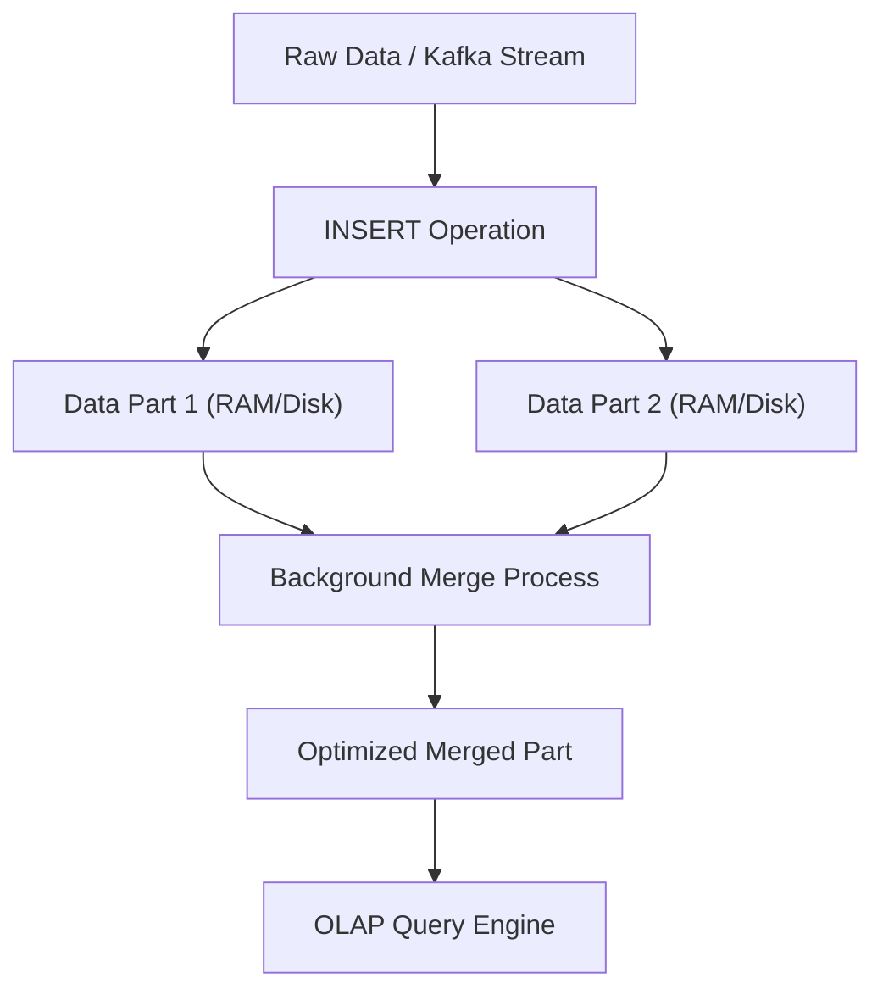

## 📌 Özet
ClickHouse, devasa veri setleri üzerinde (petabayt ölçeğinde) milisaniyeler seviyesinde karmaşık analitik sorgular (OLAP) çalıştırabilen, açık kaynaklı ve sütun odaklı (columnar) bir veritabanı yönetim sistemidir. Geleneksel satır tabanlı veritabanlarının (OLTP) aksine, aynı tipe sahip verileri bitişik olarak disk üzerinde saklar; bu sayede `SUM`, `AVG`, `COUNT` gibi analitik toplama işlemleri sırasında I/O ve RAM kullanımını çarpıcı biçimde azaltır. Mimarisinde yer alan veri sıkıştırma algoritmaları, vektörel sorgu işleme motoru ve donanımın (SIMD komut setleri) sınırlarını zorlayan hesaplama yöntemleri sayesinde, diğer analitik çözümlere kıyasla 100 ile 1000 kat arası hızlanma sağlar. Veri ambarları, log analitiği, kullanıcı davranış takibi ve gerçek zamanlı iş zekası (BI) panelleri gibi yoğun okuma ve aggregasyon gerektiren senaryolarda standart bir standart haline gelmiştir. ClickHouse'un dağınık mimarisi, masterless replikasyon modeliyle birleştiğinde, yüksek erişilebilirlik ve yatay ölçeklenebilirliği eş zamanlı olarak güvenle sunar.

## ⚙️ Teknik Detaylar

### Sütun Odaklı (Columnar) Veri Saklama
İlişkisel veritabanları (PostgreSQL, MySQL) veriyi satır satır tutar (Row-oriented). OLAP senaryolarında ise 100 kolonlu bir tablonun sadece 3 kolonunda işlem yapmak gerektiğinde satır tabanlı mimari gereksiz I/O yapar.

- ClickHouse her kolonu disk üzerinde ayrı bir dosya (veya dosya bloku) olarak yazar.
- Sadece `SELECT` sorgusunda belirtilen kolonlar okunur.
- Aynı tip veriler yan yana dizildiği için (örneğin hepsi integer veya tarih), veri sıkıştırma algoritmaları (LZ4, ZSTD) inanılmaz oranlarda (bazen 10 kata kadar) yer tasarrufu sağlar.

### MergeTree Motoru (Engine)
ClickHouse'un kalbi `MergeTree` tablo motoru ailesidir. Bu yapı LSM-Tree'ye benzer.

- Veriler diske immutable (değiştirilemez) parçalar (parts) halinde yazılır.
- Arka planda periyodik olarak küçük parçalar birleştirilerek (merge) daha büyük ve optimize edilmiş parçalara dönüştürülür.
- Primary Key (Birincil Anahtar) benzersizliği garanti etmez; verinin diskte hangi sırayla dizileceğini (sorting key) ve Sparse Index oluşturulmasını sağlar.

### Vektörel Sorgu İşleme (Vectorized Query Execution)
ClickHouse, veriyi işlemcide (CPU) tek tek değerler olarak değil, sütun blokları halinde diziler (array) olarak işler.

- Bu yöntem, modern CPU'ların SIMD (Single Instruction, Multiple Data) komut setlerinden tam anlamıyla faydalanmasını sağlar.
- Bir CPU döngüsünde birden fazla veri parçası işlenir, loop maliyetleri (branch prediction hataları vb.) düşürülür.

### ClickHouse Mimarisi ve Ölçekleme
- **Sharding (Parçalama):** `Distributed` tablo motoru kullanılarak veriler fiziksel düğümler arasında yatay olarak bölünür. Sorgular şeması aynı olan farklı shard'lara paralel olarak dağıtılır ve sonuçlar coordinator node'da birleştirilir.
- **Replikasyon:** `ReplicatedMergeTree` motoru kullanılarak shard'ların yedekliliği sağlanır. Replikasyon sürecini koordine etmek için ClickHouse Keeper (veya Apache ZooKeeper) kullanılır.

### ClickHouse'un Zayıf Yönleri (Ne zaman KULLANILMAMALI?)
- Yüksek oranda tekil satır güncelleme (`UPDATE`) ve silme (`DELETE`) işlemi gereken durumlar (Mutations ClickHouse'da çok maliyetlidir).
- ACID garantisi gerektiren finansal işlemler (Transactions).
- Yüksek eşzamanlılıklı, düşük gecikmeli tek kayıt okuma (Point-lookup) işlemleri (Key-Value store değildir).