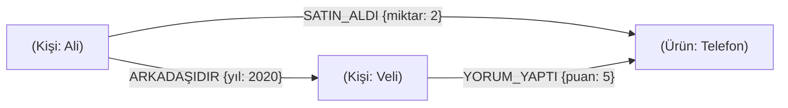

## 📌 Özet
Graph (Çizge) Veritabanları, ilişkisel modeldeki karmaşık `JOIN` tabloları ve referans anahtarları yerine, veriyi düğümler (nodes) ve bu düğümler arasındaki doğrudan bağlantılar (edges/relationships) üzerinden modelleyen NoSQL sistemleridir. Geleneksel veritabanlarında veriler arasındaki ilişkileri sorgulamak veri boyutu ve derinliği arttıkça üssel bir performans kaybına (JOIN cehennemi) yol açarken; Graph veritabanları "Index-Free Adjacency" mimarisi sayesinde ilişkileri işaretçiler (pointers) ile saklayarak mikrosaniyeler seviyesinde derinlemesine ağ gezinmesi (traversal) sağlar. Neo4j pazarın olgun ve en bilinen ürünü olarak Cypher sorgu diliyle disk tabanlı güçlü analizler sunarken, Memgraph gibi yeni nesil in-memory (ve C++ tabanlı) çözümler gerçek zamanlı analizler ve yapay zeka odaklı graf işlemleri için yüksek performans vaat eder. Özellikle sosyal ağ analizi, dolandırıcılık tespiti (fraud detection), tavsiye sistemleri (recommendation engines) ve tedarik zinciri yönetimi gibi verinin değerinin "bağlantılarında" saklı olduğu senaryolarda kullanılması zorunlu mimarilerdir.

## ⚙️ Teknik Detaylar

### Veri Modeli: Labeled Property Graph (LPG)
Graph veritabanları temelde Property Graph yapısını kullanır.

- **Nodes (Düğümler):** Varlıkları temsil eder (Örn: `Kişi`, `Şirket`, `Ürün`). Etiketler (Labels) alabilirler.
- **Relationships (İlişkiler):** İki düğümü birbirine bağlayan yönlü (directed) oklardır (Örn: `ÇALIŞIR`, `SATIN_ALDI`). İlişkilerin türü ve yönü zorunludur.
- **Properties (Özellikler):** Hem düğümler hem de ilişkiler key-value şeklinde özellikleri barındırabilir. Örneğin `SATIN_ALDI` ilişkisine `Tarih: 2023-01-01` ve `Miktar: 5` özellikleri eklenebilir.

### Neden İlişkisel DB (RDBMS) Yerine Graph?
İlişkisel veritabanlarında `M:N` (Çoğa çok) ilişkiler için ara/köprü tablolar (Join Table) kullanılır. "Ali'nin arkadaşlarının satın aldığı ürünler" sorgusu RDBMS'te 3 veya 4 adet pahalı `JOIN` işlemi gerektirir. Veri büyüdükçe Index ağaçlarında (B-Tree) arama maliyeti O(log N) olarak artar.

**Index-Free Adjacency:** Graph veritabanlarında bir düğüm, kendisiyle ilişkili olan düğümlerin fiziksel RAM/Disk adreslerini (pointer) doğrudan bilir. Bu sayede komşulara atlamak (traversal) O(1) maliyetindedir. Milyarlarca düğüm de olsa, yerel gezinme hızı sabittir.

### Neo4j ve Cypher Mimarisi
Neo4j, Java tabanlı, ACID uyumlu ve disk odaklı bir graph veritabanıdır.

- **Cypher Sorgu Dili:** SQL'den farklı olarak ASCII-art (çizim) tarzında bir dildir.
  *Örnek Sorgu (Ali'nin arkadaşlarının sevdiği ürünler):*
  `MATCH (a:Kişi {isim: 'Ali'})-[:ARKADAŞIDIR]->(arkadas)-[:SATIN_ALDI]->(u:Ürün) RETURN u.ad`
- **Native Graph Storage:** Neo4j, veriyi arka planda düğüm deposu, ilişki deposu ve özellik deposu olarak ayırarak, pointer bazlı hızlı atlamalar için optimize edilmiş özel bir dosya formatı kullanır.

### Memgraph: Yüksek Performans ve Gerçek Zamanlı Analitik
Memgraph, Neo4j'ye güçlü bir alternatif olarak öne çıkar.

- **C++ ve In-Memory:** C++ ile yazılmış olup, ana bellek (RAM) optimizasyonludur (In-Memory first). Bu mimari, Neo4j'ye kıyasla ağ gezinmelerinde ve yazma/okuma gecikmelerinde çok daha yüksek performans sunar.
- **Cypher Uyumluluğu:** Neo4j'nin dili olan Cypher'ı destekler, böylece geliştiriciler kolayca Memgraph'a geçiş yapabilir.
- **Streaming Algoritmaları:** Kafka veya Pulsar üzerinden akan veriler üzerinde gerçek zamanlı Graph algoritmalarını (PageRank, Shortest Path vb.) anlık olarak güncelleyip çalıştırabilir.

### Kullanım Durumları
1. **Dolandırıcılık Tespiti (Fraud Detection):** Ortak bir telefon numarasına, IP adresine veya cihaza sahip ancak farklı kimlikler kullanan halkaları anında tespit etmek.
2. **Knowledge Graph (Bilgi Grafiği):** Yapay zeka sistemlerini ve LLM (Büyük Dil Modelleri) altyapılarını RAG (Retrieval-Augmented Generation) yaklaşımıyla desteklemek için kurumsal veriyi ilişkisel olarak modellemek.