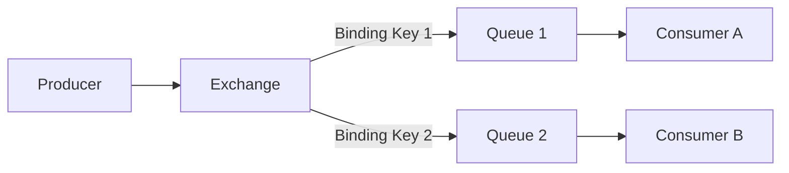

## 📌 Özet
Modern dağıtık sistemlerde asenkron iletişim ve olay güdümlü mimariler (Event-Driven Architecture) için message broker'lar kritik bir rol oynar; bu alanda öne çıkan iki ana aktör RabbitMQ ve Apache Kafka'dır. RabbitMQ, AMQP protokolünü temel alan, akıllı bir yönlendirme (smart broker / dumb consumer) mekanizması sunan ve mesajların tüketildikçe kuyruktan silindiği geleneksel bir mesaj kuyruğu sistemidir. Apache Kafka ise, yüksek hacimli veri akışlarını sürekli bir kayıt defteri (distributed commit log) mantığıyla işleyen, veriyi diskte saklayarak tekrar oynatılabilmesini sağlayan bir event streaming platformudur (dumb broker / smart consumer). RabbitMQ karmaşık yönlendirme stratejileri (routing, topic, fanout) ve düşük gecikmeli (low-latency) anlık işlemler için ideal bir çözüm sunarken, Kafka yüksek verim (high-throughput), stream analitiği ve log işleme gibi büyük veri senaryolarında eşsiz bir mimari avantaj sağlar. Bu iki teknolojinin karşılaştırması, projenin ihtiyaç duyduğu veri tutarlılığı, tüketim paterni ve ölçeklenebilirlik hedefleri doğrultusunda doğru mimari kararın verilmesini zorunlu kılar.

## ⚙️ Teknik Detaylar

### RabbitMQ (Message Broker) Mimarisi
Erlang ile geliştirilen RabbitMQ, geleneksel point-to-point veya pub-sub modellerine dayanır.

- **Exchange ve Binding:** Producer mesajı direkt kuyruğa (queue) değil, bir Exchange'e gönderir. Exchange, Binding kurallarına (routing key) göre mesajı ilgili kuyruklara yönlendirir (Direct, Topic, Fanout, Headers).
- **Mesajın Yaşam Döngüsü:** Consumer mesajı alıp işlediğinde `ACK` (Acknowledgement) gönderir. ACK alınan mesaj broker üzerinden kalıcı olarak silinir.
- **Push Model:** RabbitMQ, mesajları consumer'lara iterek (push) düşük gecikme (latency) hedefler. Consumer yavaşsa kuyruk şişebilir (pre-fetch count ile yönetilir).
- **Kullanım Senaryoları:** Arka plan görev işleme (background jobs), mikroservisler arası asenkron iletişim, karmaşık routing senaryoları.

### Apache Kafka (Event Streaming) Mimarisi
Kafka, log tabanlı veri saklama yaklaşımıyla çalışır. Mesajlara Event denir.

- **Topic ve Partition:** Veriler Topic'ler altında tutulur. Her Topic parçalara (Partition) bölünerek yatayda (farklı node'larda/broker'larda) ölçeklenir.
- **Commit Log ve Kalıcılık:** Gelen veriler append-only log dosyalarına yazılır ve tüketildikçe silinmez (belirlenen retention süresi boyunca diskte kalır).
- **Pull Model:** Tüketiciler veriyi kendi hızlarında broker'dan çeker (pull). Hangi partition'da, hangi sıradaki (Offset) mesajda kaldığını consumer (Consumer Group yardımıyla) kendisi takip eder.
- **Kullanım Senaryoları:** Event Sourcing, sistem loglarının toplanması, gerçek zamanlı stream işleme (Spark, Flink entegrasyonu), IoT telemetri verileri.

### Mimari Karşılaştırma Matrisi

| Özellik | RabbitMQ | Apache Kafka |
| :--- | :--- | :--- |
| **Mimari Yaklaşım** | Smart Broker / Dumb Consumer | Dumb Broker / Smart Consumer |
| **Veri Tutma (Retention)** | Mesaj işlenip ACK gelene kadar (Geçici) | Politikaya bağlı süreli (Kalıcı - Disk tabanlı) |
| **İletişim Modeli** | Push (Broker tüketiciye gönderir) | Pull (Tüketici broker'dan çeker) |
| **Yönlendirme Esnekliği** | Yüksek (Farklı Exchange tipleri) | Düşük (Sadece Topic bazlı) |
| **Ölçeklenebilirlik** | Dikeyde daha iyi (Clustering zordur) | Yatayda mükemmel (Partitioning) |
| **Performans (Throughput)** | On binler/saniye | Milyonlar/saniye |
| **Mesaj Sırası Garantisi** | Tek kuyrukta garanti edilir | Yalnızca Partition bazında garanti edilir |

### Seçim Kriterleri
- Eğer uygulamanız **event replay** (geçmiş veriyi tekrar oynatma), anlık milyarlarca olay işleme ve stream işleme gerektiriyorsa **Kafka**.
- Eğer sistem **karmaşık mesaj yönlendirme**, iş kuyrukları (task queue) ve gecikmesiz işlem bazlı tetiklemeler gerektiriyorsa **RabbitMQ**.