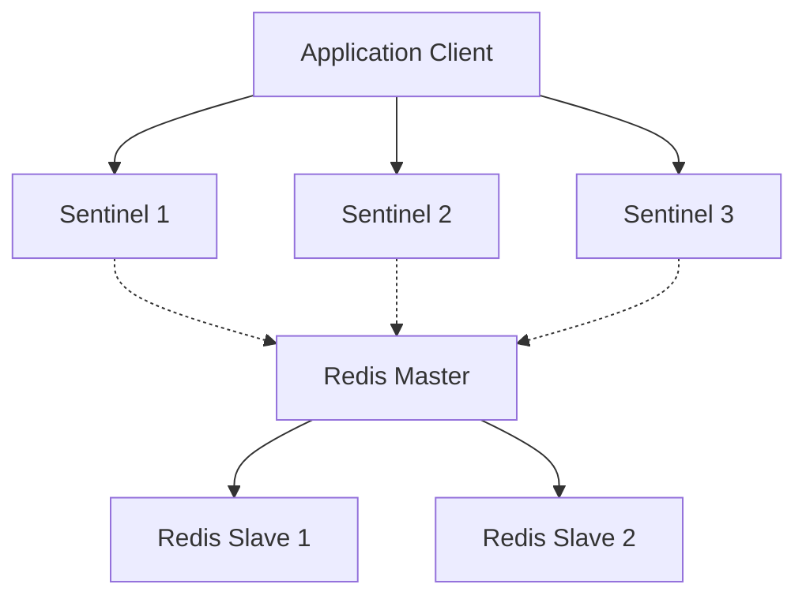

## 📌 Özet
Redis, salt bir bellek içi (in-memory) veri yapısı sunucusu olmanın ötesine geçerek, modern mimarilerde dağıtık bir mesaj kuyruğu, yüksek performanslı bir cache katmanı ve dayanıklı bir veritabanı olarak çok yönlü görevler üstlenmektedir. İleri seviye senaryolarda, tekil bir Redis sunucusunun kapasite ve erişilebilirlik limitlerini aşmak için Redis Sentinel ve Redis Cluster mimarileri devreye girer. Redis Sentinel, master-slave (primary-replica) yapıları üzerinden otomatik failover, izleme ve uyarı mekanizmaları sağlayarak yüksek erişilebilirliği (High Availability) garanti altına alırken; Redis Cluster, veriyi otomatik olarak shard'lara bölerek (partitioning) yatay ölçeklendirmeyi (horizontal scaling) mümkün kılar. Ek olarak, Lua betikleme (scripting) desteği sayesinde atomik ve karmaşık veri tabanı işlemleri sunucu tarafında tek bir adımda çalıştırılarak ağ gecikmeleri (network latency) minimize edilir. Bu ileri seviye özellikler, mikroservis mimarilerinde dağıtık kilitler, session yönetimi ve rate limiting gibi kritik operasyonların saniyenin altında gecikmelerle gerçekleştirilmesine zemin hazırlar.

## ⚙️ Teknik Detaylar

### Redis Sentinel (Yüksek Erişilebilirlik)
Sentinel, Redis kümesinde master düğümün çökmesi durumunda bir slave düğümü otomatik olarak master statüsüne yükselterek kesintiyi önleyen sistemdir.

- **Monitoring:** Master ve slave düğümlerinin sağlık durumlarını sürekli kontrol eder.
- **Notification:** Hedef düğümlerdeki problemleri API aracılığıyla yöneticilere veya diğer uygulamalara bildirir.
- **Automatic Failover:** Master düştüğünde, Sentinel düğümleri kendi aralarında oylama (quorum) yaparak yeni master'ı seçer. Seçilen master, diğer slave'ler tarafından takip edilmeye başlanır.
- **Configuration Provider:** İstemciler (clients), mevcut master'ın IP adresini öğrenmek için direkt Redis'e değil Sentinel'e bağlanırlar.



### Redis Cluster (Yatay Ölçeklendirme ve Sharding)
Veri setinin tek bir sunucu belleğine sığmadığı durumlarda Redis Cluster kullanılır.

- **Hash Slots:** Küme, 16384 adet hash slot'a bölünmüştür. Verinin anahtarı `CRC16(key) mod 16384` formülü ile hesaplanarak hangi slot'a düşeceği belirlenir.
- **Dağıtık Mimari:** Proxy tabanlı değildir. Düğümler arası P2P (Gossip) iletişim vardır. İstemci yanlış düğüme giderse `MOVED` hatası ile doğru düğüme yönlendirilir.
- **Replikasyon ve Failover:** Cluster içindeki her master node'un kendi slave node'ları bulunabilir. Bir master çökerse, kendi slave'i master statüsüne geçer. Tüm master'lar failover için oylama yapar, dışarıdan Sentinel gerekmez.

### Lua Scripting ve Atomik İşlemler
Redis tek thread (single-threaded) çalıştığı için, bir Lua script'i çalışırken diğer komutlar bloklanır. Bu özellik yarış durumlarını (race condition) engeller.

- **Ağ Gecikmesi Optimizasyonu:** Normalde 5 farklı komut göndermek 5 round-trip gerektirir. Lua ile tüm iş akışı tek seferde Redis'e gönderilir.
- **Dağıtık Kilit (Distributed Lock):** Redis'te dağıtık kilit açarken `SETNX` kullanılabilir ancak kilidin serbest bırakılması (unlock) sırasında "kilit benim mi?" kontrolü ile silme işlemi atomik olmalıdır. Lua bu işlem için biçilmiş kaftandır.

**Örnek Lua Script (Rate Limiter):**
```lua
local current = redis.call("INCR", KEYS[1])
if current == 1 then
    redis.call("EXPIRE", KEYS[1], ARGV[1])
end
if current > tonumber(ARGV[2]) then
    return 0 -- Limit aşıldı
end
return 1 -- Başarılı
```