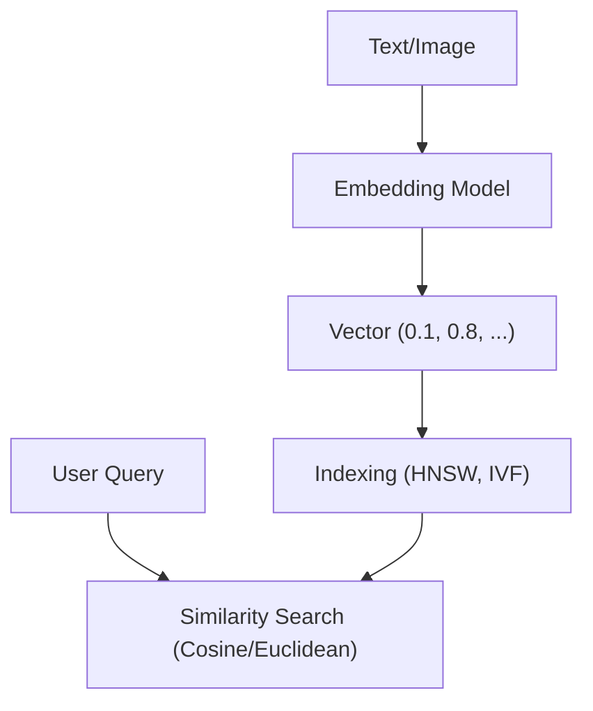

## 📌 Ozet
Vektör veritabanları, verileri çok boyutlu uzayda vektörler (sayı dizileri) olarak saklayan sistemlerdir. Yapay zeka uygulamalarında benzerlik araması (Similarity Search) yapmak için kullanılırlar. Standart SQL veritabanlarından farkı, "tam eşleşme" yerine "en yakın komşuyu" (Approximate Nearest Neighbor - ANN) bulmalarıdır.

## 🧠 Detay

### 1. İndeksleme Algoritmaları
- **HNSW (Hierarchical Navigable Small World):** En popüler ve hızlı grafik tabanlı arama algoritması.
- **IVF (Inverted File Index):** Veriyi kütüphane rafları gibi bölerek aramayı hızlandırır.

### 2. Mesafe Metrikleri
- **Cosine Similarity:** İki vektör arasındaki açıyı ölçer (Genelde metinlerde kullanılır).
- **Euclidean Distance:** İki nokta arasındaki kuş uçuşu mesafeyi ölçer.

## 💡 Baglantilar
- [[LLM - Vektör Veritabanları (Pinecone, Milvus)]]
- [[LLM - RAG (Retrieval Augmented Generation) Mimarisi]]
