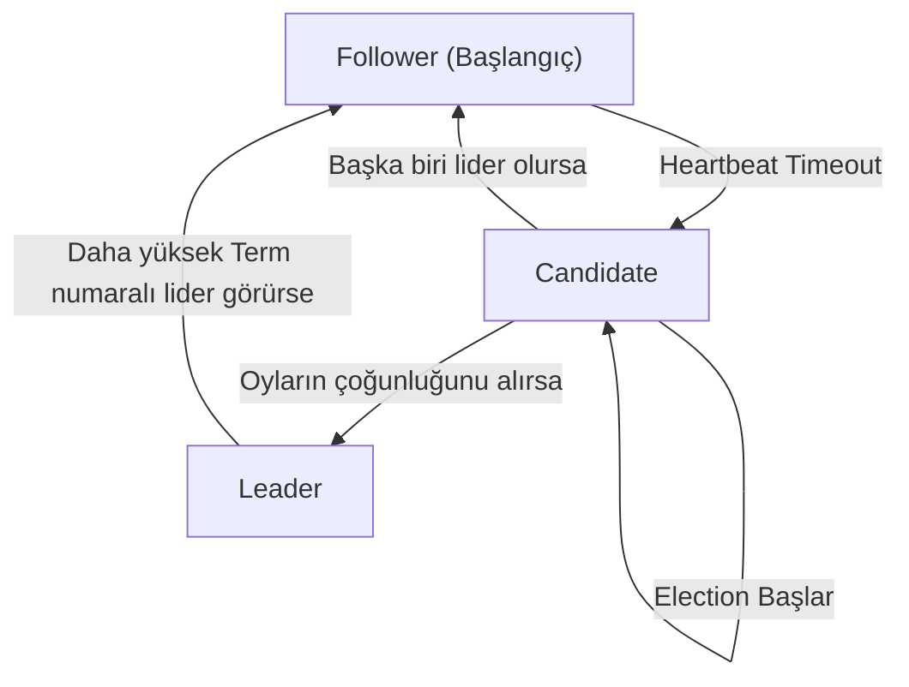

## 📌 Özet
Dağıtık veritabanlarında yüksek erişilebilirliği (High Availability) ve hata toleransını (Fault Tolerance) sağlamanın temel yolu, veriyi farklı fiziksel makinelerde kopyalamak, yani Veri Çoğaltma (Replication) işlemidir. Ancak, verinin kopyaları çoğaldıkça, tüm düğümlerin verinin son ve doğru durumu üzerinde anlaşmaya varması (Consensus) zorunlu bir problem haline gelir. Ağ gecikmeleri, sunucu çökmeleri veya iletişim kopuklukları durumunda sistemdeki düğümlerin birbirleriyle çelişmesini engellemek için Paxos ve Raft gibi matematiksel olarak ispatlanmış Consensus Algoritmaları devreye girer. Paxos, teorik olarak son derece sağlam ancak anlaşılması ve uygulanması oldukça zor bir algoritma iken; Raft, lider seçimi (leader election) ve log çoğaltma (log replication) gibi işlemleri alt modüllere ayırarak mühendislik açısından daha pratik ve yaygın (etcd, Consul) bir çözüm sunar. Bu algoritmalar sayesinde dağıtık kümeler, dışarıdan tek bir sunucuymuş gibi güvenilir (CP sistemler) bir tutarlılık sergiler.

## ⚙️ Teknik Detaylar

### Veri Çoğaltma (Replication) Stratejileri
Sistemlerin CAP teoremindeki tercihlerine göre çoğaltma mimarileri değişir.

1. **Single-Leader (Master-Slave) Replication:**
   - Yazma işlemleri sadece Lider düğüme yapılır. Lider, veri loglarını Slave düğümlere asenkron (hızlı) veya senkron (güvenli) olarak gönderir.
   - Okumalar Slave'lerden yapılabilir (Read-scaling). Lider çökerse failover gerekir.
2. **Multi-Leader Replication:**
   - Birden fazla veri merkezinde (Datacenter) aktif yazma yapılabilen liderler vardır. Liderler arası çakışma çözümü (conflict resolution) gerektirir.
3. **Leaderless Replication:**
   - Lider yoktur, her düğüm yazma/okuma kabul eder (örn. Cassandra). Quorum (çoğunluk) mekanizması ile tutarlılık hesaplanır (`W + R > N`).

### Dağıtık Mutabakat (Consensus) Nedir?
Birden fazla sunucunun, kendi aralarında iletişim kurarak tek bir değer (veya işlem sırası) üzerinde anlaşmaya varmasıdır.
- **Split-Brain (Beyin Bölünmesi):** Ağın ikiye bölünüp, her iki tarafın kendi liderini seçmesi ve birbirinden bağımsız veri yazması durumudur. Consensus algoritmaları "Quorum" (N/2 + 1) mantığıyla bunun önüne geçer.

### Paxos Algoritması
Leslie Lamport tarafından geliştirilen, endüstride Google Spanner, Apache Cassandra (hafifleştirilmiş versiyon) gibi sistemlerde kullanılan öncü algoritmadır.

- **Roller:** Proposers (Önerenler), Acceptors (Kabul edenler), Learners (Öğrenenler).
- **Aşamalar:**
  1. *Prepare/Promise:* Proposer, artan bir sıra numarası ile öneri sunar. Acceptor'lar daha yüksek numaralı bir öneri almadıysa onay sözü (promise) verir.
  2. *Accept/Accepted:* Çoğunluktan söz alındıysa, Proposer değeri yazar ve Acceptor'lara "Bunu kabul edin" der.
- **Zorluk:** Liderlik açıkça tanımlanmadığından, birden fazla Proposer aynı anda sürekli yeni sıra numaraları ile sisteme yüklenirse "Dueling Proposers" kilitlenmesi yaşanabilir. Implementasyonu inanılmaz zordur.

### Raft Algoritması
Stanford Üniversitesi'nde Paxos'un karmaşıklığına alternatif olarak "Anlaşılabilirlik" (Understandability) odaklı geliştirilmiştir (Kullanım: etcd, Consul, CockroachDB).

- **Kesin Liderlik:** Raft, güçlü bir Lider seçimi ile başlar. Tüm loglar Lider üzerinden diğer düğümlere akar.
- **Durumlar (States):** Her düğüm üç durumdan birindedir: *Leader*, *Follower*, *Candidate*.

**Raft İşleyiş Mekanizması:**
1. **Lider Seçimi (Leader Election):** Liderden `heartbeat` (yaşam sinyali) almayan bir Follower, zaman aşımına uğrar ve Candidate olup oylama (Election Term) başlatır. Kendine oy verir ve diğerlerinden oy ister. Çoğunluğu alan yeni Lider olur.
2. **Log Çoğaltma (Log Replication):**
   - Lider, istemciden komutu alır ve kendi loguna ekler (henüz işlemez/uncommitted).
   - Bu log girdisini Follower'lara gönderir (AppendEntries).
   - Follower'ların çoğunluğu logu diske yazdığını onaylarsa (ACK), Lider işlemi "Committed" (İşlenmiş) olarak işaretler ve durumu uygular. Ardından Follower'lara logu commit etmelerini söyler.