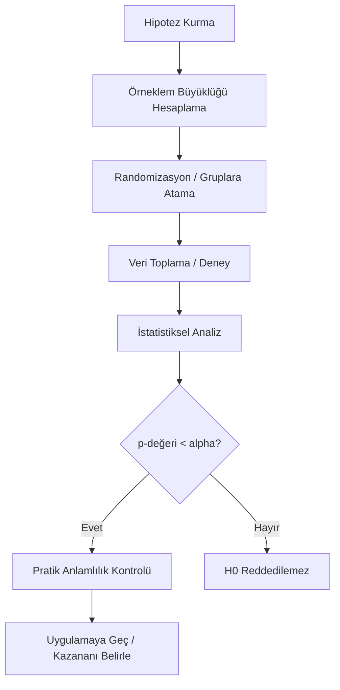

## 📌 Özet
A/B testi, iki versiyonun (A ve B) hangisinin daha iyi performans gösterdiğini belirlemek için yapılan randomize kontrollü bir deneydir. Ürün geliştirme ve dijital pazarlamada altın standarttır.

---

## 🧠 Detay

### 🗺️ A/B Testi Süreç Akışı

### 1. Planlama Aşaması
- **Metrik Seçimi**: Birincil (Primary) metrik net olmalı (Örn: Tıklama oranı - CTR).
- **Hipotez**: "Yeni buton rengi tıklama oranını %5 artıracak."
- **Örneklem Büyüklüğü (Power Analysis)**:
    - **Minimum Detectable Effect (MDE)**: Görmek istediğimiz en küçük fark.
    - **Güç (1-beta)**: Genellikle %80.
    - **Anlamlılık (alpha)**: Genellikle %5.

### 2. Uygulama ve Kontrol
- **Randomizasyon**: Kullanıcıların gruplara tamamen rastgele atanması.
- **Novelty Effect**: Kullanıcıların yenilik nedeniyle başta farklı davranması.
- **Süre**: Hafta içi/sonu etkisini görmek için genellikle en az 1-2 hafta.

### 3. Analiz ve Hatalar
- **Peeking Problem**: Test bitmeden verilere bakıp durdurmak Tip I hatayı artırır!
- **Çoklu Karşılaştırma**: Aynı anda 10 metrik test edilirse biri şans eseri anlamlı çıkabilir (Bonferroni düzeltmesi gerekebilir).

---

## 💡 Bağlantılar
- [[STAT - Hipotez Testleri - Temel Kavramlar]]
- [[STAT - Örneklem Büyüklüğü ve Güç Analizi]]
- [[STAT - Nedensellik ve Nedensel Çıkarım]]

## ❓ Sorular / Anlamadıklarım
- Örneklem yeterli değilse ne yapmalıyım? (Test süresini uzat veya MDE'yi artır).

## 🔗 Kaynaklar
- Trustworthy Online Controlled Experiments (Kohavi et al.)
- Evan Miller's A/B Tools
