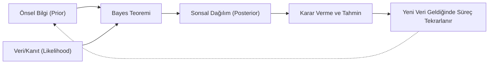

## 📌 Özet

Bayes istatistiği, parametreleri sabit birer değer yerine, olasılık dağılımına sahip rastlantı değişkenleri olarak kabul eden modern bir istatistiksel yaklaşımıdır. Bu yöntem, analiz sürecine "önsel bilgi" (prior) katarak, mevcut veriden elde edilen kanıtlarla (likelihood) bu bilgiyi birleştirir ve "sonsal dağılımı" (posterior) oluşturur. Frekansçı yaklaşımın aksine, veriyi sabit, parametreyi ise belirsiz kabul ederek doğrudan olasılık çıkarımları yapmaya olanak tanır. Özellikle karmaşık veri yapılarında ve küçük örneklemlerde, uzman görüşünü veya geçmiş çalışmaları analize dahil edebilme özelliği sayesinde oldukça esnek ve güçlüdür.

---

## 🧠 Detay



### Frekansçı vs Bayes Felsefesi

| | Frekansçı | Bayesci |
|---|---|---|
| **Parametre** | Sabit, bilinmeyen | Rastlantı değişkeni |
| **Olasılık** | Uzun vadeli frekans | İnanç derecesi |
| **Veri** | Rastlantısal | Sabit (gözlemlenmiş) |
| **Çıkarım** | p-değeri, güven aralığı | Sonsal dağılım |
| **Güven Aralığı** | %95 GA → prosedür güvencesi | Kredibilite aralığı → doğrudan olasılık |

---

### Bayes Teoremi (İstatistikte)

$$\underbrace{p(\theta|X)}_{\text{Sonsal}} = \frac{\underbrace{p(X|\theta)}_{\text{Likelihood}} \times \underbrace{p(\theta)}_{\text{Önsel}}}{\underbrace{p(X)}_{\text{Marjinal}}}$$

$$\text{Posterior} \propto \text{Likelihood} \times \text{Prior}$$

### Terminoloji

- **Prior** $p(\theta)$: Veri öncesi parametre hakkında bilgi
- **Likelihood** $p(X|\theta)$: Veri, $\theta$ değeri verilmişken ne kadar olası?
- **Posterior** $p(\theta|X)$: Veriyi gördükten sonra $\theta$ hakkında güncellenen inanç
- **Marjinal Likelihood** $p(X)$: Normalleştirme sabiti

### Konjuge Önsel Dağılımlar

Likelihood-Prior kombinasyonu aynı aileden posterior üretirse → **konjuge**.

| Likelihood | Konjuge Prior | Posterior |
|---|---|---|
| Binom | Beta | Beta |
| Normal (μ bilinmiyor) | Normal | Normal |
| Poisson | Gamma | Gamma |
| Üstel | Gamma | Gamma |

**Binom-Beta Örneği:**

$X \sim Binom(n, p)$, $p \sim Beta(\alpha, \beta)$ ise:
$$p | X=k \sim Beta(\alpha + k,\ \beta + n - k)$$

Posterior ortalama: $\frac{\alpha + k}{\alpha + \beta + n}$

### Önsel Seçimi

| Prior Türü | Açıklama |
|---|---|
| **Bilgilendirici** | Güçlü önceki bilgi var |
| **Zayıf Bilgilendirici** | Genel kısıtlamalar (ör. pozitif) |
| **Belirsiz/Düz** | Bilgi yok, $p(\theta) \propto 1$ |
| **Jeffreys** | Parametrik dönüşüme göre değişmez |

### Bayesci Tahmin

**Posterior Ortalama** (MAP Tahmini'nin alternatifi):
$$\hat{\theta}_{Bayes} = E[\theta|X]$$

**MAP (Maximum a Posteriori)**:
$$\hat{\theta}_{MAP} = \arg\max_\theta p(\theta|X) = \arg\max_\theta [p(X|\theta)p(\theta)]$$

MAP = L2 ceza → Ridge regresyon
MAP + Laplace prior = L1 ceza → Lasso

### Kredibilite Aralığı (Credible Interval)

$$P(\theta \in [a,b] | X) = 0.95$$

**Frekansçı GA'dan farkı**: Kredibilite aralığı gerçekten "$\theta$'nın %95 olasılıkla bu aralıkta" demektir. GA için bu yorum hatalıdır.

### Bayesci Model Karşılaştırma

**Bayes Faktörü:**
$$BF_{12} = \frac{p(X|M_1)}{p(X|M_2)}$$

| BF | Yorum |
|---|---|
| 1-3 | Zayıf kanıt |
| 3-10 | Orta kanıt |
| 10-100 | Güçlü kanıt |
| >100 | Çok güçlü kanıt |

### MCMC (Markov Chain Monte Carlo)

Posteriorun analitik çözümü yoksa sayısal örnekleme.

**Metropolis-Hastings:**
1. Mevcut $\theta$'dan aday $\theta^*$ öner
2. $\alpha = \min\!\left(1, \frac{p(\theta^*|X)}{p(\theta|X)}\right)$ hesapla
3. $\alpha$ olasılıkla kabul et

**Gibbs Sampling**: Her parametreyi sırayla tam koşullu dağılımından örnekle.

**Modern Araçlar**: Stan, PyMC, JAGS

```python
import pymc as pm
import numpy as np

# Binom örneği: Para atışı
with pm.Model() as coin_model:
    # Prior
    p = pm.Beta('p', alpha=1, beta=1)
    
    # Likelihood
    obs = pm.Binomial('obs', n=100, p=p, observed=55)
    
    # MCMC örnekleme
    trace = pm.sample(2000, tune=1000, return_inferencedata=True)
    
    # Posterior özeti
    pm.summary(trace)
```

---

## 💡 Bağlantılar
- [[STAT - Olasılık Temelleri]]
- [[STAT - Olasılık Dağılımları (Sürekli)]]
- [[STAT - Hipotez Testleri - Temel Kavramlar]]
- [[ML - Naive Bayes]]

## ❓ Sorular / Anlamadıklarım


## 🔗 Kaynaklar
- Think Bayes (Allen Downey) - Free online
- Bayesian Data Analysis (Gelman et al.)
- PyMC Documentation
