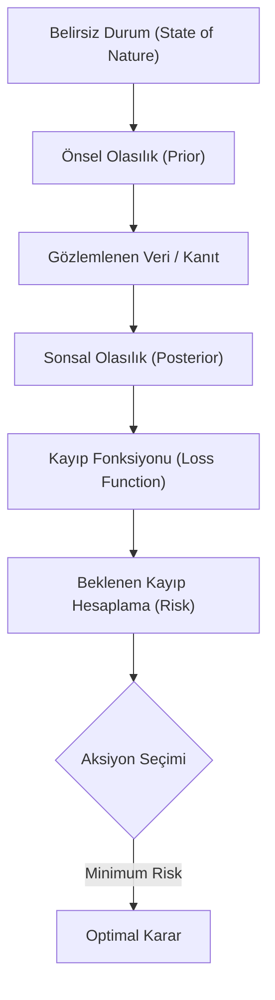

## 📌 Özet
Bayesci Karar Teorisi (Bayesian Decision Theory), belirsizlik altında optimal kararlar almak için olasılık teorisi ile ekonomi (fayda teorisi) prensiplerini birleştiren matematiksel bir çerçevedir. Bu yaklaşım, sadece bir olayın gerçekleşme olasılığını hesaplamakla kalmaz; aynı zamanda yanlış kararın maliyetini (risk) ve doğru kararın getirisini (utility) de hesaba katar. "Minimum beklenen kayıp" veya "maksimum beklenen fayda" prensibine dayanarak, bir ajanın (veya modelin) her durumda hangi aksiyonu alması gerektiğini rasyonel bir şekilde belirler.

---

## 🧠 Detay

### 🗺️ Bayesci Karar Verme Döngüsü

### 1. Temel Bileşenler
- **Aksiyon Uzayı ($\mathcal{A}$):** Karar vericinin alabileceği tüm olası kararlar (örn: "Hastalık var" veya "Hastalık yok").
- **Durum Uzayı ($\Theta$):** Doğanın gerçek hali (örn: Hastanın gerçekten hasta olması veya sağlıklı olması).
- **Kayıp Fonksiyonu ($L(a, \theta)$):** Gerçek durum $\theta$ iken $a$ aksiyonunu almanın maliyeti.

### 2. Beklenen Risk (Expected Risk)
Bir $a$ aksiyonu için beklenen risk, sonsal dağılım üzerinden alınan kayıp ortalamasıdır:
$$R(a|x) = \int L(a, \theta) P(\theta | x) d\theta$$
Optimal aksiyon ($a^*$), bu riski minimum yapan aksiyondur.

### 3. Klasik Kayıp Fonksiyonları
- **0-1 Kayıp (Zero-One Loss):** Yanlış karara 1, doğruya 0 puan verir. Sınıflandırma problemlerinde kullanılır.
- **Karesel Kayıp (Squared Error Loss):** Hatanın karesini alır ($(\theta - a)^2$). Regresyonda ortalama (mean) değerini verir.
- **Mutlak Kayıp (Absolute Error Loss):** Hatanın mutlak değerini alır ($|\theta - a|$). Medyan değerini optimal kılar.

### 4. Örnek: Tıbbi Teşhis
- Bir hastaya yanlışlıkla "kanser" demek (Yanlış Pozitif) üzücüdür ama düzeltilebilir.
- Kanser olan birine "sağlıklı" demek (Yanlış Negatif) ölümcül olabilir.
Bayesci Karar Teorisi, Yanlış Negatifin maliyetini çok daha yüksek tanımlayarak, modelin daha "temkinli" karar vermesini sağlar.

---

## 💡 Bağlantılar
- [[STAT - Bayesci Çıkarım ve MCMC]]
- [[ML - Model Değerlendirme Metrikleri]]
- [[İstatistik - Hipotez Testleri - Temel Kavramlar]]

## ❓ Sorular / Anlamadıklarım
- "Maximum Likelihood" kararı ile "Bayesian Optimal" kararı ne zaman aynı olur?
- Kayıp fonksiyonunu belirlerken subjektiflikten nasıl kaçınılır?

## 🔗 Kaynaklar
- [Statistical Decision Theory and Bayesian Analysis (James O. Berger)](https://www.springer.com/gp/book/9780387960982)
- [Pattern Recognition and Machine Learning (Christopher Bishop) - Ch. 1.5](https://www.microsoft.com/en-us/research/people/mibishop/prml-book/)
