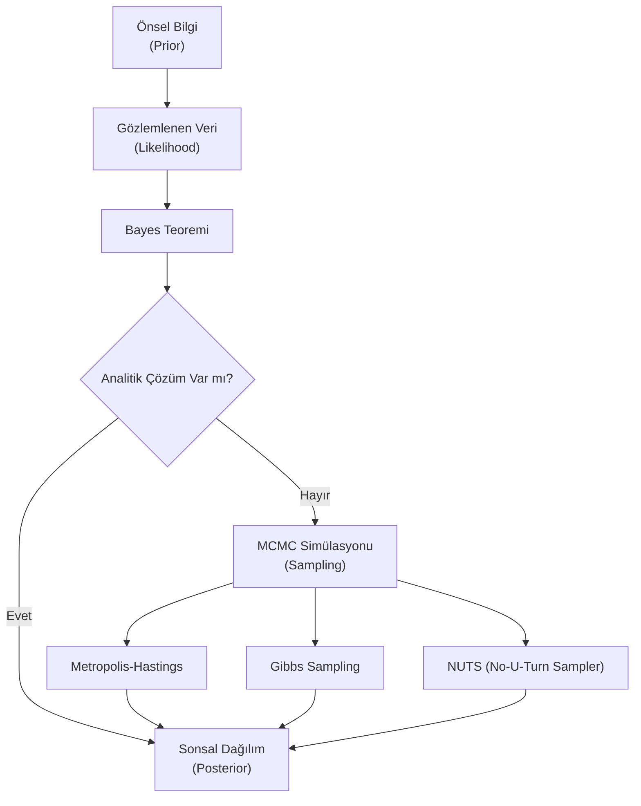

## 📌 Özet
Bayesci Çıkarım (Bayesian Inference), veriyi kullanarak parametreler hakkındaki olasılıksal inançlarımızı güncelleme sürecidir. Klasik (Frekansçı) istatistik parametreleri sabit görürken, Bayesci yaklaşım parametreleri olasılık dağılımları olarak ele alır. Karmaşık Bayes modellerinde sonsal (posterior) dağılımı analitik olarak hesaplamak imkansız hale geldiğinde, **Markov Chain Monte Carlo (MCMC)** algoritmaları devreye girer. MCMC, dağılımdan rastgele örnekler çekerek sonsal dağılımı sayısal olarak simüle eder ve modern Bayesci istatistiğin bel kemiğini oluşturur.

---

## 🧠 Detay

### 🗺️ Bayesci Güncelleme ve MCMC Süreci

### 1. Bayes Teoremi'nin Çıkarımsal Yapısı
$$P(\theta | D) = \frac{P(D | \theta) P(\theta)}{P(D)}$$
- **Posterior ($P(\theta|D)$):** Veriyi gördükten sonra parametre hakkındaki yeni bilgimiz.
- **Likelihood ($P(D|\theta)$):** Verinin model parametrelerine ne kadar uygun olduğu.
- **Prior ($P(\theta)$):** Veriyi görmeden önceki inancımız.
- **Evidence ($P(D)$):** Verinin toplam olasılığı (MCMC'de sadeleşir).

### 2. MCMC (Markov Chain Monte Carlo) Neden Gereklidir?
Bayes formülündeki payda ($P(D)$), tüm parametre uzayı üzerinden integral almayı gerektirir. Çok boyutlu modellerde bu integralin çözümü imkansızdır. MCMC algoritmaları, bu integrali çözmek yerine sonsal dağılımın en yoğun olduğu bölgelerde daha çok vakit geçirerek örnekler toplar.

### 3. Temel Algoritmalar
- **Metropolis-Hastings:** Bir "öneri" (proposal) noktası seçer ve bu noktayı belirli bir kabul olasılığına göre kabul eder.
- **Gibbs Sampling:** Parametreleri tek tek, diğerlerini sabit tutarak günceller. Çok boyutlu modellerde çok etkilidir.
- **HMC (Hamiltonian Monte Carlo):** Fizik prensiplerini (enerji) kullanarak parametre uzayında daha hızlı ve kararlı gezinir (PyMC ve Stan bu yöntemi kullanır).

### 4. Yakınsama Kontrolü (Diagnostics)
MCMC örneklerinin gerçek dağılımı temsil edip etmediğini kontrol etmek için:
- **Trace Plot:** Zincirin parametre uzayındaki hareketi (bulanık bir tırtıl gibi görünmelidir).
- **R-Hat ($\hat{R}$):** Zincirler arası varyansın zincir içi varyansa oranı (1.0'a yakın olmalıdır).
- **Effective Sample Size (ESS):** Örneklerin ne kadarının bağımsız bilgi taşıdığı.

---

## 💡 Bağlantılar
- [[STAT - Bayes İstatistiği]]
- [[STAT - Olasılık Temelleri]]
- [[Machine Learning - Naive Bayes]]

## ❓ Sorular / Anlamadıklarım
- "Burn-in" veya "Warm-up" dönemi MCMC'de neden gereklidir?
- Uninformative (bilgi içermeyen) prior seçimi sonuçları nasıl etkiler?

## 🔗 Kaynaklar
- [Statistical Rethinking (Richard McElreath)](https://xcelab.net/rm/statistical-rethinking/)
- [Bayesian Data Analysis (Gelman et al.)](http://www.stat.columbia.edu/~gelman/book/)
