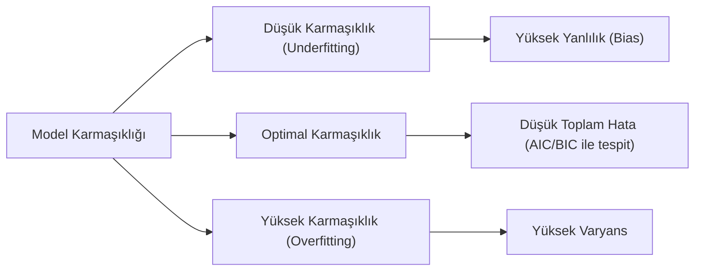

## 📌 Özet

Model seçimi, bir veri setini en iyi açıklayan matematiksel modelin, aşırı karmaşıklıktan (overfitting) kaçınılarak belirlenmesi sürecidir. İstatistiksel analizlerde, modelin veriye uyumu (fit) ile kullanılan parametre sayısı (parsimony) arasında hassas bir denge kurulması gerekir; çünkü gereğinden fazla parametre içeren modeller eğitim verisine çok iyi uysa da yeni verilerde başarısız olur. Akaike Bilgi Kriteri (AIC) ve Bayes Bilgi Kriteri (BIC) gibi yöntemler, modelleri karşılaştırırken fazla parametre kullanımı için bir "ceza terimi" uygulayarak en optimal modeli seçmeye yardımcı olur. Bu süreç, modelin genelleme yeteneğini artırarak hem tahmin performansını iyileştirir hem de yorumlanabilirliği sağlar.

---

## 🧠 Detay



### Bias-Variance Tradeoff

$$MSE(\hat{f}(x)) = \underbrace{[Bias(\hat{f}(x))]^2}_{\text{Model yanlılığı}} + \underbrace{Var(\hat{f}(x))}_{\text{Model değişkenliği}} + \underbrace{\sigma^2}_{\text{İndirgenemez hata}}$$

| Model Karmaşıklığı | Bias | Varyans | Sonuç |
|---|---|---|---|
| Çok basit | Yüksek | Düşük | Underfitting |
| Çok karmaşık | Düşük | Yüksek | Overfitting |
| Optimal | Dengeli | Dengeli | ✅ |

---

### Akaike Bilgi Kriteri (AIC)

$$AIC = 2k - 2\ln(\hat{L})$$

- $k$: Parametre sayısı
- $\hat{L}$: Maksimum log-likelihood

**Küçük örneklem için AICc:**
$$AICc = AIC + \frac{2k(k+1)}{n-k-1}$$

**Yorumlama:**
- **Küçük AIC = Daha iyi model**
- $\Delta AIC < 2$: Modeller benzer destekte
- $\Delta AIC > 10$: Büyük fark, üst model güçlü destek

**Akaike Ağırlıkları:**
$$w_i = \frac{e^{-\Delta_i/2}}{\sum_j e^{-\Delta_j/2}}$$

Model seçim belirsizliğini ölçer.

---

### Bayes Bilgi Kriteri (BIC)

$$BIC = k\ln(n) - 2\ln(\hat{L})$$

**AIC vs BIC Farkları:**

| Özellik | AIC | BIC |
|---|---|---|
| Ceza terimi | $2k$ | $k\ln(n)$ |
| Büyük n'de | Daha az cezalandırır | Daha çok cezalandırır |
| Hedef | Tahmin doğruluğu | Gerçek model keşfi |
| Seçim eğilimi | Daha karmaşık | Daha basit |

**Hangi kullanılmalı?**
- Tahmin amaçlı → AIC
- Gerçek modeli bulmak → BIC
- Büyük n'de → BIC (AIC'den genellikle farklı)

---

### Diğer Bilgi Kriterleri

**DIC (Deviance Information Criterion)**: Bayesci modeller için.

**WAIC (Widely Applicable IC)**: Daha genel, Bayesci tahmine dayalı.

**Hannan-Quinn Criterion:**
$$HQC = 2k\ln\ln(n) - 2\ln(\hat{L})$$

AIC ile BIC arasında bir ceza.

---

### Regülarizasyon (Ceza Ekleme)

#### Ridge Regresyon (L2)

$$\hat{\boldsymbol{\beta}}_{Ridge} = \arg\min_\beta \left[\sum(y_i - \mathbf{x}_i^T\boldsymbol{\beta})^2 + \lambda\sum_{j=1}^p \beta_j^2\right]$$

- Katsayıları sıfıra yaklaştırır ama sıfır yapmaz
- Çoklu doğrusallıkta iyi
- Kapalı form çözümü: $\hat{\boldsymbol{\beta}} = (\mathbf{X}^T\mathbf{X} + \lambda\mathbf{I})^{-1}\mathbf{X}^T\mathbf{y}$

#### Lasso Regresyon (L1)

$$\hat{\boldsymbol{\beta}}_{Lasso} = \arg\min_\beta \left[\sum(y_i - \mathbf{x}_i^T\boldsymbol{\beta})^2 + \lambda\sum_{j=1}^p |\beta_j|\right]$$

- Katsayıları tam sıfıra çekebilir → **Otomatik değişken seçimi**
- Kapalı form çözümü yok (koordinat iniş)

#### Elastic Net

$$\hat{\boldsymbol{\beta}} = \arg\min_\beta \left[\text{RSS} + \lambda_1\sum|\beta_j| + \lambda_2\sum\beta_j^2\right]$$

L1 + L2 kombinasyonu. Gruplu değişkenler için.

**λ Seçimi**: Çapraz doğrulama ile.

| Yöntem | Değişken Seçimi | Çoklu Doğrusallık | Grup Değişkenler |
|---|---|---|---|
| Ridge | ❌ | ✅ | ✅ |
| Lasso | ✅ | Kısmi | ❌ |
| Elastic Net | ✅ | ✅ | ✅ |

---

### Model Karşılaştırma Stratejisi

1. **Likelihood Ratio Testi** (iç içe modeller):
$$LRT = -2(\ell_0 - \ell_1) \sim \chi^2_{df_1 - df_0}$$

2. **AIC/BIC** (iç içe olmayan modeller dahil)

3. **Çapraz Doğrulama** (tahmin performansı)

4. **F-testi** (regresyon, iç içe modeller)

---

### Python

```python
import numpy as np
from sklearn.linear_model import Ridge, Lasso, ElasticNet
from sklearn.model_selection import cross_val_score
import statsmodels.api as sm

# AIC ve BIC (statsmodels)
model = sm.OLS(y, X).fit()
print(f'AIC: {model.aic:.2f}')
print(f'BIC: {model.bic:.2f}')

# Ridge
from sklearn.linear_model import RidgeCV
ridge = RidgeCV(alphas=[0.1, 1, 10, 100], cv=5)
ridge.fit(X_train, y_train)
print(f'Optimal λ: {ridge.alpha_}')

# Lasso
from sklearn.linear_model import LassoCV
lasso = LassoCV(cv=5, random_state=42)
lasso.fit(X_train, y_train)

# Cross-validation ile karşılaştırma
for model in [ols_model, ridge, lasso]:
    scores = cross_val_score(model, X, y, cv=10, scoring='neg_mse')
    print(f'CV RMSE: {np.sqrt(-scores.mean()):.4f}')
```

---

## 💡 Bağlantılar
- [[STAT - Çoklu Doğrusal Regresyon]]
- [[STAT - Yeniden Örnekleme Yöntemleri]]
- [[ML - Overfitting ve Underfitting]]
- [[ML - Özellik Seçimi]]

## ❓ Sorular / Anlamadıklarım


## 🔗 Kaynaklar
- Introduction to Statistical Learning (ISLR) - Ch. 6
- Elements of Statistical Learning (ESL) - Ch. 7
