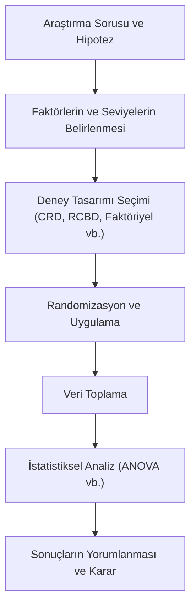

## 📌 Özet

Deneysel tasarım (Experimental Design), değişkenler arasındaki neden-sonuç ilişkilerini bilimsel ve geçerli bir şekilde ortaya koymak için kullanılan sistematik bir planlama sürecidir. Bu süreçte araştırmacı, bağımsız değişkenleri (faktörleri) kontrollü bir şekilde manipüle ederek bağımlı değişken (yanıt) üzerindeki etkilerini gözlemler. İyi bir deneysel tasarım; dışsal değişkenlerin etkisini minimize eden kontrol grupları, karıştırıcı etkileri dengeleyen randomizasyon (rastgele atama) ve sonuçların güvenilirliğini artıran replikasyon (tekrarlama) prensiplerine dayanır. Doğru tasarlanmış bir deney, karmaşık veri yapılarında bile faktörlerin tekil ve etkileşimli etkilerini birbirinden ayrıştırmaya olanak tanır.

---

## 🧠 Detay



### Temel Kavramlar

| Kavram | Tanım |
|---|---|
| **Faktör** | Manipüle edilen bağımsız değişken |
| **Seviye** | Faktörün aldığı değerler |
| **Yanıt (Response)** | Bağımlı değişken |
| **Denek (Subject)** | Deney birimi |
| **Blok** | Benzer deneklerin grubu |
| **Replikasyon** | Her koşulun tekrarı |

### Fisher'ın 3 Prensibi

1. **Randomizasyon**: Denekleri gruplara rastgele ata → karıştırıcı faktörleri dengele
2. **Replikasyon**: Her koşulu birden fazla tekrarla → tahmin güvenilirliği
3. **Yerel kontrol**: Bloklar kullan → bilinen karıştırıcıları kontrol et

---

### Randomize Kontrollü Deney (RCT)

En güçlü nedensellik tasarımı.

```
Denekler → Rastgele Atama → Müdahale grubu
                         → Kontrol grubu
         ↓
    Ölçüm karşılaştırması
```

**Kör (Blinding):**
- **Tek kör**: Denek bilmiyor
- **Çift kör**: Denek + araştırmacı bilmiyor
- **Üçlü kör**: + Veri analistleri bilmiyor

**ITT (Intention-to-Treat)**: Atandıkları gruba göre analiz et, uyum ne olursa olsun.

---

### Tamamen Rastgele Tasarım (CRD)

Denekler koşullara tamamen rastgele atanır. **Tek yönlü ANOVA** ile analiz.

**Uygun:** Denekler homojen ise.

---

### Randomize Tam Blok Tasarımı (RCBD)

Benzer denekler bloklanır, her blokta tüm koşullar uygulanır.

| Blok | Koşul A | Koşul B | Koşul C |
|---|---|---|---|
| 1 | ✓ | ✓ | ✓ |
| 2 | ✓ | ✓ | ✓ |

**Analiz:** Bloğu faktör olarak ekle → Tekrarlı ölçümler ANOVA.

**Avantaj:** Blok içi varyasyon elenir → Daha güçlü test.

---

### Latin Kare Tasarımı

İki karıştırıcı (satır + sütun) kontrol edilir.

$$\begin{pmatrix} A & B & C \\ B & C & A \\ C & A & B \end{pmatrix}$$

Her satır ve sütunda her koşul tam olarak bir kez. $n \times n$ matris için $n$ koşul.

---

### Faktöriyel Tasarım

**2 faktör × 2 seviye = 2² = 4 koşul**

| | B1 | B2 |
|---|---|---|
| **A1** | A1B1 | A1B2 |
| **A2** | A2B1 | A2B2 |

**Avantaj:**
- Ana etkiler: A'nın etkisi, B'nin etkisi
- **Etkileşim (Interaction)**: A'nın etkisi B'ye göre değişiyor mu?

**$2^k$ Faktöriyel Tasarım**: $k$ faktör, her biri 2 seviyeli → $2^k$ koşul.

**Yarı Faktöriyel**: $2^{k-p}$ — büyük $k$ için tüm kombinasyonlar pratik değilse.

---

### Yanıt Yüzeyi Metodolojisi (RSM)

Optimum koşulları bulmak için.

**Box-Behnken**: Köşeler yerine kenar orta noktaları → daha az koşul.
**Merkezi Kompozit Tasarım (CCD)**: Eksenel noktalar ekler → ikinci derece modele uygun.

$$\hat{y} = \beta_0 + \sum \beta_i x_i + \sum \beta_{ii} x_i^2 + \sum_{i<j} \beta_{ij} x_i x_j$$

---

### Gücü Artırma Stratejileri

| Strateji | Açıklama |
|---|---|
| n artır | En doğrudan yol |
| Varyasyonu azalt | Blok tasarımı, kontrollü koşullar |
| α yükselt | 0.05 → 0.10 (önerilen değil) |
| Tek yönlü test | İki yönlü yerine |
| Eşleştir | RCBD, tekrarlı ölçüm |

---

### A/B Testi (Web/Ürün)

Dijital ortamda RCT uygulaması.

**Tasarım:**
- Hipotez: Yeni buton rengi dönüşümü artırır mı?
- Metrik: Dönüşüm oranı (CTR)
- Minimum tespit edilebilir etki (MDE): %2
- $\alpha = 0.05$, Güç = 0.80
- n hesapla → Süre tahmin et

**Pitfalls:**
- **Erken durdurma (Peeking)**: p-değeri anlamlıyken testi durdurma → Tip I hata
- **SUTVA ihlali**: Denekler birbirini etkiliyor (sosyal ağ deneyleri)
- **Novelty etkisi**: Yeni şeyler geçici olarak ilgi çekebilir

**Sequential Testing**: Sürekli monitörlemek için Alpha Spending (O'Brien-Fleming).

---

## 💡 Bağlantılar
- [[STAT - ANOVA]]
- [[STAT - Örneklem Büyüklüğü ve Güç Analizi]]
- [[STAT - Hipotez Testleri - Temel Kavramlar]]

## ❓ Sorular / Anlamadıklarım


## 🔗 Kaynaklar
- Design and Analysis of Experiments (Douglas Montgomery)
- Trustworthy Online Controlled Experiments (Kohavi et al.)
