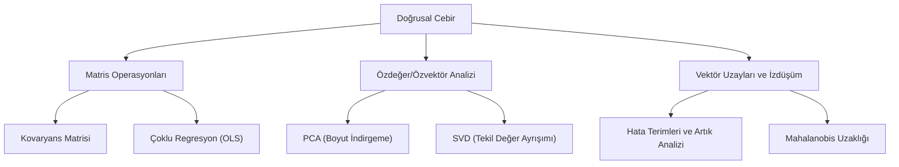

## 📌 Özet

Doğrusal cebir, modern istatistik ve veri biliminin temel yapı taşlarını ve matematiksel dilini oluşturur. Çok değişkenli verilerin matris formunda temsil edilmesi, binlerce gözlemin ve değişkenin eşzamanlı olarak işlenmesine ve analiz edilmesine olanak tanır. Regresyon analizindeki en küçük kareler (OLS) çözümü, temel bileşenler analizindeki (PCA) varyans maksimizasyonu ve kovaryans yapılarının incelenmesi doğrudan matris cebiri, özdeğerler ve özvektörler üzerinden gerçekleştirilir. Bu matematiksel altyapı, verideki karmaşık geometrik dönüşümleri, izdüşümleri ve boyut indirgeme işlemlerini anlaşılır kılarak istatistiksel modellerin optimize edilmesini sağlar.

---

## 🧠 Detay



### Vektörler ve Matrisler

**Vektör**: $\mathbf{x} = [x_1, x_2, \ldots, x_p]^T$

**Matris işlemleri:**
$$(\mathbf{AB})^T = \mathbf{B}^T\mathbf{A}^T$$
$$(\mathbf{AB})^{-1} = \mathbf{B}^{-1}\mathbf{A}^{-1}$$

**Determinant özellikleri:**
$$\det(\mathbf{AB}) = \det(\mathbf{A})\det(\mathbf{B})$$
$$\det(\mathbf{A}^{-1}) = 1/\det(\mathbf{A})$$
$$\det(\mathbf{A}^T) = \det(\mathbf{A})$$

### İz (Trace)

$$tr(\mathbf{A}) = \sum_i a_{ii} = \sum_i \lambda_i$$

**Özellikler:**
$$tr(\mathbf{AB}) = tr(\mathbf{BA})$$
$$tr(\mathbf{A} + \mathbf{B}) = tr(\mathbf{A}) + tr(\mathbf{B})$$

### Özdeğerler ve Özvektörler

$$\mathbf{A}\mathbf{v} = \lambda\mathbf{v}$$

- $\lambda$: Özdeğer (eigenvalue)
- $\mathbf{v}$: Özvektör (eigenvector)

**Hesaplama**: $\det(\mathbf{A} - \lambda \mathbf{I}) = 0$

**Özellikler:**
- $\sum \lambda_i = tr(\mathbf{A})$
- $\prod \lambda_i = \det(\mathbf{A})$
- Simetrik matrisin tüm özdeğerleri reel
- Pozitif tanımlı matrisin tüm özdeğerleri pozitif

### Özel Matris Türleri

| Tür | Koşul | İstatistiksel Anlam |
|---|---|---|
| **Simetrik** | $\mathbf{A} = \mathbf{A}^T$ | Kovaryans matrisi |
| **Pozitif Tanımlı** | $\mathbf{x}^T\mathbf{A}\mathbf{x} > 0$ | Geçerli kovaryans |
| **Ortogonal** | $\mathbf{A}^T\mathbf{A} = \mathbf{I}$ | Döndürme matrisi (PCA) |
| **İdempotent** | $\mathbf{A}^2 = \mathbf{A}$ | Hat matrisi (regresyon) |

### Kovaryans Matrisi

$$\boldsymbol{\Sigma} = Cov(\mathbf{X}) = E[(\mathbf{X}-\boldsymbol{\mu})(\mathbf{X}-\boldsymbol{\mu})^T]$$

$$\boldsymbol{\Sigma} = \begin{pmatrix} \sigma_1^2 & \sigma_{12} & \cdots \\ \sigma_{12} & \sigma_2^2 & \cdots \\ \vdots & \vdots & \ddots \end{pmatrix}$$

**Özellikler:**
- Simetrik: $\boldsymbol{\Sigma} = \boldsymbol{\Sigma}^T$
- Pozitif yarı-tanımlı: $\mathbf{x}^T\boldsymbol{\Sigma}\mathbf{x} \geq 0$

**Örneklem kovaryans matrisi:**
$$\mathbf{S} = \frac{1}{n-1}\mathbf{X}_c^T\mathbf{X}_c$$

$\mathbf{X}_c$: Sütunları merkezlenmiş veri matrisi

### Regresyon — Matris Formu

$$\mathbf{Y} = \mathbf{X}\boldsymbol{\beta} + \boldsymbol{\varepsilon}$$

**OLS çözümü:**
$$\hat{\boldsymbol{\beta}} = (\mathbf{X}^T\mathbf{X})^{-1}\mathbf{X}^T\mathbf{Y}$$

**Hat (Projeksiyon) Matrisi:**
$$\mathbf{H} = \mathbf{X}(\mathbf{X}^T\mathbf{X})^{-1}\mathbf{X}^T$$
$$\hat{\mathbf{Y}} = \mathbf{H}\mathbf{Y}$$

$\mathbf{H}$ idempotent: $\mathbf{H}^2 = \mathbf{H}$, $\mathbf{H}^T = \mathbf{H}$

**Artıklar:**
$$\mathbf{e} = (\mathbf{I}-\mathbf{H})\mathbf{Y}$$

### Spektral Ayrışım (Eigendecomposition)

Simetrik matris $\mathbf{A}$ için:
$$\mathbf{A} = \mathbf{P}\boldsymbol{\Lambda}\mathbf{P}^T$$

- $\mathbf{P}$: Ortogonal özvektör matrisi
- $\boldsymbol{\Lambda}$: Özdeğerlerin köşegen matrisi

**PCA bağlantısı**: Kovaryans matrisinin özdeğer ayrışımı = PCA.

### SVD (Tekil Değer Ayrışımı)

Herhangi bir $m \times n$ matris için:
$$\mathbf{X} = \mathbf{U}\boldsymbol{\Sigma}\mathbf{V}^T$$

- $\mathbf{U}$: $m \times m$ ortogonal (sol tekil vektörler)
- $\boldsymbol{\Sigma}$: $m \times n$ köşegen (tekil değerler)
- $\mathbf{V}$: $n \times n$ ortogonal (sağ tekil vektörler)

**PCA ile ilişki**: $\mathbf{X}$'in SVD'si, $\mathbf{X}^T\mathbf{X}$'in (kovaryans matrisi) eigendecomposition ile aynıdır.

**Düşük boyutlu yaklaşım (rank-k)**:
$$\mathbf{X} \approx \mathbf{U}_k\boldsymbol{\Sigma}_k\mathbf{V}_k^T$$

### Mahalanobis Uzaklığı

Kovaryans yapısını dikkate alan uzaklık:

$$D_M(\mathbf{x}) = \sqrt{(\mathbf{x}-\boldsymbol{\mu})^T \boldsymbol{\Sigma}^{-1} (\mathbf{x}-\boldsymbol{\mu})}$$

- $D_M = 1$: 1 standart sapma uzaklığı (çok boyutlu)
- Kümeleme, aykırı değer tespitinde kullanılır

### Python

```python
import numpy as np

# Kovaryans matrisi
S = np.cov(X.T)  # X: n x p matris

# Özdeğer ayrışımı
eigenvalues, eigenvectors = np.linalg.eigh(S)  # Simetrik için eigh

# SVD
U, sigma, Vt = np.linalg.svd(X, full_matrices=False)

# Matris tersi
S_inv = np.linalg.inv(S)

# Hat matrisi
H = X @ np.linalg.inv(X.T @ X) @ X.T

# Mahalanobis uzaklığı
from scipy.spatial.distance import mahalanobis
VI = np.linalg.inv(S)  # Kovaryans inversesi
d = mahalanobis(x, mu, VI)
```

---

## 💡 Bağlantılar
- [[STAT - Çoklu Doğrusal Regresyon]]
- [[ML - PCA - Boyut İndirgeme]]
- [[STAT - Çok Değişkenli İstatistik]]

## ❓ Sorular / Anlamadıklarım


## 🔗 Kaynaklar
- Linear Algebra and Its Applications (Gilbert Strang)
- The Matrix Cookbook (free PDF)
- numpy.linalg Documentation
