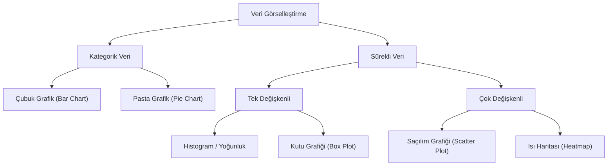

## 📌 Özet

Frekans dağılımları ve grafiksel yöntemler, ham veriyi anlamlı bir yapıya dönüştürerek verinin genel dağılımını, merkezini ve yayılımını keşfetmemizi sağlayan betimsel araçlardır. Frekans tabloları, verideki değerlerin veya aralıkların ne sıklıkla tekrar ettiğini sayısal olarak özetlerken; histogramlar, kutu grafikleri ve saçılım grafikleri bu sayısal özetleri görsel bir dile aktarır. Veri görselleştirme, sadece bir sunum aracı değil, aynı zamanda verideki aykırı değerleri, çarpıklıkları ve gizli örüntüleri tespit etmek için kullanılan kritik bir keşifsel veri analizi (EDA) sürecidir. Doğru grafik seçimi, verinin türüne (kategorik veya sürekli) ve yanıtlanmak istenen soruya göre verinin en doğru ve etkileyici şekilde temsil edilmesini sağlar.

---

## 🧠 Detay



### Frekans Türleri

| Tür | Tanım | Formül |
|---|---|---|
| **Frekans (f)** | Sınıftaki gözlem sayısı | — |
| **Göreli Frekans** | Frekansın toplama oranı | $f_i / n$ |
| **Yüzde Frekans** | Göreli frekans × 100 | $(f_i / n) \times 100$ |
| **Kümülatif Frekans** | O sınıfa kadar toplam gözlem | $\sum_{j \leq i} f_j$ |

### Sınıf Aralıklarının Belirlenmesi

**Sturges Kuralı:**
$$k = 1 + 3.322 \times \log_{10}(n)$$

**Scott Kuralı:**
$$h = 3.49 \times s \times n^{-1/3}$$

**Freedman-Diaconis Kuralı (aykırı değerlere dayanıklı):**
$$h = 2 \times IQR \times n^{-1/3}$$

Sınıf genişliği:
$$w = \frac{x_{max} - x_{min}}{k}$$

### Grafik Türleri

#### Histogramlar
- Sürekli veriler için
- Sınıf aralıkları x ekseninde, frekans y ekseninde
- Çubuklar birbirine bitişiktir

#### Çubuk Grafik (Bar Chart)
- Kategorik veriler için
- Çubuklar arasında boşluk var

#### Pasta Grafik (Pie Chart)
- Kategorik, parça-bütün ilişkisi için
- Açı: $(f_i / n) \times 360°$

#### Zaman Serisi Grafiği (Line Chart)
- Zamanla değişimi gösterir

#### Dağılım Grafiği (Scatter Plot)
- İki değişken arası ilişki
- x ve y eksenlerinde iki farklı değişken

#### Kutu Grafiği (Box Plot)
```
        |-----|===========|=====|-----|
        Q1-1.5IQR  Q1   Medyan  Q3  Q3+1.5IQR
                         ↑
                     Ortalama (bazen eklenir)
```

#### Keman Grafiği (Violin Plot)
- Kutu grafiği + yoğunluk tahmini
- Dağılımın şeklini de gösterir

#### Q-Q Plot (Quantile-Quantile)
- Normalliği test etmek için
- Veriler normal dağılıma uyuyorsa → düz çizgi üzerinde

### Frekans Poligonu ve Ogiv

- **Frekans Poligonu**: Sınıf orta noktalarını birleştiren çizgi grafik
- **Ogiv (Kümülatif Frekans Eğrisi)**: Kümülatif frekansların çizgisi

### Stem-and-Leaf Plot (Gövde-Yaprak)

```
Veri: 23, 25, 28, 31, 35, 37, 42, 45

Gövde | Yaprak
  2   | 3 5 8
  3   | 1 5 7
  4   | 2 5
```

### İki Değişken: Çapraz Tablo (Contingency Table)

|  | Erkek | Kadın | Toplam |
|---|---|---|---|
| Mezun | 40 | 60 | 100 |
| Mezun Değil | 30 | 20 | 50 |
| **Toplam** | 70 | 80 | **150** |

---

## 💡 Bağlantılar
- [[STAT - Betimsel İstatistik]]
- [[STAT - Temel Kavramlar ve Tanımlar]]
- [[DS - Veri Görselleştirme İlkeleri]]
- [[DS - Matplotlib Temel Grafikler]]
- [[DS - Seaborn İstatistiksel Grafikler]]

## ❓ Sorular / Anlamadıklarım


## 🔗 Kaynaklar
- Matplotlib Documentation
- Seaborn Gallery
