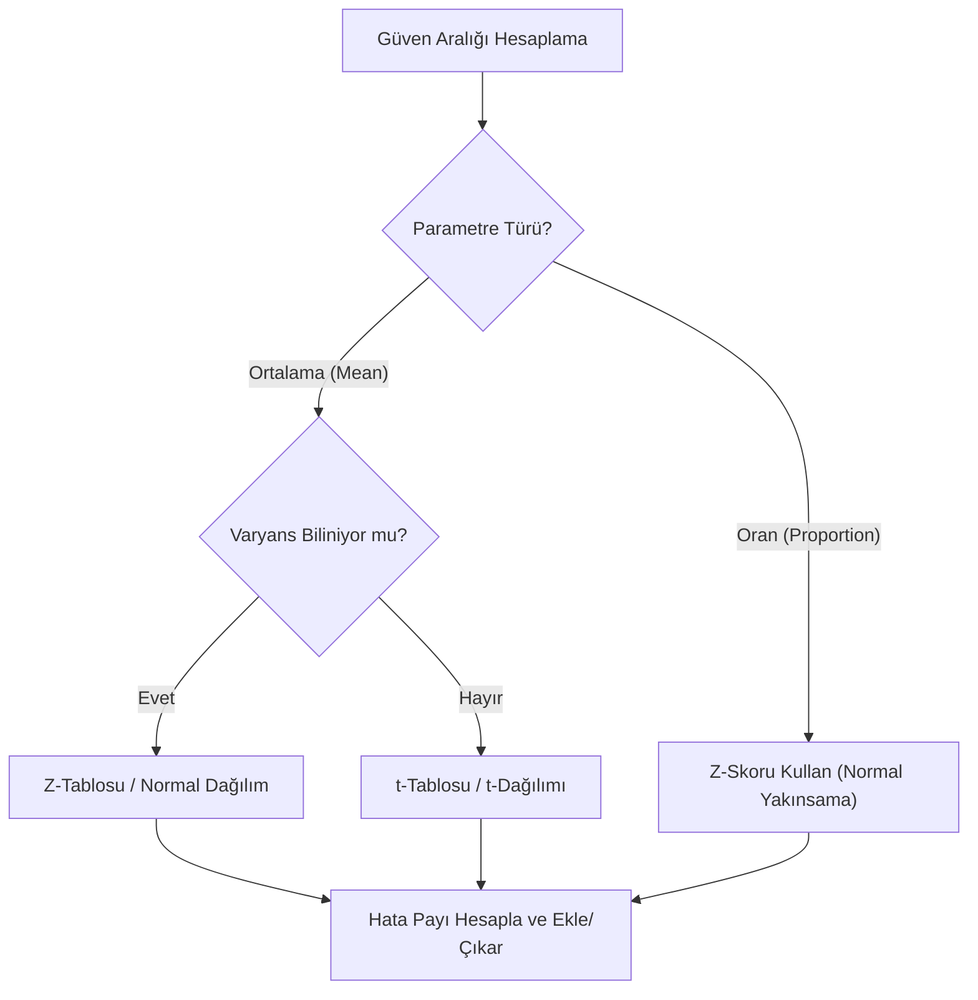

## 📌 Özet

Güven aralığı (Confidence Interval), bir anakütle parametresinin (ortalama, oran vb.) belirli bir olasılıkla (güven düzeyiyle) içerisinde yer alması beklenen değerler aralığını ifade eder. Nokta tahminine bir hata payı (margin of error) ekleyerek oluşturulan bu aralık, tahminin hassasiyetini ve güvenilirliğini sayısal olarak ortaya koyar. Frekansçı yaklaşımda %95 güven düzeyi, "bu süreç 100 kez tekrarlanırsa, üretilen 95 aralığın gerçek parametreyi kapsaması beklenir" anlamına gelir; yani güven parametreye değil, kullanılan yönteme atfedilir. Güven aralığının genişliği, örneklem büyüklüğü, verideki değişkenlik ve seçilen güven düzeyiyle doğrudan ilişkilidir; n arttıkça aralık daralır ve tahmin netleşir.

---

## 🧠 Detay

### Güven Aralığı Yorumu ⚠️

**Yanlış yorum**: "%95 olasılıkla parametre bu aralığın içindedir."
**Doğru yorum**: "Bu yöntemle 100 kez örneklem alsak, ~95 aralık gerçek parametreyi kapsar."

Parametre sabit, aralık rastgele!

### Genel Formül

$$\text{Güven Aralığı} = \text{Nokta Tahmini} \pm \text{Hata Payı}$$

$$\text{Hata Payı} = \text{Kritik Değer} \times \text{Standart Hata}$$

### 1. Ortalama İçin GA ($\sigma$ biliniyorsa) — Z Aralığı

$$\bar{x} \pm z_{\alpha/2} \cdot \frac{\sigma}{\sqrt{n}}$$

| Güven Düzeyi | $\alpha$ | $z_{\alpha/2}$ |
|---|---|---|
| %90 | 0.10 | 1.645 |
| %95 | 0.05 | 1.960 |
| %99 | 0.01 | 2.576 |

### 2. Ortalama İçin GA ($\sigma$ bilinmiyorsa) — t Aralığı

$$\bar{x} \pm t_{\alpha/2,\ n-1} \cdot \frac{s}{\sqrt{n}}$$

- Serbestlik derecesi: $df = n - 1$
- $t$ dağılımı normal'den kalın kuyruklu → daha geniş aralık

### 3. Oran İçin GA

$$\hat{p} \pm z_{\alpha/2} \cdot \sqrt{\frac{\hat{p}(1-\hat{p})}{n}}$$

Koşul: $n\hat{p} \geq 5$ ve $n(1-\hat{p}) \geq 5$

### 4. Varyans İçin GA — Ki-Kare

$$\left[\frac{(n-1)s^2}{\chi^2_{\alpha/2,\ n-1}},\ \frac{(n-1)s^2}{\chi^2_{1-\alpha/2,\ n-1}}\right]$$

Asimetrik aralık!

### 5. İki Ortalama Farkı İçin GA

**Bağımsız örneklemler (σ bilinmiyor, eşit varyans)**:
$$(\bar{x}_1 - \bar{x}_2) \pm t_{\alpha/2,\ n_1+n_2-2} \cdot s_p\sqrt{\frac{1}{n_1}+\frac{1}{n_2}}$$

Havuzlanmış standart sapma:
$$s_p = \sqrt{\frac{(n_1-1)s_1^2 + (n_2-1)s_2^2}{n_1+n_2-2}}$$

**Eşleştirilmiş örneklemler**:
$$\bar{d} \pm t_{\alpha/2,\ n-1} \cdot \frac{s_d}{\sqrt{n}}$$

### Örneklem Büyüklüğü Belirleme

**Ortalama için**:
$$n = \left(\frac{z_{\alpha/2} \cdot \sigma}{E}\right)^2$$

**Oran için**:
$$n = \frac{z_{\alpha/2}^2 \cdot \hat{p}(1-\hat{p})}{E^2}$$

$\hat{p}$ bilinmiyorsa: $\hat{p} = 0.5$ (maksimum n)

**Örnek**: %95 güven, $E = 2$, $\sigma = 10$ için:
$$n = \left(\frac{1.96 \times 10}{2}\right)^2 = 96.04 \to n = 97$$

### Güven Aralığını Etkileyen Faktörler

| Faktör | Etkisi |
|---|---|
| Güven düzeyi ↑ | Aralık genişler |
| n ↑ | Aralık daralır |
| σ (veya s) ↑ | Aralık genişler |

### Bootstrap Güven Aralığı

Parametrik varsayım gerektirmeyen yöntem:
1. Örneklemden tekrar çekimle (with replacement) B adet yeni örneklem oluştur
2. Her birinde istatistiği hesapla
3. İstatistiklerin %2.5 ve %97.5 persentilini al

---

## 💡 Bağlantılar
- [[STAT - Hipotez Testleri - Temel Kavramlar]]
- [[STAT - Merkezi Limit Teoremi ve Örnekleme]]
- [[STAT - Normal Dağılım]]
- [[STAT - Olasılık Dağılımları (Sürekli)]]

## ❓ Sorular / Anlamadıklarım

## 🔗 Kaynaklar
- OpenStax Statistics - Ch. 8-9
- All of Statistics (Wasserman) - Ch. 6
