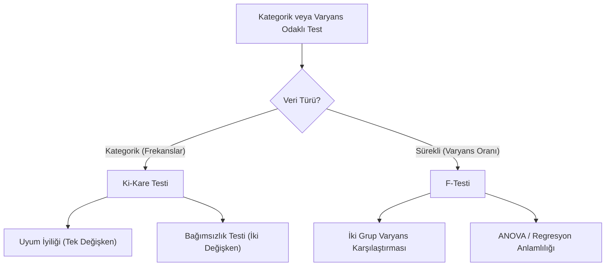

## 📌 Özet

Ki-kare ve F-testleri, verideki değişkenlik ve kategorik ilişkileri incelemek için kullanılan kritik hipotez testleridir. Ki-kare testi, özellikle kategorik verilerin beklenen bir dağılıma uyup uymadığını (iyilik-uyum) veya iki kategorik değişken arasında bağımsızlık olup olmadığını test etmek için temel araçtır. F-testi ise, iki farklı grubun varyanslarını karşılaştırmak veya regresyon modellerinin genel anlamlılığını değerlendirmek amacıyla kullanılır. Her iki yöntem de sürekli verilerden ziyade frekanslar veya varyans oranları üzerinden çıkarım yaparak, araştırmacılara değişkenler arasındaki yapısal ilişkiler ve grup farklılıkları hakkında istatistiksel kanıt sunar.

---

## 🧠 Detay



### Ki-kare Dağılımı Hatırlatması

$$\chi^2_\nu = \sum_{i=1}^\nu Z_i^2, \quad Z_i \sim N(0,1)$$

- Sağa çarpık, $[0, \infty)$ aralığında
- $E[\chi^2] = \nu$, $Var[\chi^2] = 2\nu$
- Büyük $\nu$ ile normale yaklaşır

---

### 1. İyilik-Uyum Testi (Goodness-of-Fit)

**Amaç**: Gözlenen frekanslar beklenen dağılıma uyuyor mu?

$$H_0: \text{Veri beklenen dağılıma uyar}$$

$$\chi^2 = \sum_{i=1}^{k} \frac{(O_i - E_i)^2}{E_i} \sim \chi^2_{k-1}$$

- $O_i$: Gözlenen frekans
- $E_i$: Beklenen frekans ($E_i = n \cdot p_i$)
- $df = k - 1$ (k: kategori sayısı)

**Koşul**: Her kategori için $E_i \geq 5$

**Örnek**: Bir zarın adil olup olmadığı (her yüz 1/6 ihtimalli)

| Yüz | Gözlenen | Beklenen |
|---|---|---|
| 1 | 18 | 20 |
| 2 | 22 | 20 |
| ... | ... | ... |

$$\chi^2 = \frac{(18-20)^2}{20} + \frac{(22-20)^2}{20} + \cdots, \quad df=5$$

---

### 2. Bağımsızlık Testi (Contingency Table)

**Amaç**: İki kategorik değişken birbirinden bağımsız mı?

$$H_0: \text{İki değişken bağımsızdır}$$

Beklenen frekans:
$$E_{ij} = \frac{(\text{Satır toplamı}_i) \times (\text{Sütun toplamı}_j)}{n}$$

$$\chi^2 = \sum_{i}\sum_{j} \frac{(O_{ij} - E_{ij})^2}{E_{ij}} \sim \chi^2_{(r-1)(c-1)}$$

- $df = (satır - 1)(sütun - 1)$
- Koşul: $E_{ij} \geq 5$ (küçükse Fisher's Exact Test kullan)

**Etki Büyüklüğü:**
$$\phi = \sqrt{\frac{\chi^2}{n}} \quad (2\times2 \text{ tablo})$$

$$V = \sqrt{\frac{\chi^2}{n \cdot \min(r-1, c-1)}} \quad \text{(Cramér's V)}$$

| V | Etki |
|---|---|
| 0.1 | Küçük |
| 0.3 | Orta |
| 0.5 | Büyük |

---

### 3. Varyans Homojenliği Testleri

#### Levene Testi (t-testi öncesi)
- Ortalamalara dayalı, normale gerek yok
- $H_0$: Tüm grupların varyansları eşit

#### Bartlett Testi
- Normallik gerektiriyor
- Normalse Levene'den güçlü

#### F-testi (İki Varyans)

$$H_0: \sigma_1^2 = \sigma_2^2$$

$$F = \frac{s_1^2}{s_2^2} \sim F_{n_1-1,\ n_2-1}$$

---

### 4. Ki-kare ile Normallik Testi

**Çıkarımsal testler için** (bkz. Shapiro-Wilk genellikle tercih edilir):

$$\chi^2 = \sum_{i=1}^{k} \frac{(O_i - E_i)^2}{E_i}$$

Burada $E_i$ normal dağılımdan beklenen frekanslardır.

---

### 5. McNemar Testi (Eşleştirilmiş Oranlar)

**Amaç**: Eşleştirilmiş kategorik veride oran değişimi.

$$\chi^2 = \frac{(b-c)^2}{b+c}$$

Örnek: Tedavi öncesi/sonrası iyileşme oranı

---

### Python ile Ki-kare ve F Testleri

```python
from scipy import stats
import numpy as np

# 1. İyilik-uyum testi
chi2, p = stats.chisquare(f_obs=observed, f_exp=expected)

# 2. Bağımsızlık testi (çapraz tablo)
contingency_table = [[10, 20], [30, 40]]
chi2, p, dof, expected = stats.chi2_contingency(contingency_table)

# 3. İki varyans F testi
F = np.var(group1, ddof=1) / np.var(group2, ddof=1)
p = stats.f.sf(F, dfn=len(group1)-1, dfd=len(group2)-1)

# 4. Levene testi
stat, p = stats.levene(group1, group2)

# 5. McNemar
from statsmodels.stats.contingency_tables import mcnemar
result = mcnemar([[a, b], [c, d]])
```

---

### Özet: Hangi Testi Kullan?

| Durum | Test |
|---|---|
| Tek kategorik değişken, beklenen dağılım? | Ki-kare iyilik-uyum |
| İki kategorik değişken bağımsız mı? | Ki-kare bağımsızlık |
| İki kategorik değişken, eşleştirilmiş? | McNemar |
| İki varyans eşit mi? | Levene / F-testi |
| 2x2 tablo, küçük örneklem? | Fisher's Exact Test |

---

## 💡 Bağlantılar
- [[STAT - Hipotez Testleri - Temel Kavramlar]]
- [[STAT - ANOVA]]
- [[STAT - Hipotez Testleri - t-testi]]
- [[STAT - Parametrik Olmayan Testler]]

## ❓ Sorular / Anlamadıklarım


## 🔗 Kaynaklar
- OpenStax Statistics - Ch. 11
- scipy.stats.chi2_contingency Documentation
