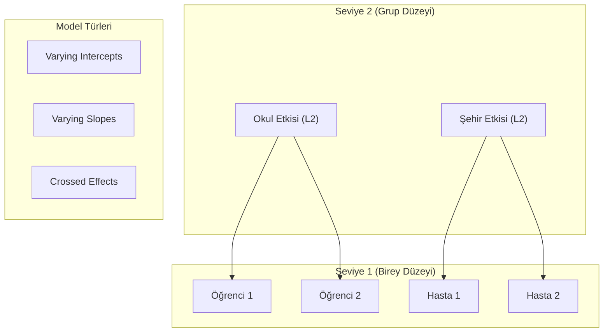

## 📌 Özet
Hiyerarşik ve çok düzeyli modeller (HLM), verinin doğal olarak gruplandığı (örneğin; okullar içindeki öğrenciler veya şehirler içindeki hastaneler) yapılarda, gruplar arası ve grup içi değişkenliği eşzamanlı olarak modellemek için kullanılır. Bu modeller, "no pooling" (grupları tamamen ayrı ele alma) ve "complete pooling" (grupları tek bir yığın olarak görme) uçları arasında dengeli bir yaklaşım sunan "partial pooling" (kısmi havuzlama) prensibiyle çalışır. Değişen kesim noktaları (varying intercepts) ve değişen eğimler (varying slopes) aracılığıyla, verideki bağımlılık yapısını hesaba katarak daha güvenilir ve genellenebilir parametre tahminleri sağlar.

---

## 🧠 Detay

### 📉 Hiyerarşik Modelleme Yapısı



### 1. Neden Hiyerarşik Model?
Geleneksel regresyon (OLS), gözlemlerin birbirinden bağımsız olduğunu varsayar. Ancak hiyerarşik verilerde aynı gruptaki bireyler benzer özellikler gösterme eğilimindedir (kümelenmiş veri).
- **Kümelenmiş Hatalar:** Gruplandırmayı görmezden gelmek, standart hataların olduğundan küçük tahmin edilmesine ve yanlış anlamlılık sonuçlarına (Type I error) yol açar.
- **Partial Pooling:** Az verisi olan gruplar için tahminler, popülasyon ortalamasına doğru "çekilir" (shrinkage). Bu, aşırı uç değerlere karşı modeli dirençli kılar.

### 2. Sabit ve Rastgele Etkiler (Fixed vs. Random Effects)
- **Fixed Effects (Sabit Etkiler):** Tüm gruplar için aynı olan genel etkilerdir (örneğin; genel eğitim süresinin başarıya etkisi).
- **Random Effects (Rastgele Etkiler):** Gruplara göre değişen, belirli bir dağılımdan (genelde Normal) geldiği varsayılan etkilerdir.

### 3. Model Formülasyonu (Varying Intercepts)
$$y_{ij} = \beta_0 + u_j + \beta_1 x_{ij} + \epsilon_{ij}$$
Burada:
- $u_j \sim N(0, \sigma_u^2)$: $j$. grubun ortalamadan sapması (Rastgele Kesim).
- $\beta_1$: Sabit eğim.

### 🐍 Python Örneği (Statsmodels / Pymer4)
```python
import statsmodels.formula.api as smf

# Karma Etkili Model (Mixed-Effects)
# 'Group' değişkenine göre rastgele kesim (intercept) ekleme
model = smf.mixedlm("Basari ~ Calisma_Saati", data=df, groups=df["Okul_ID"])
result = model.fit()

print(result.summary())
```

### 🛠️ Temel Kavramlar
- **ICC (Intraclass Correlation Coefficient):** Toplam varyansın ne kadarının gruplar arası farklardan kaynaklandığını gösterir. 0'a yakınsa hiyerarşik modele gerek olmayabilir.
- **Shrinkage (Büzülme):** Grup bazlı tahminlerin, grup örneklem büyüklüğü azaldıkça genel ortalamaya yaklaşması olayıdır.

---

## 💡 Bağlantılar
- [[STAT - Çoklu Doğrusal Regresyon]]
- [[STAT - Bayesci Çıkarım ve MCMC]]
- [[STAT - Regresyon Diagnostiği ve Varsayım Kontrolleri]]

## ❓ Sorular / Anlamadıklarım
- Rastgele etkiler ne zaman "Fixed Effects" yerine tercih edilmelidir? (Hausman Testi).
- 3 veya daha fazla seviyeli hiyerarşilerde model karmaşıklığı nasıl yönetilir?

## 🔗 Kaynaklar
- Gelman, A., & Hill, J. - Data Analysis Using Regression and Multilevel/Hierarchical Models.
- McElreath, R. - Statistical Rethinking (Bayesian perspective).
