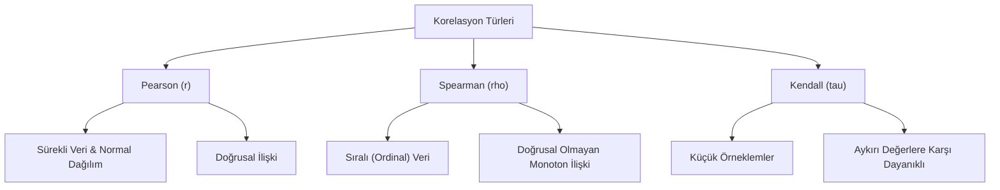

## 📌 Özet

Korelasyon analizi, iki değişken arasındaki istatistiksel ilişkinin yönünü (pozitif/negatif) ve gücünü ölçmek için kullanılan temel bir tekniktir. Korelasyon katsayısı -1 ile +1 arasında değer alarak, bir değişkenin değerindeki değişimin diğeriyle ne kadar uyumlu olduğunu sayısal olarak ifade eder. En yaygın kullanılan Pearson katsayısı doğrusal ilişkileri hedeflerken, Spearman ve Kendall gibi parametrik olmayan yöntemler sıralı veriler ve doğrusal olmayan monoton ilişkiler için uygundur. En kritik kural, korelasyonun varlığının mutlaka bir neden-sonuç ilişkisi (nedensellik) anlamına gelmediği; ilişkili görünen değişkenlerin aslında üçüncü bir gizli faktörden etkileniyor olabileceğidir.

---

## 🧠 Detay



### Pearson Korelasyon Katsayısı (r)

Sürekli, normal dağılımlı veriler için.

$$r = \frac{\sum_{i=1}^n (x_i - \bar{x})(y_i - \bar{y})}{\sqrt{\sum(x_i-\bar{x})^2 \cdot \sum(y_i-\bar{y})^2}}$$

veya:
$$r = \frac{Cov(X,Y)}{s_X \cdot s_Y}$$

**Özellikler:**
- $-1 \leq r \leq 1$
- $r = 1$: Mükemmel pozitif doğrusal ilişki
- $r = -1$: Mükemmel negatif doğrusal ilişki
- $r = 0$: Doğrusal ilişki yok
- Boyutsuz (birimsiz)
- Aykırı değerlere hassas

**Yorumlama:**

| |r| | Yorum |
|---|---|
| 0.00 - 0.19 | Çok zayıf |
| 0.20 - 0.39 | Zayıf |
| 0.40 - 0.59 | Orta |
| 0.60 - 0.79 | Güçlü |
| 0.80 - 1.00 | Çok güçlü |

### Hipotez Testi (Pearson r)

$$H_0: \rho = 0 \quad \text{(anakütle korelasyonu 0)}$$

$$t = \frac{r\sqrt{n-2}}{\sqrt{1-r^2}} \sim t_{n-2}$$

### Kovaryans

$$Cov(X,Y) = \frac{\sum(x_i-\bar{x})(y_i-\bar{y})}{n-1}$$

- Birimlere bağlı (yorumlanması zor)
- $Cov(X,X) = Var(X)$
- $r = Cov(X,Y) / (s_X s_Y)$

### Varyans-Kovaryans Matrisi

$$\Sigma = \begin{pmatrix} \sigma_X^2 & Cov(X,Y) \\ Cov(X,Y) & \sigma_Y^2 \end{pmatrix}$$

### Belirtme Katsayısı (R²)

$$R^2 = r^2$$

Yorumlama: "X değişkeni Y'nin değişiminin %R²'sini açıklar."

---

### Spearman Sıra Korelasyonu ($r_s$)

Parametrik olmayan alternatif. Sıralama verileri veya normallik sağlanamıyorsa.

1. Her değişken için sıralamaları bul
2. Sıralamalar üzerinde Pearson r hesapla

$$r_s = 1 - \frac{6\sum d_i^2}{n(n^2-1)}$$

$d_i$ = i. gözlem için iki değişken arasındaki sıra farkı

**Ne zaman kullan?**
- Ordinal veri
- Normallik yok
- Aykırı değer çok
- Monoton ama doğrusal olmayan ilişki

---

### Kendall's Tau ($\tau$)

Küçük örneklemlerde Spearman'dan daha güvenilir.

$$\tau = \frac{C - D}{\binom{n}{2}}$$

- C: Uyumlu çiftler
- D: Uyumsuz çiftler

---

### Kısmi Korelasyon

Üçüncü değişkenin etkisi kontrol altındayken X-Y korelasyonu:

$$r_{XY.Z} = \frac{r_{XY} - r_{XZ} \cdot r_{YZ}}{\sqrt{(1-r_{XZ}^2)(1-r_{YZ}^2)}}$$

---

### Point-Biserial Korelasyon

Bir sürekli + bir ikili (0/1) değişken arasındaki korelasyon.

$$r_{pb} = \frac{\bar{x}_1 - \bar{x}_0}{s_x} \cdot \sqrt{\frac{n_1 n_0}{n^2}}$$

---

### ⚠️ Korelasyon Nedensellik Değildir

**Spurious Correlation Örnekleri:**
- Dondurma satışları ile boğulma ölümleri (gizli değişken: sıcaklık)
- Aylık Nicolas Cage filmi ile havuz boğulmaları

**Nedensellik için:**
- Randomize kontrollü deney (RCT)
- Doğal deney
- Araçsal değişken (IV)
- Fark-içinde-fark (DiD)

---

### Korelasyon Matrisi (Python)

```python
import pandas as pd
import seaborn as sns
import matplotlib.pyplot as plt
from scipy import stats

# Pearson
corr_matrix = df.corr(method='pearson')

# Spearman
corr_matrix = df.corr(method='spearman')

# Görselleştirme
sns.heatmap(corr_matrix, annot=True, cmap='coolwarm', 
            vmin=-1, vmax=1, center=0)

# Hipotez testi
r, p = stats.pearsonr(x, y)
r_s, p_s = stats.spearmanr(x, y)
tau, p_t = stats.kendalltau(x, y)
```

---

## 💡 Bağlantılar
- [[STAT - Regresyon Analizi - Basit Doğrusal Regresyon]]
- [[STAT - Hipotez Testleri - Temel Kavramlar]]
- [[DS - Korelasyon Analizi]]
- [[DS - EDA - Keşifsel Veri Analizi]]

## ❓ Sorular / Anlamadıklarım


## 🔗 Kaynaklar
- OpenStax Statistics - Ch. 12
- Spurious Correlations (Tyler Vigen) - tylervigen.com
