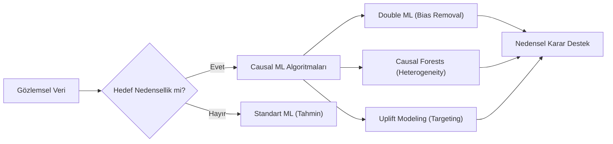

## 📌 Özet
Nedensel Makine Öğrenmesi (Causal ML), klasik makine öğrenmesinin tahminleme gücü ile istatistiksel nedensellik yöntemlerini birleştirerek, "ne olacak?" sorusundan ziyade "müdahale edersem ne değişecek?" sorusuna odaklanır. Double Machine Learning (DML) yöntemiyle karıştırıcı değişkenlerin (confounders) etkisi ortadan kaldırılırken, Causal Forests ile heterojen tedavi etkileri (HTE) birey düzeyinde tahmin edilebilir. Uplift Modeling gibi uygulamalar sayesinde pazarlama, sağlık ve politika alanlarında kaynakların en yüksek etkiyi yaratacak kişilere (persuadables) yönlendirilmesi sağlanır.

---

## 🧠 Detay

### 🛠️ Causal ML Akış Şeması



### 1. Double Machine Learning (DML)
DML, yüksek boyutlu verilerde nedensel etkiyi (ATE) yansız bir şekilde tahmin etmek için kullanılır.
- **Aşama 1:** Sonucu ($Y$) özelliklerden ($X$) tahmin et (Residualize $Y$).
- **Aşama 2:** Tedaviyi ($W$) özelliklerden ($X$) tahmin et (Residualize $W$).
- **Aşama 3:** Kalıntıları (residuals) birbirine regrese et. Bu sayede $X$'in etkisi her iki taraftan da "temizlenmiş" olur.

### 2. Causal Forests ve Heterojen Etki
Herkes bir tedaviden aynı şekilde etkilenmez. Causal Forest (Generalized Random Forest), veriyi alt gruplara bölerek her yaprakta yerel bir tedavi etkisi (CATE - Conditional Average Treatment Effect) hesaplar.
- **Örnek:** Bir ilaç genel popülasyonda etkisiz görünebilir (ATE=0), ancak Causal Forest ile gençlerde pozitif, yaşlılarda negatif etkisi olduğu keşfedilebilir.

### 3. Uplift Modeling (İkna Edilebilirlik)
Müşterileri dört gruba ayırır:
1. **Sure Things:** Tedavi olsa da olmasa da satın alacaklar.
2. **Lost Causes:** Ne yapılırsa yapılsın almayacaklar.
3. **Sleeping Dogs:** Müdahale edilirse ters tepki verecekler (Churn riski).
4. **Persuadables:** Müdahale edilirse alacak olanlar (Hedef kitle!).

### 💻 Python Örneği (EconML Kütüphanesi)
```python
from econml.dml import LinearDML
from sklearn.ensemble import RandomForestRegressor

# Double ML Modeli
est = LinearDML(
    model_y=RandomForestRegressor(),
    model_t=RandomForestRegressor(),
    discrete_treatment=True
)

# Eğitme ve Etki Tahmini
est.fit(Y, T, X=X, W=None)
treatment_effects = est.effect(X_test)
```

### 🎯 Kullanım Durumları
- **Pazarlama:** Hangi müşteriye indirim kuponu verilirse gerçekten alışveriş yapar?
- **Fiyatlandırma:** Dinamik fiyat değişiminin talep üzerindeki nedensel etkisi nedir?
- **Sağlık:** Hangi hasta profili bu tedaviye en iyi yanıtı verir?

---

## 💡 Bağlantılar
- [[STAT - Nedensellik ve Nedensel Çıkarım]]
- [[ML - Ensemble Öğrenme (LightGBM ve CatBoost)]]
- [[STAT - Hipotez Testleri - Temel Kavramlar]]

## ❓ Sorular / Anlamadıklarım
- DML'de "Overfitting" riski nedensel tahminleri nasıl bozar?
- Uplift modellerinin başarısını ölçmek için kullanılan "Qini Curve" nedir?

## 🔗 Kaynaklar
- Microsoft Research - EconML Documentation
- Chernozhukov et al. - Double Machine Learning for Treatment and Structural Parameters
