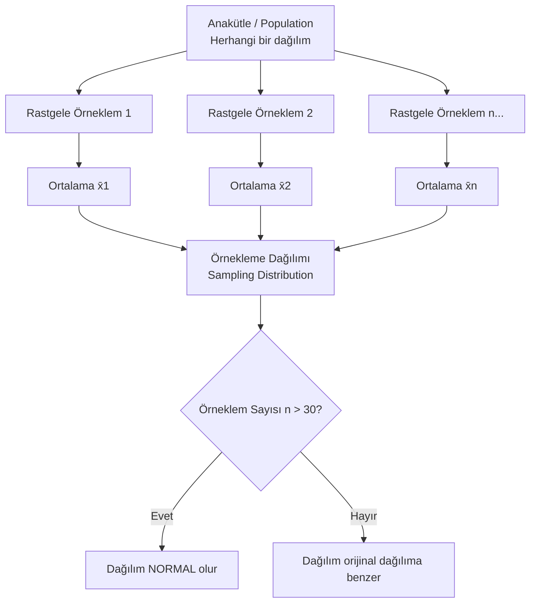

## 📌 Özet

Merkezi Limit Teoremi (MLT), istatistiksel çıkarımın en temel teoremidir. Hangi dağılımdan gelirse gelsin, yeterli büyüklükte örneklem ortalaması normal dağılıma yaklaşır.

---

## 🧠 Detay

### 🗺️ Örnekleme Dağılımı ve CLT Görselleşimi

### Büyük Sayılar Yasası (Law of Large Numbers)

**Zayıf Versiyon**: $n \to \infty$ iken $\bar{X}_n \xrightarrow{p} \mu$

Örnek ortalama büyük örneklemlerde anakütle ortalamasına yaklaşır.

$$P(|\bar{X}_n - \mu| > \epsilon) \to 0 \quad \text{(her } \epsilon > 0 \text{ için)}$$

---

### Merkezi Limit Teoremi (MLT) ⭐

**Teorem**: $X_1, X_2, \ldots, X_n$ bağımsız ve aynı dağılımlı (i.i.d.) rastlantı değişkenleri, $E[X_i] = \mu$ ve $Var(X_i) = \sigma^2 < \infty$ ise:

$$\bar{X} = \frac{1}{n}\sum_{i=1}^n X_i$$

için:

$$\frac{\bar{X} - \mu}{\sigma/\sqrt{n}} \xrightarrow{d} N(0, 1) \quad n \to \infty$$

**Yani:**
$$\bar{X} \approx N\!\left(\mu,\ \frac{\sigma^2}{n}\right)$$

### Örnekleme Standart Hatası

$$SE = \frac{\sigma}{\sqrt{n}}$$

- $n$ arttıkça SE azalır → tahmin hassaslaşır
- $n$ 4 katına çıkarılırsa SE yarıya düşer

### MLT Ne Zaman Uygulanır?

| Durum | Gerekli n |
|---|---|
| Orijinal dağılım normal | Her n |
| Hafif çarpık dağılım | $n \geq 30$ |
| Çok çarpık dağılım | $n \geq 50-100$ |
| Binom (np ≥ 5 ve n(1-p) ≥ 5) | Uygulanabilir |

**Genel kural: $n \geq 30$**

### Örnekleme Dağılımı

Örneklem istatistiğinin (örn. $\bar{X}$) olasılık dağılımı.

**Örneklem Ortalaması** ($\sigma$ biliniyorsa):
$$\bar{X} \sim N\!\left(\mu, \frac{\sigma^2}{n}\right)$$

**Örneklem Ortalaması** ($\sigma$ bilinmiyorsa, $s$ ile tahmin):
$$T = \frac{\bar{X} - \mu}{s/\sqrt{n}} \sim t_{n-1}$$

**Örneklem Oranı** ($\hat{p}$):
$$\hat{p} \sim N\!\left(p, \frac{p(1-p)}{n}\right)$$

**Örneklem Varyansı**:
$$\frac{(n-1)s^2}{\sigma^2} \sim \chi^2_{n-1}$$

### Örnekleme Yöntemleri

| Yöntem | Açıklama | Avantaj |
|---|---|---|
| **Basit Rastgele** | Her birim eşit şansla seçilir | Yansısız |
| **Tabakalı** | Alt gruplardan orantılı seçim | Temsil gücü yüksek |
| **Küme** | Kümeler rastgele, hepsi alınır | Ekonomik |
| **Sistematik** | Her k'ıncı eleman (k=N/n) | Uygulaması kolay |
| **Kolaylık** | Ulaşılabilir bireyler | Hızlı ama yanlı |

### Örnekleme Hatası vs Örnekleme Dışı Hata

**Örnekleme Hatası**: Örneklem istatistiği ile parametre arasındaki fark (rastlantısaldır, n artırınca azalır)

**Örnekleme Dışı Hatalar** (sistematik, n artırınca azalmaz):
- Kapsama hatası
- Yanıt vermeme hatası
- Ölçüm hatası
- İşlem hatası

### MLT Uygulaması - Örnek

**Problem**: Bir fabrikada vida ağırlıkları $\mu=5g$, $\sigma=0.5g$ ile dağılıyor. 100 vidanın ağırlık toplamının 505g'ı aşma olasılığı?

$$\bar{X} \sim N\!\left(5,\ \frac{0.25}{100}\right) = N(5, 0.0025)$$

$$P\!\left(\sum X_i > 505\right) = P\!\left(\bar{X} > 5.05\right)$$

$$Z = \frac{5.05 - 5}{0.5/\sqrt{100}} = \frac{0.05}{0.05} = 1$$

$$P(Z > 1) = 1 - 0.8413 = 0.1587 \approx 15.87\%$$

---

## 💡 Bağlantılar
- [[STAT - Normal Dağılım]]
- [[STAT - Güven Aralıkları]]
- [[STAT - Hipotez Testleri - Temel Kavramlar]]
- [[STAT - Olasılık Dağılımları (Sürekli)]]

## ❓ Sorular / Anlamadıklarım

## 🔗 Kaynaklar
- OpenStax Statistics - Ch. 7-8
- 3Blue1Brown - CLT Visual Explanation
