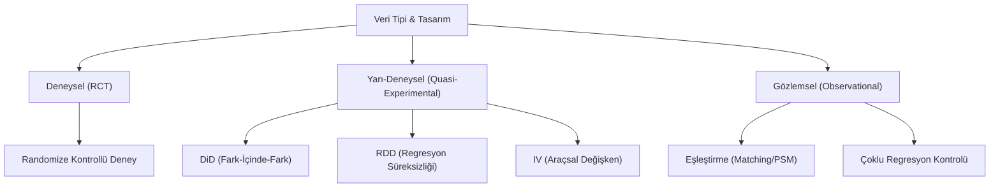

## 📌 Özet

Nedensel çıkarım, değişkenler arasındaki basit korelasyonun ötesine geçerek, bir müdahalenin (tedavi) sonuç üzerindeki gerçek etkisini belirlemeyi amaçlayan bir metodolojidir. Gözlemsel verilerde karşılaşılan karıştırıcı değişken (confounder) sorunu, korelasyonu nedensellik gibi göstererek yanıltıcı sonuçlara yol açabilir. Bu karmaşıklığı çözmek için DAG gibi görsel modellerle değişkenler arası yapılar tanımlanır ve IV (Araçsal Değişken), DiD (Fark-İçinde-Fark) veya RDD (Regresyon Süreksizliği) gibi "yarı-deneysel" yöntemler kullanılarak rastgele kontrollü deneylerin (RCT) koşulları ampirik olarak taklit edilir. Temel amaç, "bu tedavi uygulanmasaydı ne olurdu?" sorusuna yanıt arayan karşı-olgusal (counterfactual) düşünce yapısı üzerinden net nedensel etkileri tahmin etmektir.

---

## 🧠 Detay

### Nedensel Çıkarım Yöntemleri Hiyerarşisi



### Korelasyon ≠ Nedensellik

**Karıştırıcı Değişken (Confounder)**: Hem tedaviye hem sonuca etki eden gizli değişken.

**Simpson Paradoksu**: Toplam veriye bakışta ortaya çıkan ilişki, alt gruplarda tersine dönebilir.

**Örnek:**
- Üniversite eğitimi → Yüksek gelir (ama yetenek karıştırıcı değişken!)

---

### Nedensel Grafikler (DAG)

**Directed Acyclic Graph**: Oklar nedensellik yönünü gösterir.

```
Yaş → Tedavi → Sonuç
 ↘              ↗
    Karıştırıcı
```

**Düğüm Türleri:**

| Tür | Yapı | Açılıp Açılmamalı? |
|---|---|---|
| **Çatal (Fork/Confounder)** | A ← C → B | Kontrol et (aç) |
| **Zincir (Chain/Mediator)** | A → M → B | Amaca göre |
| **Çarpıştırıcı (Collider)** | A → C ← B | Kontrol etme (kapatma!) |

**Backdoor Kriteri**: Tedavi-sonuç yolundaki tüm "arka kapıları" kapat → nedensel etki tanımlanır.

---

### Ortalama Tedavi Etkisi (ATE)

**Potansiyel Sonuçlar Çerçevesi (Rubin):**
$$Y_i = Y_i(1) \cdot D_i + Y_i(0) \cdot (1-D_i)$$

- $Y_i(1)$: Tedavi alınsaydı sonuç
- $Y_i(0)$: Tedavi alınmasaydı sonuç
- **Temel sorun**: Aynı anda ikisini gözlemleyemeyiz

**Ortalama Tedavi Etkisi:**
$$ATE = E[Y_i(1) - Y_i(0)]$$

**ATT (Tedavi Görenlerdeki Ortalama Etki):**
$$ATT = E[Y_i(1) - Y_i(0) | D_i = 1]$$

---

### Araçsal Değişken (IV — Instrumental Variables)

**Durum:** Tedavi endojen (karıştırıcı değişken var, ölçülemiyor).

**Araçsal Değişken** $Z$ için koşullar:
1. **Alaka**: $Z$, tedaviyi etkiler ($Z \not\perp D$)
2. **Dışlama**: $Z$, sonucu sadece tedavi üzerinden etkiler
3. **Bağımsızlık**: $Z$, karıştırıcılardan bağımsız

**2SLS (Two-Stage Least Squares):**

Aşama 1: $D_i = \alpha_0 + \alpha_1 Z_i + \text{kontroller} + \nu_i$

Aşama 2: $Y_i = \beta_0 + \beta_1 \hat{D}_i + \text{kontroller} + \varepsilon_i$

**$\beta_1$ = LATE** (Yerel Ortalama Tedavi Etkisi — "complier" grubu için)

**Klasik IV Örnekleri:**
- Doğum ayı → Eğitim süresini etkiler (Angrist & Krueger)
- Piyango → Gelir değişkeni (askere alınma etkisi)

---

### Fark-İçinde-Fark (DiD — Difference-in-Differences)

**Durum:** Panel verisi, bir grup politikadan etkileniyor diğeri etkilenmiyor.

$$\hat{\delta} = (\bar{Y}_{tedavi,sonra} - \bar{Y}_{tedavi,önce}) - (\bar{Y}_{kontrol,sonra} - \bar{Y}_{kontrol,önce})$$

**Temel Varsayım**: **Paralel eğilim** — Tedavi olmasaydı iki grup benzer trend izlerdi.

**Regresyon formu:**
$$Y_{it} = \beta_0 + \beta_1 Tedavi_i + \beta_2 Sonra_t + \beta_3 (Tedavi_i \times Sonra_t) + \varepsilon_{it}$$

$\beta_3$ = DiD tahmincisi (nedensel etki).

**Paralel eğilim testi**: Tedavi öncesi dönem için plasebo testi.

---

### Regresyon Süreksizliği (RDD — Regression Discontinuity)

**Durum:** Tedavi, eşik değere göre belirleniyor.

```
Puan > 70 → Burs aldı
Puan < 70 → Burs alamadı
```

**Fikir:** Eşiğin hemen altı ve üstü neredeyse rastgele atanmış → Lokal RCT.

$$E[Y | X=c^+] - E[Y | X=c^-] = \text{Nedensel Etki}$$

**LATE** sadece eşik değerdeki bireyler için geçerli.

**Sharp RDD**: Eşikte tam geçiş
**Fuzzy RDD**: Eşikte geçiş olasılığı artıyor (IV ile analiz edilir)

---

### Eşleştirme Yöntemleri

**Propensity Score Matching:**

1. Tedavi alma olasılığını tahmin et: $e(X) = P(D=1|X)$
2. Benzer propensity skorlu kontrol-tedavi çiftleri eşleştir
3. Eşleştirilmiş örneklemde tedavi etkisini tahmin et

**Yöntemler:** En yakın komşu, caliper, kernel

**Varsayım:** Gözlenen kovaryatlar yeterli (tüm karıştırıcılar ölçülmüş)

---

### Hangi Yöntemi Kullanmalı?

| Durum | Yöntem |
|---|---|
| Randomizasyon mümkün | RCT |
| Doğal eşik var | RDD |
| Politika değişikliği + panel veri | DiD |
| İyi araçsal değişken var | IV / 2SLS |
| Tüm karıştırıcılar ölçüldü | PSM, Matching |

---

## 💡 Bağlantılar
- [[STAT - Korelasyon Analizi]]
- [[STAT - Regresyon Analizi - Basit Doğrusal]]
- [[STAT - Deneysel Tasarım]]

## ❓ Sorular / Anlamadıklarım


## 🔗 Kaynaklar
- Causal Inference: The Mixtape (Cunningham) - Free online
- The Effect (Huntington-Klein) - Free online
- Book of Why (Pearl)
