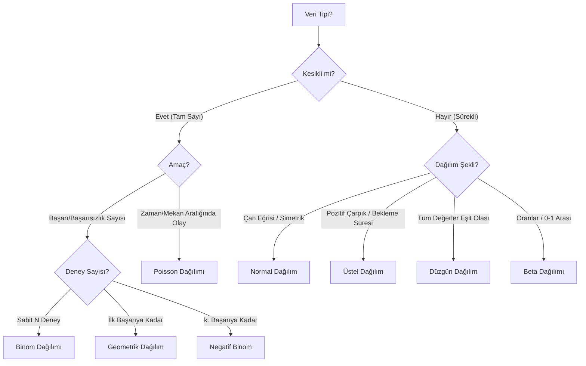

## 📌 Özet
Doğru olasılık dağılımını seçmek, verinin doğasını anlamak ve doğru istatistiksel modelleri kurmak için esastır. Verinin kesikli veya sürekli olması ve oluşma biçimi seçimi belirler.

---

## 🧠 Detay

### 🗺️ Olasılık Dağılım Seçim Karar Ağacı

### Önemli Dağılımların Özeti

| Dağılım | Kullanım Alanı | Önemli Parametre |
|---|---|---|
| **Normal** | Boy, Kilo, Ölçüm Hataları | $\mu$ (Ortalama), $\sigma$ (Std) |
| **Binom** | Yazı-Tura, Geçti-Kaldı | $n$ (Deney), $p$ (Olasılık) |
| **Poisson** | Saatlik müşteri sayısı, radyoaktif bozunma | $\lambda$ (Ortalama oran) |
| **Üstel** | İki çağrı arası geçen süre | $\lambda$ (Hız) |
| **Log-Normal** | Gelir dağılımı, hisse senedi fiyatları | $\mu, \sigma$ (Logaritmik) |

---

## 💡 Bağlantılar
- [[STAT - Olasılık Dağılımları (Kesikli)]]
- [[STAT - Olasılık Dağılımları (Sürekli)]]
- [[STAT - Normal Dağılım]]

## ❓ Sorular / Anlamadıklarım
- Merkezi Limit Teoremi neden her şeyi Normal dağılıma yaklaştırır?

## 🔗 Kaynaklar
- Common Probability Distributions Guide (Towards Data Science)
