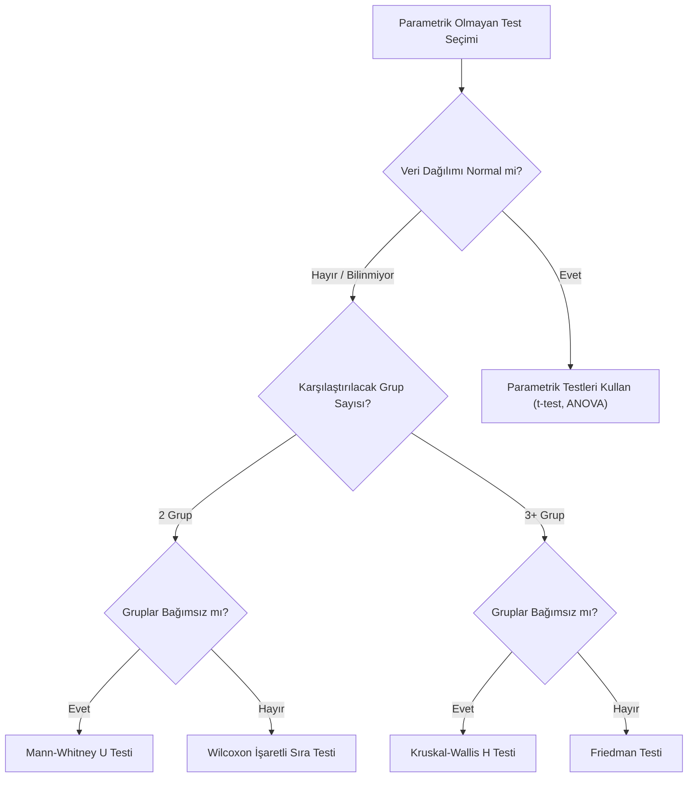

## 📌 Özet

Parametrik olmayan (non-parametric) testler, verilerin belirli bir dağılıma (örneğin normal dağılım) uyma zorunluluğu bulunmadığı durumlarda kullanılan esnek istatistiksel yöntemlerdir. Bu testler, verilerin ham değerlerinden ziyade sıralama (rank) değerlerini analiz ederek aykırı değerlere ve çarpık dağılımlara karşı direnç gösterir. Özellikle küçük örneklemlerde, sıralı (ordinal) verilerde veya varyans homojenliği sağlanamadığında t-testi ve ANOVA gibi parametrik yöntemlere en güçlü alternatifleri sunar. Mann-Whitney U, Wilcoxon ve Kruskal-Wallis gibi testler, modern veri analizinde varsayımların ihlal edildiği senaryolarda güvenilir sonuçlar elde etmek için kritik öneme sahiptir.

---

## 🧠 Detay



### Ne Zaman Parametrik Olmayan Test Kullanılır?

- Normallik sağlanamıyor (Shapiro-Wilk: p < 0.05)
- Küçük örneklem ($n < 30$) ve normal dağılım bilinmiyor
- Ordinal veri
- Aykırı değer çok fazla
- Varyans homojenliği yok

**Dezavantaj**: Parametrik testlere göre genellikle daha az güçlü (istatistiksel güç kaybı).

---

### Karşılaştırma Tablosu

| Parametrik | Parametrik Olmayan | Amaç |
|---|---|---|
| Tek örneklem t | Wilcoxon işaretli sıra | Medyanı sabit değerle karşılaştır |
| Bağımsız t | Mann-Whitney U | 2 bağımsız grup medyanı |
| Eşleştirilmiş t | Wilcoxon işaretli sıra | 2 bağımlı grup medyanı |
| Tek yönlü ANOVA | Kruskal-Wallis | k bağımsız grup medyanı |
| Tekrarlı ANOVA | Friedman | k bağımlı grup medyanı |
| Pearson r | Spearman r, Kendall τ | İki değişken ilişkisi |

---

### 1. Mann-Whitney U Testi

**Amaç**: İki bağımsız grubun medyanları farklı mı?

$H_0$: İki popülasyon dağılımı aynı (medyanlar eşit)

**Adımlar:**
1. İki grubu birleştir, küçükten büyüğe sırala
2. Her grubun sıralarını topla ($R_1$ ve $R_2$)
3. U istatistiklerini hesapla:

$$U_1 = n_1 n_2 + \frac{n_1(n_1+1)}{2} - R_1$$
$$U_2 = n_1 n_2 + \frac{n_2(n_2+1)}{2} - R_2$$
$$U = \min(U_1, U_2)$$

Büyük örneklemlerde normal yaklaşım:
$$Z = \frac{U - \mu_U}{\sigma_U}, \quad \mu_U = \frac{n_1 n_2}{2}, \quad \sigma_U = \sqrt{\frac{n_1 n_2(n_1+n_2+1)}{12}}$$

**Etki büyüklüğü** (r):
$$r = \frac{Z}{\sqrt{N}}$$

---

### 2. Wilcoxon İşaretli Sıra Testi

**İki kullanımı:**

#### a) Tek Örneklem
Medyanı belirli bir değerle karşılaştır ($H_0: \tilde{\mu} = \mu_0$)

1. $d_i = x_i - \mu_0$ hesapla
2. $|d_i|$'ye göre sırala
3. Pozitif ve negatif sıraları topla: $W^+$ ve $W^-$
4. $W = \min(W^+, W^-)$

#### b) Eşleştirilmiş
İki bağımlı grup:
1. $d_i = x_{1i} - x_{2i}$ hesapla
2. $|d_i|$'ye göre sırala
3. Aynı şekilde W hesapla

---

### 3. Kruskal-Wallis H Testi

**Amaç**: k bağımsız grubu karşılaştır (tek yönlü ANOVA alternatifi)

$H_0$: Tüm grupların dağılımı aynı

1. Tüm gözlemleri birleştir ve sırala
2. Her grup için sıra toplamları: $R_i$

$$H = \frac{12}{N(N+1)}\sum_{i=1}^k \frac{R_i^2}{n_i} - 3(N+1) \sim \chi^2_{k-1}$$

**Post-hoc**: Dunn testi (Bonferroni düzeltmeli)

---

### 4. Friedman Testi

**Amaç**: k bağımlı ölçüm (tekrarlı ANOVA alternatifi)

Matris olarak düşün: satırlar denekler, sütunlar koşullar.

1. Her satır içinde sırala
2. Sütun ortalama sıralarını hesapla

$$\chi^2_r = \frac{12}{nk(k+1)}\sum_{j=1}^k R_j^2 - 3n(k+1) \sim \chi^2_{k-1}$$

**Post-hoc**: Wilcoxon (Bonferroni düzeltmeli)

---

### 5. Sign Test (İşaret Testi)

Wilcoxon'dan daha basit ama daha az güçlü.

1. $d_i > 0$ için + işareti, $d_i < 0$ için - işareti
2. $S = \min(S^+, S^-)$
3. Binom dağılımıyla test et

---

### Python ile Parametrik Olmayan Testler

```python
from scipy import stats

# Mann-Whitney U
stat, p = stats.mannwhitneyu(group1, group2, alternative='two-sided')

# Wilcoxon işaretli sıra (eşleştirilmiş)
stat, p = stats.wilcoxon(before, after)

# Tek örneklem Wilcoxon
stat, p = stats.wilcoxon(data - mu0)

# Kruskal-Wallis
stat, p = stats.kruskal(group1, group2, group3)

# Friedman
stat, p = stats.friedmanchisquare(cond1, cond2, cond3)

# Post-hoc Dunn (kruskal sonrası)
import scikit_posthocs as sp
result = sp.posthoc_dunn([group1, group2, group3], p_adjust='bonferroni')
```

---

## 💡 Bağlantılar
- [[STAT - Hipotez Testleri - t-testi]]
- [[STAT - ANOVA]]
- [[STAT - Normal Dağılım]]
- [[STAT - Hipotez Testleri - Temel Kavramlar]]

## ❓ Sorular / Anlamadıklarım


## 🔗 Kaynaklar
- Field, A. - Discovering Statistics Using IBM SPSS - Ch. 6-7
- scipy.stats Documentation
