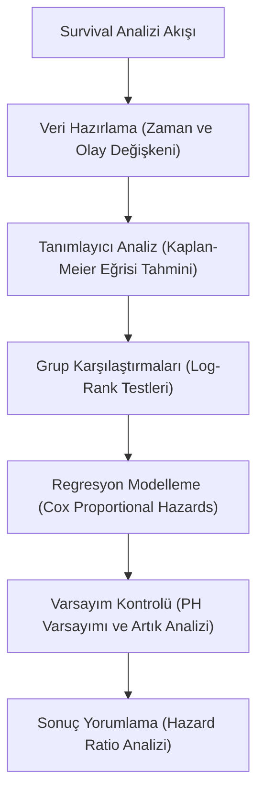

## 📌 Özet

Survival analizi (hayatta kalma analizi), belirli bir başlangıç noktasından ilgilenilen bir olayın (ölüm, makine arızası, abonelik iptali vb.) gerçekleşmesine kadar geçen 'bekleme süresini' inceleyen istatistiksel yöntemler bütünüdür. Bu analizin en ayırt edici özelliği, çalışma süresince olayın henüz gerçekleşmediği veya takibin koptuğu 'sansürlenmiş' verileri (censored data) etkin bir şekilde işleyebilmesidir. Tıpta tedavi etkinliği ölçümünden, bankacılıkta kredi temerrüt analizine ve mühendislikte güvenilirlik hesaplamalarına kadar geniş bir uygulama alanına sahiptir. Kaplan-Meier eğrileri ile olasılık tahmini yapılırken, Cox regresyonu ile risk faktörlerinin süre üzerindeki etkileri nicelleştirilir.

---

## 🧠 Detay



### Temel Kavramlar

| Kavram | Tanım |
|---|---|
| **Olay (Event)** | İlgilenilen son nokta (ölüm, arıza, churn) |
| **Süre (Time)** | Başlangıçtan olaya kadar geçen zaman |
| **Sansürleme** | Gözlem süresi dolmadan çalışma bitti / kişi ayrıldı |

### Sansür Türleri

| Tür | Açıklama |
|---|---|
| **Sağ sansür (Right)** | Olay gözlem döneminin dışında (en yaygın) |
| **Sol sansür (Left)** | Olay başlangıçtan önce gerçekleşmiş |
| **Aralık sansür** | Olay bilinen bir aralıkta |

**Sansürleme varsayımı**: Sansürleme nedeni ile olay olasılığı bağımsız.

---

### Temel Fonksiyonlar

#### Survival Fonksiyonu S(t)

$$S(t) = P(T > t)$$

- $S(0) = 1$ (herkes hayatta başlıyor)
- $S(\infty) = 0$ (herkes sonunda deneyimler)
- Azalan fonksiyon

#### Hazard Fonksiyonu h(t)

Anlık olay hızı:

$$h(t) = \lim_{\Delta t \to 0} \frac{P(t \leq T < t+\Delta t | T \geq t)}{\Delta t} = \frac{f(t)}{S(t)}$$

**Kümülatif Hazard:**
$$H(t) = \int_0^t h(u)\, du = -\ln S(t)$$

$$S(t) = e^{-H(t)}$$

#### Dağılım Seçimi

| Dağılım | Hazard | Kullanım |
|---|---|---|
| Üstel | Sabit $h(t) = \lambda$ | Hafızasızlık, elektronik |
| Weibull | $h(t) = \lambda\alpha(\lambda t)^{\alpha-1}$ | Genel amaç |
| Log-Normal | Önce artar, sonra azalır | Kanser nüksü |
| Gompertz | Üstel artar | Yaşlanma |

---

### Kaplan-Meier Tahmincisi

Parametrik varsayım gerektirmeyen S(t) tahmini.

$$\hat{S}(t) = \prod_{t_i \leq t} \left(1 - \frac{d_i}{n_i}\right)$$

- $d_i$: $t_i$ anında olay sayısı
- $n_i$: $t_i$ anında risk altındaki sayı

**Örnek KM Tablosu:**

| t | n_i | d_i | S(t) |
|---|---|---|---|
| 0 | 20 | — | 1.000 |
| 3 | 20 | 2 | 0.900 |
| 5 | 17 | 1 | 0.847 |
| 8 | 15 | 3 | 0.678 |

**Güven Aralığı** (Greenwood formülü):
$$Var[\ln(-\ln\hat{S}(t))] \approx \sum_{t_i \leq t} \frac{d_i}{n_i(n_i - d_i)}$$

---

### Log-Rank Testi

İki veya daha fazla grubun survival eğrilerini karşılaştırır.

$$H_0: S_1(t) = S_2(t) \text{ (tüm t için)}$$

$$\chi^2 = \frac{(O_1 - E_1)^2}{E_1} + \frac{(O_2 - E_2)^2}{E_2} \sim \chi^2_1$$

---

### Cox Proportional Hazard Modeli

Kovaryatların hayatta kalma süresine etkisini modeller.

$$h(t|\mathbf{x}) = h_0(t) \cdot \exp(\beta_1 x_1 + \beta_2 x_2 + \cdots)$$

- $h_0(t)$: Baz hazard (parametrik varsayım yok)
- $e^{\beta_j}$: **Hazard Ratio (HR)** — j. değişkende 1 birim artışın hazard üzerindeki etkisi

**Yorumlama HR:**
- HR = 1: Etki yok
- HR = 2: Hazard 2 katına çıktı (daha kötü)
- HR = 0.5: Hazard yarıya indi (daha iyi, koruyucu)

**Proportional Hazard Varsayımı:**
$$\frac{h(t|\mathbf{x}_1)}{h(t|\mathbf{x}_2)} = \text{sabit}$$

Test: Schoenfeld artıkları, log-log S(t) grafikleri.

---

### Python ile Survival Analizi

```python
from lifelines import KaplanMeierFitter, CoxPHFitter, LogRankTest
import pandas as pd

# Kaplan-Meier
kmf = KaplanMeierFitter()
kmf.fit(df['duration'], event_observed=df['event'])
kmf.plot_survival_function()

# İki grup karşılaştırma
kmf_group1 = KaplanMeierFitter()
kmf_group2 = KaplanMeierFitter()
kmf_group1.fit(df[df.group==1]['duration'], df[df.group==1]['event'])
kmf_group2.fit(df[df.group==2]['duration'], df[df.group==2]['event'])

# Log-rank testi
results = LogRankTest(df[df.group==1]['duration'],
                      df[df.group==2]['duration'],
                      event_observed_A=df[df.group==1]['event'],
                      event_observed_B=df[df.group==2]['event'])
print(f'p-value: {results.p_value:.4f}')

# Cox Model
cph = CoxPHFitter()
cph.fit(df, duration_col='duration', event_col='event')
cph.print_summary()
cph.plot_partial_effects_on_outcome('age', values=[40, 50, 60])
```

---

## 💡 Bağlantılar
- [[STAT - Olasılık Dağılımları (Sürekli)]]
- [[STAT - Hipotez Testleri - Ki-kare ve F Testi]]
- [[STAT - Regresyon Analizi - Basit Doğrusal]]

## ❓ Sorular / Anlamadıklarım


## 🔗 Kaynaklar
- Applied Survival Analysis (Hosmer & Lemeshow)
- lifelines Python Documentation
