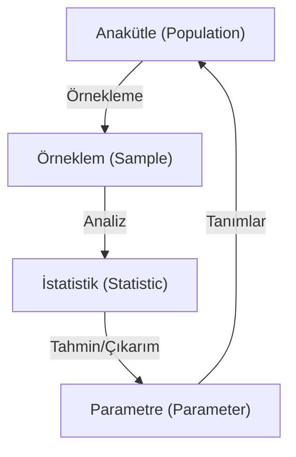

## 📌 Özet

İstatistik bilimi, verilerin sistematik bir şekilde toplanması, özetlenmesi ve bu verilerden hareketle evren hakkında anlamlı çıkarımlar yapılması sürecini kapsar. Temel amacı, belirsizlik içeren durumlarda veriye dayalı karar verme mekanizmalarını güçlendirmek ve karmaşık veri setlerini anlaşılır hale getirmektir. Bu süreçte anakütleden seçilen temsil kabiliyeti yüksek örneklemler üzerinden elde edilen istatistikler, anakütle parametrelerini tahmin etmek için kullanılır. İstatistiksel yöntemler, sadece geçmişi betimlemekle kalmaz, aynı zamanda geleceğe yönelik öngörülerde bulunmamıza ve değişkenler arasındaki nedensellik ilişkilerini test etmemize olanak tanır.

---

## 🧠 Detay

### İstatistiksel Süreç Akışı



### Temel Kavramlar

| Kavram | Tanım |
|---|---|
| **Anakütle (Population)** | İncelenmek istenen tüm birimler kümesi |
| **Örneklem (Sample)** | Anakütleden seçilen alt küme |
| **Parametre** | Anakütleyi tanımlayan sayısal değer (μ, σ) |
| **İstatistik** | Örneklemi tanımlayan sayısal değer (x̄, s) |
| **Değişken (Variable)** | Birimden birime farklılık gösteren özellik |

### Değişken Türleri

```
Değişkenler
├── Nitel (Kategorik)
│   ├── Nominal → Cinsiyet, Renk, Şehir
│   └── Ordinal → Eğitim düzeyi, Memnuniyet skoru
└── Nicel (Sayısal)
    ├── Kesikli (Discrete) → Öğrenci sayısı, Hata sayısı
    └── Sürekli (Continuous) → Boy, Kilo, Sıcaklık
```

### Ölçüm Ölçekleri

| Ölçek | Özellik | Örnek |
|---|---|---|
| **Nominal** | Sadece sınıflandırma | Kan grubu |
| **Ordinal** | Sıralama var, aralık eşit değil | Likert ölçeği |
| **Aralık (Interval)** | Eşit aralık, mutlak sıfır yok | Celsius |
| **Oran (Ratio)** | Eşit aralık + mutlak sıfır var | Kilo, Yaş |

### Betimsel vs Çıkarımsal İstatistik

- **Betimsel**: Veriyi özetler, açıklar (tablo, grafik, ortalama)
- **Çıkarımsal**: Örneklemden anakütleye genelleme yapar (hipotez testi, güven aralığı)

### Veri Toplama Yöntemleri

- **Gözlem**: Doğal ortamda pasif izleme
- **Anket**: Soru formu ile bilgi toplama
- **Deney**: Kontrollü ortamda müdahale
- **Mevcut veriler**: İdari kayıtlar, veri tabanları

---

## 💡 Bağlantılar
- [[STAT - Betimsel İstatistik]]
- [[STAT - Olasılık Temelleri]]
- [[DS - Betimsel İstatistik]]

## ❓ Sorular / Anlamadıklarım


## 🔗 Kaynaklar
- Statistics (Freedman, Pisani, Purves)
- OpenStax Statistics
