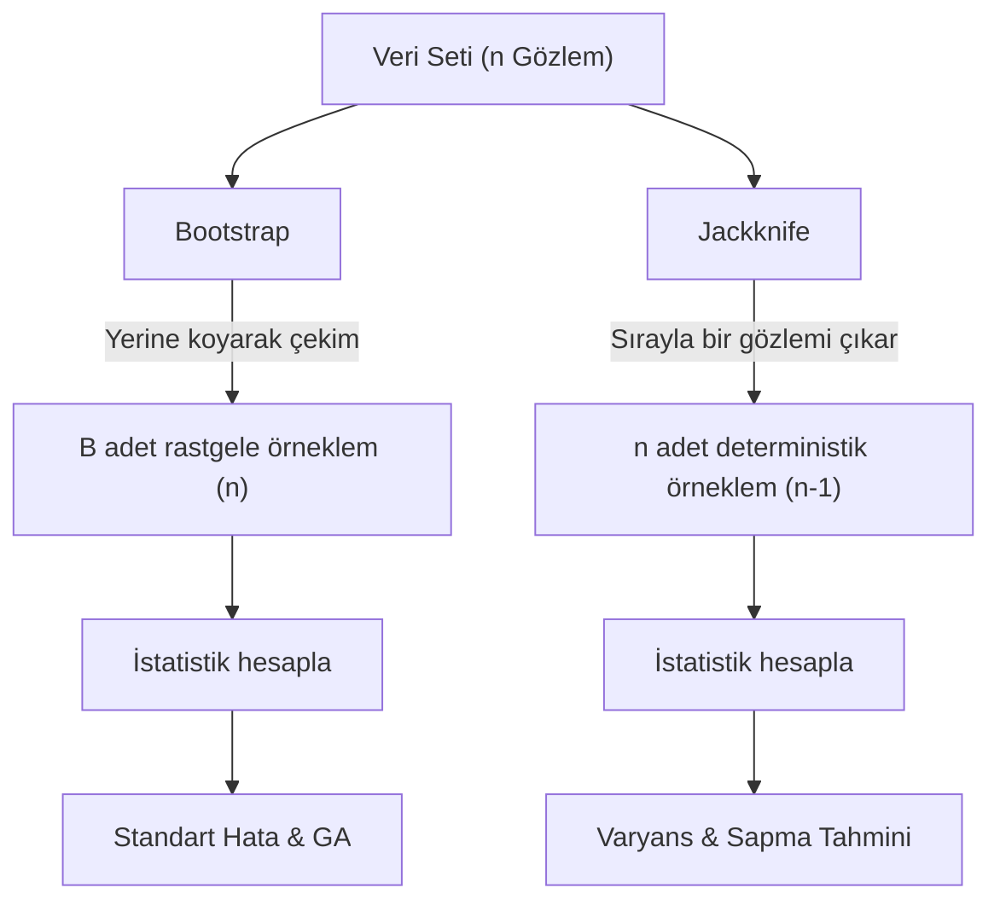

## 📌 Özet

Yeniden örnekleme (resampling) yöntemleri, modern istatistiğin en güçlü araçlarından biri olup, verinin dağılımı hakkında katı varsayımlarda bulunmadan (non-parametrik) çıkarım yapmamızı sağlar. Bu yöntemler, mevcut veri setinden tekrar tekrar alt örneklemler çekerek istatistiksel tahmin edicilerin değişkenliğini, standart hatasını ve güven aralıklarını hesaplar. Özellikle analitik formüllerin bulunmadığı karmaşık istatistiklerde veya örneklem büyüklüğünün küçük olduğu durumlarda Bootstrap ve Jackknife gibi teknikler hayat kurtarıcıdır. Ayrıca, model geçerliliğini test etmek için Cross-Validation ve hipotez testleri için Permütasyon testleri, veriye dayalı kararların doğruluğunu ampirik olarak kanıtlamak için yaygın olarak kullanılır.

---

## 🧠 Detay

### Yeniden Örnekleme Stratejileri



### Bootstrap ⭐

**Fikir**: Gerçek anakütle bilinmiyor → Örneklem anakütle gibi davranır. Örneklemden tekrar çekimle (with replacement) yeni örneklemler oluştur.

**Algoritma:**
1. Orijinal örneklem: $\mathbf{x} = (x_1, \ldots, x_n)$
2. B kez: $\mathbf{x}^{*(b)}$ çek (n gözlem, yerine koy)
3. Her $\mathbf{x}^{*(b)}$ için istatistiği hesapla: $\hat{\theta}^{*(b)}$
4. $\{\hat{\theta}^{*(1)}, \ldots, \hat{\theta}^{*(B)}\}$ bootstrap dağılımını analiz et

**B = 1000** genellikle yeterli (GA için B = 2000-5000).

#### Bootstrap Standart Hatası

$$SE_B = \sqrt{\frac{1}{B-1}\sum_{b=1}^B (\hat{\theta}^{*(b)} - \bar{\theta}^*)^2}$$

#### Bootstrap Güven Aralıkları

**1. Percentile Yöntemi (basit):**
$$GA = [\hat{\theta}^*_{(\alpha/2)},\ \hat{\theta}^*_{(1-\alpha/2)}]$$

**2. BCa (Bias-Corrected and Accelerated):**
Daha doğru, daha karmaşık.

**3. t-Bootstrap:**
$$GA = [\hat{\theta} - t_{1-\alpha/2}^* \cdot SE,\ \hat{\theta} - t_{\alpha/2}^* \cdot SE]$$

**Ne zaman Bootstrap?**
- Medyan, korelasyon, rasyo gibi karmaşık istatistikler
- Küçük örneklem, normallik yok
- Analitik formül yok veya zor

---

### Jackknife

**Fikir**: Sırayla her gözlemi dışarıda bırak, istatistiği hesapla.

$$\hat{\theta}_{(i)} = T(\mathbf{x}_{-i})$$

**Jackknife SE:**
$$SE_{JK} = \sqrt{\frac{n-1}{n}\sum_{i=1}^n (\hat{\theta}_{(i)} - \bar{\theta}_{JK})^2}$$

**Jackknife Bias Tahmini:**
$$Bias_{JK} = (n-1)(\bar{\theta}_{JK} - \hat{\theta})$$

**Düzeltilmiş Tahminci:**
$$\hat{\theta}_{JK} = \hat{\theta} - Bias_{JK}$$

**Bootstrap vs Jackknife:**
- Jackknife: Hızlı, deterministik, ama daha az genel
- Bootstrap: Genel, daha güçlü, rassal (seed ile tekrarlanabilir)

---

### Permütasyon Testi

**Fikir**: $H_0$ doğruysa grup etiketleri önemli değil → Rastgele karıştır.

**Algoritma:**
1. Gözlenen test istatistiği: $T_{obs}$
2. B kez: Grup etiketlerini karıştır, $T^{(b)}$ hesapla
3. p-değeri: $p = \frac{\#\{T^{(b)} \geq T_{obs}\}}{B}$

**Özellikler:**
- Parametrik varsayım YOK
- $H_0$ altında **kesin** (exact) p-değeri
- İki grup karşılaştırması, bağımsızlık testi için

**Örnek:**
```python
def permutation_test(group1, group2, B=10000):
    observed_diff = np.mean(group1) - np.mean(group2)
    combined = np.concatenate([group1, group2])
    n1 = len(group1)
    
    count = 0
    for _ in range(B):
        shuffled = np.random.permutation(combined)
        perm_diff = np.mean(shuffled[:n1]) - np.mean(shuffled[n1:])
        if abs(perm_diff) >= abs(observed_diff):
            count += 1
    
    return count / B  # p-değeri
```

---

### Çapraz Doğrulama (Cross-Validation)

**Amaç**: Model performansını bağımsız test verisinde tahmin et.

#### k-Fold CV

1. Veriyi k eşit parçaya böl
2. Her parça bir kez test, geri kalanlar eğitim
3. k hata ortalaması → CV hatası

**k = 5** veya **k = 10** standart.

#### Leave-One-Out CV (LOOCV)

$k = n$ özel durumu. Her seferinde 1 gözlem test.

$$CV_{LOO} = \frac{1}{n}\sum_{i=1}^n L(y_i, \hat{y}_{-i})$$

**Dezavantaj**: Hesap maliyetli; yüksek varyans.

#### Stratified k-Fold

Sınıf dengesizliğinde her fold'da sınıf oranı korunur.

#### Zaman Serisi CV

Gelecek geçmişi kullanamaz → Expanding window veya rolling window.

---

### Monte Carlo Simülasyonu

**Fikir**: Analitik çözüm zor → Rastgele örnekleme ile sayısal çözüm.

**Örnek — π tahmini:**
```python
import numpy as np

N = 1_000_000
x, y = np.random.uniform(-1, 1, N), np.random.uniform(-1, 1, N)
inside = (x**2 + y**2) <= 1
pi_estimate = 4 * inside.mean()  # ≈ 3.14159
```

**Kullanım Alanları:**
- Risk analizi (finansal simülasyon)
- Karmaşık olasılık hesapları
- Örneklem büyüklüğü simülasyonu
- MCMC (Bayesci çıkarım)

---

## 💡 Bağlantılar
- [[STAT - Güven Aralıkları]]
- [[STAT - Hipotez Testleri - Temel Kavramlar]]
- [[STAT - Bayes İstatistiği]]
- [[ML - Model Değerlendirme Metrikleri]]

## ❓ Sorular / Anlamadıklarım


## 🔗 Kaynaklar
- Computer Age Statistical Inference (Efron & Hastie) - Free PDF
- All of Statistics (Wasserman) - Ch. 8
