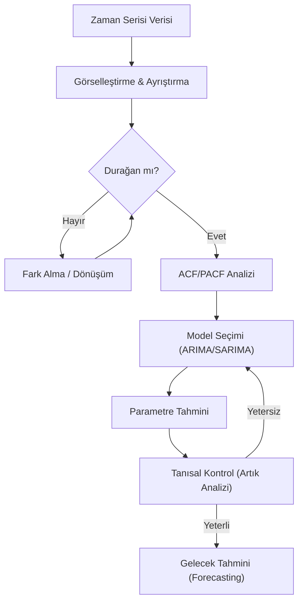

## 📌 Özet

Zaman serisi analizi, verilerin belirli zaman aralıklarıyla sıralı bir şekilde gözlemlendiği durumlarda, geçmişteki desenleri kullanarak geleceğe yönelik tahminler yapmayı amaçlayan istatistiksel bir disiplindir. Bu analizde veriler; uzun vadeli eğilimi gösteren trend, periyodik tekrarları ifade eden mevsimsellik, ekonomik dalgalanmaları yansıtan döngü ve öngörülemeyen rastgele bileşenlere ayrıştırılır. Analiz sürecinin en kritik adımlarından biri durağanlık testidir; çünkü ARIMA gibi modeller, serinin ortalama ve varyansının zaman boyunca sabit kalmasını gerektirir. Doğru modelleme stratejisi, otokorelasyon fonksiyonları (ACF/PACF) ve bilgi kriterleri (AIC/BIC) kullanılarak belirlenir ve modelin başarısı RMSE veya MAPE gibi hata metrikleriyle ölçülür.

---

## 🧠 Detay

### Zaman Serisi Analiz İş Akışı



### Zaman Serisi Bileşenleri

$$Y_t = T_t + S_t + C_t + I_t \quad \text{(Katkısal Model)}$$
$$Y_t = T_t \times S_t \times C_t \times I_t \quad \text{(Çarpımsal Model)}$$

| Bileşen | Sembol | Açıklama |
|---|---|---|
| **Trend** | $T_t$ | Uzun dönem artış/azalış eğilimi |
| **Mevsimsellik** | $S_t$ | Tekrarlayan dönemsel desen (yıllık, haftalık) |
| **Döngü** | $C_t$ | Ekonomik döngüler (çoklu yıl) |
| **Düzensizlik** | $I_t$ | Açıklanamayan rastgele dalgalanmalar |

---

### Durağanlık (Stationarity) ⭐

Zaman serisinin istatistiksel özellikleri zamanla değişmiyorsa **durağandır**.

**Güçlü Durağanlık**: Tüm ortak dağılım zamanla aynı.

**Zayıf (Kovaryans) Durağanlık**:
1. $E[Y_t] = \mu$ (sabit ortalama)
2. $Var(Y_t) = \sigma^2$ (sabit varyans)
3. $Cov(Y_t, Y_{t+h}) = \gamma(h)$ (sadece $h$'ye bağlı)

**Durağanlık Testleri:**
- **ADF (Augmented Dickey-Fuller)**: $H_0$: Birim kök var (durağan değil)
- **KPSS**: $H_0$: Durağan
- **PP (Phillips-Perron)**: ADF'nin güçlendirilmiş versiyonu

**Durağanlaştırma:**
- Fark alma: $\Delta Y_t = Y_t - Y_{t-1}$
- Log dönüşümü: $\ln(Y_t)$

---

### Otokorelasyon

Zaman serisinin kendi gecikmesiyle korelasyonu.

**ACF (Otokorelasyon Fonksiyonu)**:
$$r_h = \frac{\sum_{t=h+1}^n (y_t-\bar{y})(y_{t-h}-\bar{y})}{\sum_{t=1}^n (y_t-\bar{y})^2}$$

**PACF (Kısmi Otokorelasyon)**: Araya giren gecikmeler kontrol altındayken korelasyon.

**Yorumlama:**

| Model | ACF | PACF |
|---|---|---|
| AR(p) | Yavaş azalır | p'de kesilir |
| MA(q) | q'da kesilir | Yavaş azalır |
| ARMA(p,q) | Yavaş azalır | Yavaş azalır |

---

### ARIMA(p, d, q) Modeli

$$\text{AR}(p): Y_t = \phi_1 Y_{t-1} + \phi_2 Y_{t-2} + \cdots + \phi_p Y_{t-p} + \varepsilon_t$$

$$\text{MA}(q): Y_t = \varepsilon_t + \theta_1\varepsilon_{t-1} + \cdots + \theta_q\varepsilon_{t-q}$$

- **p**: AR derecesi (gecikmeli Y sayısı)
- **d**: Fark sayısı (durağanlaştırma için)
- **q**: MA derecesi (gecikmeli hata sayısı)

**Mevsimsel SARIMA(p,d,q)(P,D,Q)[m]**:
Mevsimsel periyot $m$ (ay verisi için 12) ile ek parametreler.

### ARIMA Model Seçimi

1. Trend/mevsimsellik varsa fark al / log al
2. ADF ile durağanlık test et
3. ACF ve PACF grafiklerinden p, q tahmin et
4. AIC/BIC ile model seç (en küçük = en iyi)
5. Artıklarda otokorelasyon var mı? (Ljung-Box testi)

**auto_arima** ile otomatik seçim mümkündür.

---

### Exponential Smoothing (Üstel Düzeltme)

#### Simple Exponential Smoothing (Trend/Mevsimsellik yok)

$$\hat{Y}_{t+1} = \alpha Y_t + (1-\alpha)\hat{Y}_t, \quad 0 < \alpha < 1$$

$\alpha$ büyükse → son gözleme ağırlık artar (hızlı tepki)

#### Holt's Method (Trend var)

Level + Trend iki bileşen.

#### Holt-Winters (Trend + Mevsimsellik)

Level + Trend + Seasonality üç bileşen.

---

### Tahmin Doğruluğu Metrikleri

$$MAE = \frac{1}{n}\sum|y_t - \hat{y}_t|$$

$$MSE = \frac{1}{n}\sum(y_t - \hat{y}_t)^2$$

$$RMSE = \sqrt{MSE}$$

$$MAPE = \frac{100}{n}\sum\left|\frac{y_t - \hat{y}_t}{y_t}\right|$$

### Python ile Zaman Serisi

```python
import pandas as pd
import matplotlib.pyplot as plt
from statsmodels.tsa.stattools import adfuller, acf, pacf
from statsmodels.graphics.tsaplots import plot_acf, plot_pacf
from statsmodels.tsa.arima.model import ARIMA
from statsmodels.tsa.statespace.sarimax import SARIMAX

# ADF testi
result = adfuller(ts)
print(f'ADF İstatistiği: {result[0]:.4f}')
print(f'p-değeri: {result[1]:.4f}')

# ACF/PACF grafikleri
fig, axes = plt.subplots(1, 2, figsize=(12, 4))
plot_acf(ts, ax=axes[0], lags=40)
plot_pacf(ts, ax=axes[1], lags=40)

# ARIMA modeli
model = ARIMA(ts, order=(1, 1, 1)).fit()
forecast = model.forecast(steps=12)

# Auto ARIMA
import pmdarima as pm
model = pm.auto_arima(ts, seasonal=True, m=12, 
                       information_criterion='aic')
```

---

## 💡 Bağlantılar
- [[DS - Zaman Serisi Analizi]]
- [[STAT - Otokorelasyon ve Durbin-Watson]]
- [[ML - Gradient Boosting ve XGB]] (zaman serisi için)

## ❓ Sorular / Anlamadıklarım


## 🔗 Kaynaklar
- Hyndman & Athanasopoulos - Forecasting: Principles and Practice (free online)
- statsmodels Time Series Analysis
