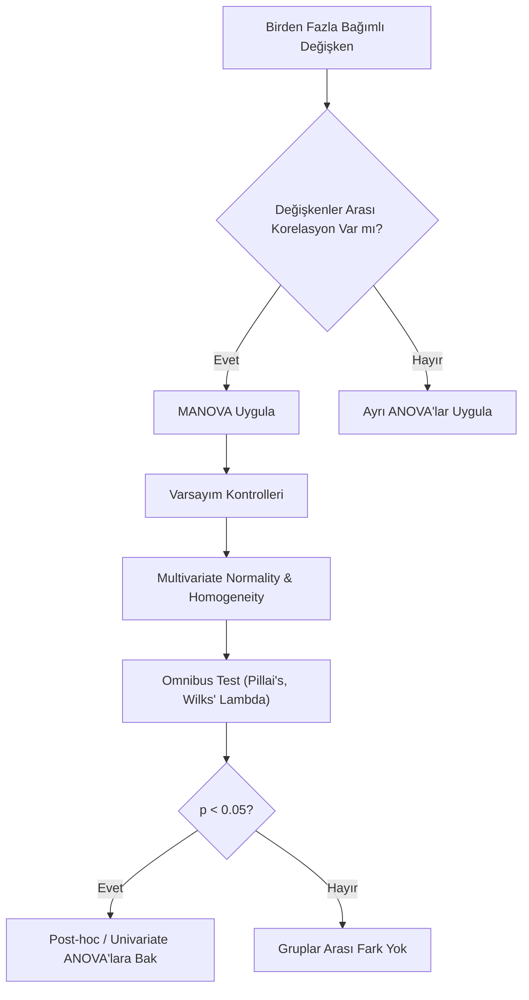

## 📌 Özet
MANOVA (Multivariate Analysis of Variance), birden fazla bağımlı değişkenin (outcome) bir veya daha fazla bağımsız değişken (grup) üzerindeki etkisini aynı anda inceleyen istatistiksel bir yöntemdir. Standart ANOVA sadece tek bir bağımlı değişkene odaklanırken, MANOVA bu değişkenler arasındaki korelasyonu da hesaba katarak daha kapsamlı bir analiz sunar. Bu yöntem, tip I hata oranını (çoklu test yapma hatası) kontrol altında tutmak ve değişkenler arasındaki ortak etkileri keşfetmek için kritik öneme sahiptir.

---

## 🧠 Detay

### 🗺️ MANOVA Karar ve Analiz Akışı

### 1. Neden ANOVA yerine MANOVA?
- **Tip I Hata Koruması:** 5 farklı bağımlı değişken için 5 ayrı ANOVA yapıldığında hata payı artar. MANOVA tek bir testle genel anlamlılığı sorgular.
- **Değişken Etkileşimi:** Bazen değişkenler tek başına fark yaratmazken, bir araya geldiklerinde (multivariate uzayda) grupları birbirinden keskin bir şekilde ayırabilirler.

### 2. MANOVA Varsayımları
- **Bağımsızlık:** Gözlemler birbirinden bağımsız olmalıdır.
- **Çok Değişkenli Normallik (Multivariate Normality):** Değişkenlerin kombinasyonu normal dağılmalıdır.
- **Varyans-Kovaryans Matrislerinin Homojenliği:** Grupların kovaryans matrisleri benzer olmalıdır (Box's M Testi ile kontrol edilir).
- **Multicollinearity Yokluğu:** Bağımlı değişkenler arasında çok yüksek korelasyon olmamalıdır (ideal: 0.20 - 0.70 arası).

### 3. İstatistiksel Metrikler
MANOVA sonuçlarını yorumlarken dört ana test kullanılır:
- **Wilks' Lambda:** En yaygın kullanılanıdır. Değer küçüldükçe etkinin büyüklüğü artar.
- **Pillai’s Trace:** Varsayımların ihlaline karşı en dayanıklı (robust) testtir.
- **Hotelling’s Trace:** Sadece iki grup olduğunda tercih edilir.
- **Roy’s Largest Root:** Sadece tek bir boyutun önemli olduğunu düşünüyorsanız kullanılır.

---

## 💡 Bağlantılar
- [[STAT - ANOVA]]
- [[STAT - Hipotez Testleri - Temel Kavramlar]]
- [[STAT - Çok Değişkenli İstatistik]]

## ❓ Sorular / Anlamadıklarım
- Box's M testi çok hassas mıdır? (Cevap: Evet, örneklem büyükse en küçük sapmada bile anlamlı çıkar).
- MANOVA anlamlı çıktıktan sonra hangi değişkenin fark yarattığını nasıl anlarız? (Follow-up ANOVA).

## 🔗 Kaynaklar
- [Discovering Statistics Using R/IBM SPSS (Andy Field)](https://www.discoveringstatistics.com/)
- [Multivariate Data Analysis (Hair et al.)](https://www.pearson.com/)
