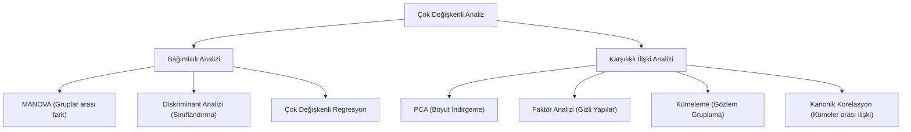

## 📌 Özet

Çok değişkenli istatistik, tek bir bağımlı değişken yerine birden fazla bağımlı değişkenin eş zamanlı olarak incelendiği ve bu değişkenler arasındaki korelasyon yapısının dikkate alındığı ileri düzey bir analiz alanıdır. Bu yaklaşım, değişkenleri birbirinden bağımsızmış gibi ele almak yerine, onları bir vektör olarak tanımlayarak sistemin bütünsel davranışını kavramamıza olanak tanır. MANOVA ile gruplar arası farklılıklar birden fazla boyutta test edilirken, Diskriminant Analizi ile bu farkların hangi değişkenlerden kaynaklandığı ve yeni gözlemlerin hangi gruba ait olduğu belirlenir. Kanonik korelasyon ve kümeleme gibi teknikler ise veri setindeki gizli yapıları ve değişken kümeleri arasındaki ilişkileri ortaya çıkarmak için kullanılır.

---

## 🧠 Detay

### Çok Değişkenli Tekniklerin Sınıflandırılması



### Çok Değişkenli Normal Dağılım $MVN(\boldsymbol{\mu}, \boldsymbol{\Sigma})$

$$f(\mathbf{x}) = \frac{1}{(2\pi)^{p/2}|\boldsymbol{\Sigma}|^{1/2}} \exp\!\left(-\frac{1}{2}(\mathbf{x}-\boldsymbol{\mu})^T\boldsymbol{\Sigma}^{-1}(\mathbf{x}-\boldsymbol{\mu})\right)$$

- $p$: Boyut sayısı
- $\boldsymbol{\mu}$: $p \times 1$ ortalama vektörü
- $\boldsymbol{\Sigma}$: $p \times p$ kovaryans matrisi

**Özellikler:**
- Marjinal dağılımlar da normal: $X_i \sim N(\mu_i, \sigma_{ii})$
- Koşullu dağılımlar da normal
- $\boldsymbol{\Sigma}$ köşegen ise değişkenler bağımsız
- Sabit Mahalanobis uzaklığındaki noktalar elips oluşturur

### Çok Değişkenli Normallik Testi

- **Henze-Zirkler testi**: Çok değişkenli normalliğin güçlü testi
- **Mardia testi**: Çarpıklık ve basıklık tabanlı
- **Grafik**: Çok değişkenli Q-Q plot (chi-kare Q-Q)

### Hotelling'in $T^2$ Testi

Tek örneklem t-testinin çok değişkenli genellemesi.

**Tek örneklem:**
$$T^2 = n(\bar{\mathbf{x}} - \boldsymbol{\mu}_0)^T \mathbf{S}^{-1} (\bar{\mathbf{x}} - \boldsymbol{\mu}_0) \sim \frac{p(n-1)}{n-p} F_{p, n-p}$$

**İki örneklem:**
$$T^2 = \frac{n_1 n_2}{n_1+n_2} (\bar{\mathbf{x}}_1 - \bar{\mathbf{x}}_2)^T \mathbf{S}_p^{-1} (\bar{\mathbf{x}}_1 - \bar{\mathbf{x}}_2)$$

$\mathbf{S}_p$: Havuzlanmış kovaryans matrisi

### MANOVA (Çok Değişkenli ANOVA)

Birden fazla bağımlı değişken aynı anda test edilir.

**Avantaj**: Tip I hatayı kontrol eder, değişkenler arası korelasyonu dikkate alır.

**Test İstatistikleri:**

| İstatistik | Formül | Güçlü Olduğu Durum |
|---|---|---|
| **Wilks' Λ** | $\Lambda = |\mathbf{W}|/|\mathbf{T}|$ | Genel kullanım |
| **Pillai's Trace** | $\sum \frac{\lambda_i}{1+\lambda_i}$ | Küçük örneklem, normallik ihlali |
| **Hotelling-Lawley** | $\sum \lambda_i$ | Tek faktör |
| **Roy's Largest Root** | $\max(\lambda_i)$ | Güçlü ama hassas |

**Wilks' Λ Yorumlama:**
- $\Lambda = 1$: Gruplar arası fark yok
- $\Lambda = 0$: Mükemmel ayrışım

**Sonrasında**: Her bağımlı değişken için ayrı ANOVA (Bonferroni düzeltmeli).

### Doğrusal Diskriminant Analizi (LDA)

**Amaç**: Grupları en iyi ayıran doğrusal kombinasyonu bul. Hem boyut indirgeme hem sınıflandırma.

**Fisher'ın Kriterini Maksimize Et:**
$$J(\mathbf{w}) = \frac{\mathbf{w}^T \mathbf{S}_B \mathbf{w}}{\mathbf{w}^T \mathbf{S}_W \mathbf{w}}$$

- $\mathbf{S}_B$: Gruplar arası varyans matrisi
- $\mathbf{S}_W$: Gruplar içi varyans matrisi

**Çözüm**: $\mathbf{S}_W^{-1}\mathbf{S}_B$ matrisinin özvektörleri.

**Sınıf tahmini** (2 grup):
$$\delta_k(\mathbf{x}) = \mathbf{x}^T\boldsymbol{\Sigma}^{-1}\boldsymbol{\mu}_k - \frac{1}{2}\boldsymbol{\mu}_k^T\boldsymbol{\Sigma}^{-1}\boldsymbol{\mu}_k + \ln(\pi_k)$$

**LDA vs PCA:**
- LDA: Sınıf ayrışımını maksimize eder (denetimli)
- PCA: Varyansı maksimize eder (denetimsiz)

### Kanonik Korelasyon Analizi (CCA)

İki değişken kümesi arasındaki ilişkiyi inceler.

$\mathbf{X}$: $p$ değişken, $\mathbf{Y}$: $q$ değişken

**Kanonik değişkenler**: $U = \mathbf{a}^T\mathbf{X}$, $V = \mathbf{b}^T\mathbf{Y}$

**Amaç**: $\text{Cor}(U,V)$'yi maksimize edecek $\mathbf{a}$ ve $\mathbf{b}$'yi bul.

### Kümeleme (Cluster Analysis)

İstatistiksel temeli:

**K-Means Hedef Fonksiyonu:**
$$\min \sum_{k=1}^K \sum_{\mathbf{x} \in C_k} ||\mathbf{x} - \boldsymbol{\mu}_k||^2$$

**Gaussian Mixture Model (GMM):**
$$p(\mathbf{x}) = \sum_{k=1}^K \pi_k \cdot \mathcal{N}(\mathbf{x}|\boldsymbol{\mu}_k, \boldsymbol{\Sigma}_k)$$

EM algoritması ile tahmin edilir.

### Python

```python
from sklearn.discriminant_analysis import LinearDiscriminantAnalysis
from sklearn.preprocessing import StandardScaler
import pingouin as pg
import numpy as np

# MANOVA (pingouin)
results = pg.manova(data=df, dvs=['y1', 'y2', 'y3'], between='group')
print(results)

# LDA
lda = LinearDiscriminantAnalysis(n_components=2)
X_lda = lda.fit_transform(X, y)

# Hotelling T2 (manuel)
n, p = X.shape
x_bar = X.mean(axis=0)
S = np.cov(X.T)
mu0 = np.zeros(p)
T2 = n * (x_bar - mu0) @ np.linalg.inv(S) @ (x_bar - mu0)
F = (n - p) / (p * (n - 1)) * T2
```

---

## 💡 Bağlantılar
- [[STAT - Doğrusal Cebir ve İstatistik]]
- [[STAT - ANOVA]]
- [[ML - PCA - Boyut İndirgeme]]
- [[ML - K-Means Kümeleme]]

## ❓ Sorular / Anlamadıklarım


## 🔗 Kaynaklar
- Applied Multivariate Statistical Analysis (Johnson & Wichern)
- sklearn.discriminant_analysis Documentation
