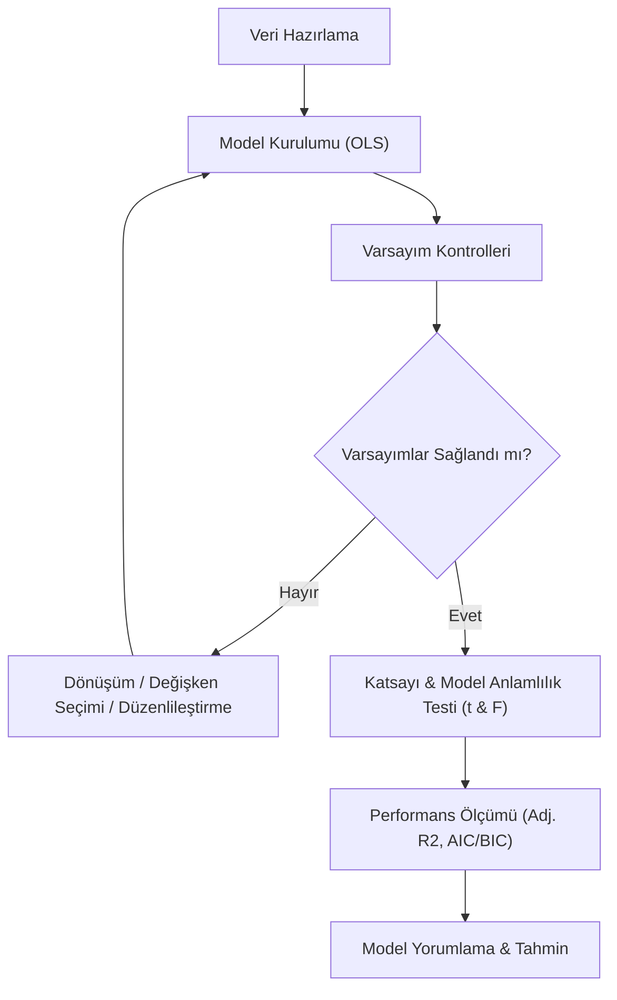

## 📌 Özet

Çoklu doğrusal regresyon, bağımlı bir değişken ile birden fazla bağımsız değişken arasındaki ilişkiyi matematiksel bir denklemle açıklayan, istatistiğin en temel ve yaygın kullanılan araçlarından biridir. Bu yöntem, her bir bağımsız değişkenin, diğer tüm değişkenler sabit tutulduğunda (ceteris paribus) bağımlı değişken üzerindeki net etkisini ölçmemize olanak tanır. Modelin başarısı, sadece açıklayıcılık gücü (R²) ile değil, aynı zamanda hataların homoscedasticity ve bağımsızlık gibi Gauss-Markov varsayımlarını ne ölçüde karşıladığıyla değerlendirilir. Gerçek dünya uygulamalarında, çoklu doğrusallık (multicollinearity) gibi sorunları tespit etmek için VIF değerlerini kontrol etmek ve model karmaşıklığını yönetmek için AIC/BIC gibi kriterlere dayalı model seçim yöntemlerini kullanmak kritiktir.

---

## 🧠 Detay

### Çoklu Regresyon Analiz Süreci



### Model

$$Y = \beta_0 + \beta_1 X_1 + \beta_2 X_2 + \cdots + \beta_k X_k + \varepsilon$$

**Matris formülasyonu:**
$$\mathbf{Y} = \mathbf{X}\boldsymbol{\beta} + \boldsymbol{\varepsilon}$$

**OLS Çözümü:**
$$\hat{\boldsymbol{\beta}} = (\mathbf{X}^T\mathbf{X})^{-1}\mathbf{X}^T\mathbf{Y}$$

### Varsayımlar (Gauss-Markov)

1. **Doğrusallık**: $E[Y] = X\beta$
2. **Tam sıra**: $rank(\mathbf{X}) = k+1$ (tam çoklu doğrusallık yok)
3. **Sabit varyans**: $Var(\varepsilon_i) = \sigma^2$ (homoscedasticity)
4. **Korelasyonsuz artıklar**: $Cov(\varepsilon_i, \varepsilon_j) = 0$
5. **Normallik** (çıkarım için): $\varepsilon \sim N(0, \sigma^2)$

Bu koşullar altında OLS **BLUE** (Best Linear Unbiased Estimator).

### Model Değerlendirme

#### Düzeltilmiş R² (Adjusted R²)

Yeni değişken eklendikçe R² artışını cezalandırır:
$$R^2_{adj} = 1 - \frac{(1-R^2)(n-1)}{n-k-1}$$

> Model karşılaştırmasında R² değil **Adjusted R²** kullan.

#### AIC ve BIC (Bilgi Kriterleri)

$$AIC = 2k - 2\ln(\hat{L})$$
$$BIC = k\ln(n) - 2\ln(\hat{L})$$

**Küçük = Daha iyi**. BIC, büyük örneklemlerde daha çok cezalandırır.

### Çoklu Doğrusallık (Multicollinearity)

Bağımsız değişkenler arasında yüksek korelasyon.

**Belirtileri:**
- Bireysel t-testleri anlamsız ama F-testi anlamlı
- Katsayılar beklenmedik işaret veya büyüklükte
- Katsayılar değişken ekleme/çıkarmayla çok değişiyor

**VIF (Variance Inflation Factor):**
$$VIF_j = \frac{1}{1-R_j^2}$$

$R_j^2$: $X_j$'yi diğer değişkenlerle regresyon $R^2$'si

| VIF | Yorum |
|---|---|
| 1 | Çoklu doğrusallık yok |
| 1-5 | Orta düzey |
| 5-10 | Yüksek, sorun olabilir |
| >10 | Ciddi çoklu doğrusallık |

**Çözümler:**
- Yüksek VIF'li değişkeni çıkar
- Ridge regresyon, Lasso kullan
- PCA ile boyut indirgeme

### Kategorik Değişkenler (Dummy Coding)

$k$ kategori → $k-1$ dummy değişken (referans kategori)

```
Eğitim: İlkokul / Ortaokul / Lise / Üniversite (4 kategori)
→ 3 dummy: d_ortaokul, d_lise, d_universite
→ Referans: İlkokul
```

$$Y = \beta_0 + \beta_1 d_{orta} + \beta_2 d_{lise} + \beta_3 d_{uni} + \cdots$$

**Yorumlama**: $\beta_1$ = Ortaokul ile İlkokul arasındaki Y farkı (diğerleri sabit).

### Model Seçim Yöntemleri

| Yöntem | Açıklama | Dezavantaj |
|---|---|---|
| **İleriye Seçim** | Boş modelden, değişken ekle | Yerel optimal |
| **Geriye Eleme** | Tam modelden, değişken çıkar | Yerel optimal |
| **Adımsal (Stepwise)** | Her iki yönde | İleriye + geriye |
| **En İyi Alt Küme** | Tüm kombinasyonlar | Hesap maliyeti yüksek |

**Tercih**: AIC/BIC minimizasyonu ile düzenlilik yaklaşımları (Lasso/Ridge).

### Etkileşim Terimleri

$$Y = \beta_0 + \beta_1 X_1 + \beta_2 X_2 + \beta_3 X_1 X_2 + \varepsilon$$

$\beta_3$: X₁'in Y üzerindeki etkisinin X₂'ye göre değişimi.

### Polinom Regresyon

$$Y = \beta_0 + \beta_1 X + \beta_2 X^2 + \beta_3 X^3 + \varepsilon$$

Eğrili ilişkiyi yakalamak için. Hâlâ doğrusal regresyon (katsayılarda doğrusal).

### Python

```python
import statsmodels.api as sm
import pandas as pd
from statsmodels.stats.outliers_influence import variance_inflation_factor

# Model
X = sm.add_constant(df[['x1', 'x2', 'x3']])
model = sm.OLS(df['y'], X).fit()
print(model.summary())

# VIF
vif_data = pd.DataFrame()
vif_data['Feature'] = X.columns
vif_data['VIF'] = [variance_inflation_factor(X.values, i) 
                   for i in range(X.shape[1])]

# Etkileşim
df['x1_x2'] = df['x1'] * df['x2']

# Polinom
from sklearn.preprocessing import PolynomialFeatures
poly = PolynomialFeatures(degree=2)
X_poly = poly.fit_transform(X)
```

---

## 💡 Bağlantılar
- [[STAT - Regresyon Analizi - Basit Doğrusal]]
- [[STAT - Lojistik Regresyon]]
- [[ML - Lineer Regresyon]]
- [[ML - Overfitting ve Underfitting]]

## ❓ Sorular / Anlamadıklarım


## 🔗 Kaynaklar
- Introduction to Statistical Learning (ISLR) - Ch. 3
- statsmodels Documentation
