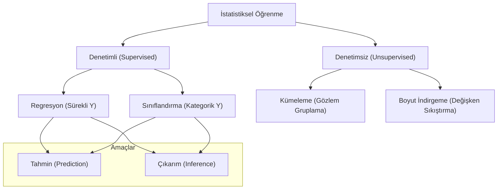

## 📌 Özet

İstatistiksel öğrenme, bağımsız değişkenler (X) ile bağımlı değişken (Y) arasındaki ilişkiyi temsil eden bir fonksiyonu (f) veriden hareketle tahmin etme sürecidir. Bu disiplin, hem geleceğe yönelik doğru tahminler yapmayı (prediction) hem de değişkenler arasındaki karmaşık ilişkileri anlamayı (inference) hedefler. Temel prensip, toplam hata payını oluşturan indirgelenebilir model hatalarını (bias ve varyans) minimize ederken, verideki doğal gürültüyü (indirgelemez hata) tanımaktır. Başarılı bir istatistiksel öğrenme süreci, modelin esnekliği ile yorumlanabilirliği arasındaki hassas dengenin kurulmasına ve aşırı öğrenme (overfitting) tuzağına düşmeden genelleme yeteneğinin korunmasına dayanır.

---

## 🧠 Detay

### İstatistiksel Öğrenme Görevleri



### Genel Çerçeve

$$Y = f(X) + \varepsilon$$

**Amaçlar:**
1. **Tahmin**: $\hat{Y} = \hat{f}(X)$ — Yorumlanabilirlik önemli değil
2. **Çıkarım**: "X, Y'yi nasıl etkiler?" — Yorumlanabilirlik önemli

### Tahmin Hatası

$$E[(Y - \hat{f}(X))^2] = \underbrace{[f(X) - \hat{f}(X)]^2}_{\text{İndirgelenebilir}} + \underbrace{Var(\varepsilon)}_{\text{İndirgelemez}}$$

İndirgelemez hata: Ölçüm hatası, eksik değişkenler, doğal rastlantısallık.

---

### Parametrik vs Parametrik Olmayan Yöntemler

| Özellik | Parametrik | Parametrik Olmayan |
|---|---|---|
| f şekli | Önceden belirlenir | Veri belirler |
| Parametre sayısı | Sabit | Veri büyüdükçe artar |
| Yorumlama | Kolay | Zor |
| Esneklik | Az | Fazla |
| Veri ihtiyacı | Az | Fazla |
| Örnekler | Doğrusal regresyon | KNN, kernel, spline |

**Parametrik**: $f(X) = \beta_0 + \beta_1 X$ → $\beta$ tahmin edilir.

**Parametrik Olmayan**: Veri yapısı kendisi modeli belirler.

---

### Esneklik-Yorumlanabilirlik Dengesi

```
Yüksek Esneklik ←──────────────→ Düşük Esneklik
                                   
Lasso         ──────────────── Subset Seçimi
GAM           ─────────── Doğrusal Reg.
Bagging/RF    ──────────
Boosting      ─────────
SVM           ───────
Deep Learning ─────

                   Yorumlanabilirlik
Düşük ←──────────────────────────→ Yüksek
```

---

### Model Değerlendirme Temeli

#### Eğitim Hata vs Test Hatası

- **Eğitim (Training) Hatası**: Model, eğitim verisi üzerinde ne kadar iyi?
- **Test Hatası**: Görülmemiş veriye genelleme ne kadar iyi?

Karmaşıklık artınca:
- Eğitim hatası: Sürekli azalır
- Test hatası: U-şekli eğri (önce azalır, sonra artar)

#### Çapraz Doğrulama

Test verisinin proxy'si olarak kullanılır:

$$CV_{(k)} = \frac{1}{k}\sum_{j=1}^k MSE_j$$

---

### Doğrusal Olmayan f Yaklaşımları

#### Polynomial Regresyon

$$f(X) = \beta_0 + \beta_1 X + \beta_2 X^2 + \cdots + \beta_d X^d$$

#### Spline (Parçalı Polinom)

Düğüm noktalarında bağlanan parçalı polinomlar. Bölge sınırlarında türev sürekliliği.

**Doğal Kübik Spline**: Uçlarda doğrusal → daha kararlı.

#### GAM (Genelleştirilmiş Katkısal Model)

$$y = \beta_0 + f_1(x_1) + f_2(x_2) + \cdots + f_p(x_p) + \varepsilon$$

Her değişken için esnek $f_j$ fonksiyonu. Yorumlanabilirlik korunur.

---

### Karar Sınırı ve Sınıflandırma

**Bayes Sınıflandırıcısı** (teorik optimum):

$$\hat{Y}(x) = \arg\max_k P(Y=k|X=x)$$

**Bayes Hata Oranı** (optimal, indirgelemez):
$$1 - E[\max_k P(Y=k|X)]$$

**KNN (K En Yakın Komşu)** — Bayes sınıflandırıcısını yaklaştırır:
$$P(Y=k|X=x) = \frac{1}{K}\sum_{i \in \mathcal{N}(x)} I(y_i = k)$$

Küçük K → Esnek, aşırı öğrenme; Büyük K → Düzgün, yetersiz öğrenme.

---

### İstatistiksel Öğrenme vs Makine Öğrenmesi

| Boyut | İstatistiksel Öğrenme | Makine Öğrenmesi |
|---|---|---|
| Odak | Çıkarım + Tahmin | Tahmin + Performans |
| Yorum | Merkezi | İkincil |
| Belirsizlik | Modellenir | Genellikle yok sayılır |
| Model | Olasılıksal | Genellikle determinstik |
| Araçlar | R, statsmodels | Python, sklearn, TF |

---

## 💡 Bağlantılar
- [[STAT - Çoklu Doğrusal Regresyon]]
- [[STAT - Lojistik Regresyon]]
- [[STAT - Bilgi Kriterleri ve Model Seçimi]]
- [[ML - Overfitting ve Underfitting]]

## ❓ Sorular / Anlamadıklarım


## 🔗 Kaynaklar
- Introduction to Statistical Learning (ISLR) - Ch. 1-2 (free PDF)
- Elements of Statistical Learning (ESL) - Ch. 2 (free PDF)
